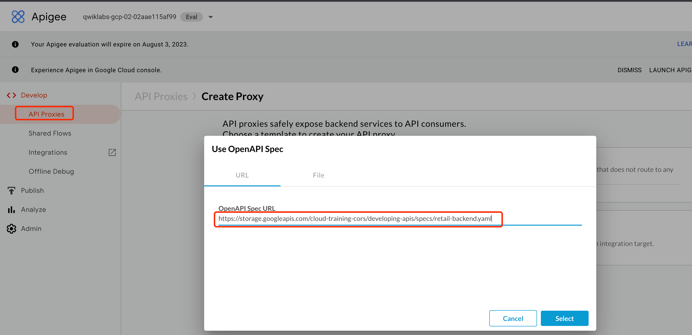
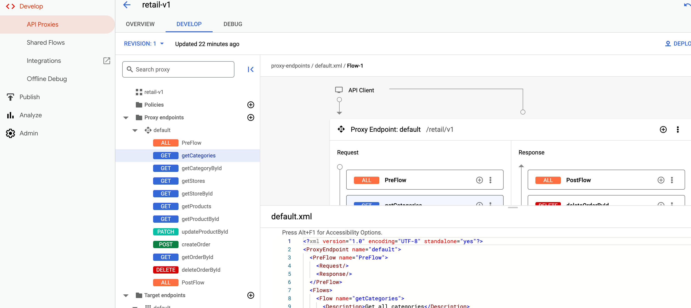
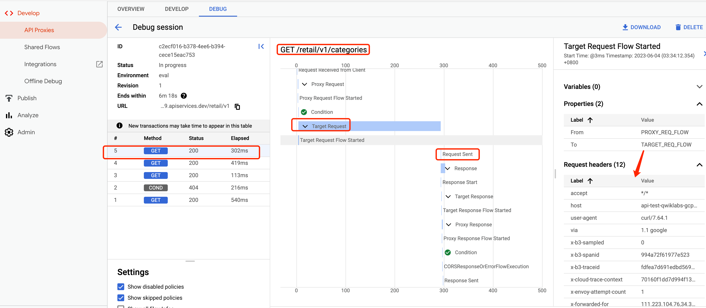

= Apigee
:toc: manual

== API Proxy

This section will generate an API Proxy using an OpenAPI Specification

=== OpenAPI specification

* link:retail-backend.yaml[retail-backend.yaml]

=== API Developer(API Engineer)

=== API Access(Test API)

[source, bash]
----
$ curl https://api-test-qwiklabs-gcp-02-02aae115af99.apiservices.dev/retail/v1/categories -v

> GET /retail/v1/categories HTTP/2
> Host: api-test-qwiklabs-gcp-02-02aae115af99.apiservices.dev
> User-Agent: curl/7.64.1
> Accept: */*

< HTTP/2 200 
< date: Sun, 04 Jun 2023 15:34:12 GMT
< content-type: application/json; charset=utf-8
< content-length: 486
< access-control-allow-origin: *
< cache-control: no-cache
< strict-transport-security: max-age=31556926; includeSubDomains; preload
< x-request-id: f3249460-c537-4d04-a50a-9c64827f868f
< via: 1.1 google
< alt-svc: h3=":443"; ma=2592000,h3-29=":443"; ma=2592000
----

== Target Server

== Route Rules
