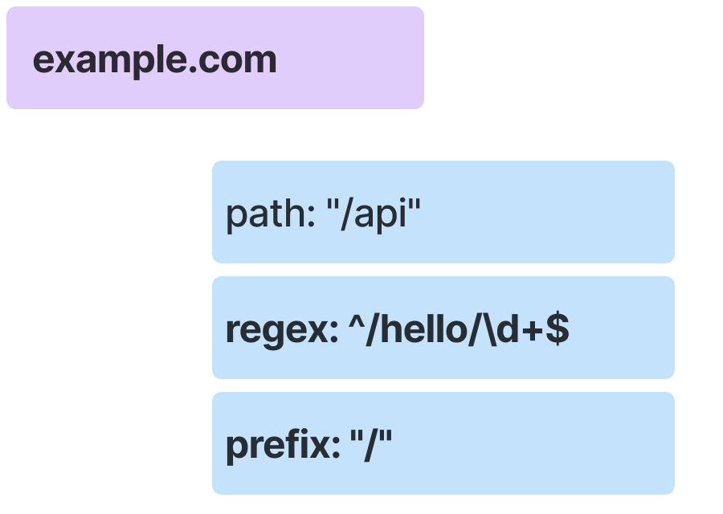
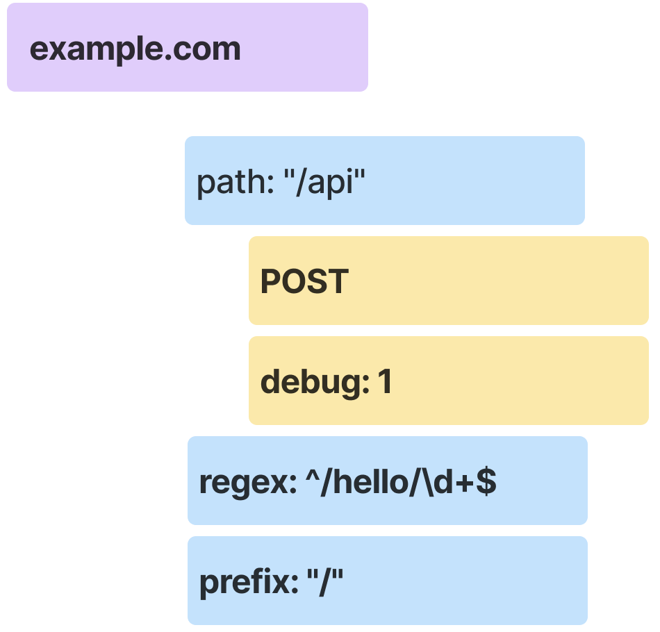
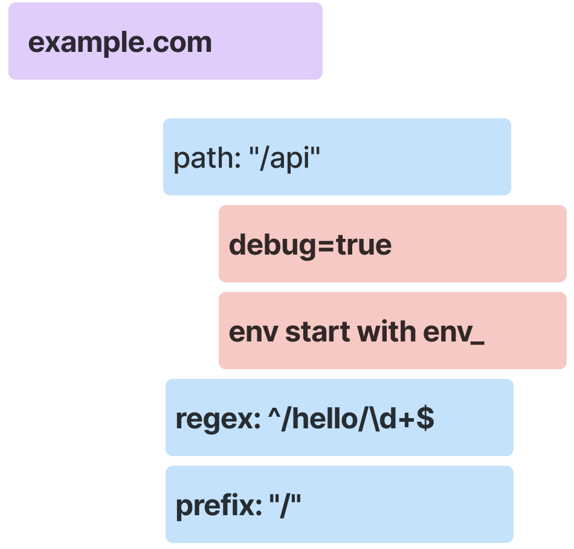

= Envoy
:toc: manual

== Run Envoy

[source, bash]
.*Start*
----
func-e run -c envoy-demo.yaml
----

* link:envoy-demo.yaml[envoy-demo.yaml]

[source, bash]
.*Test*
----
% curl http://10.1.10.136:10000 -I
HTTP/1.1 200 OK
accept-ranges: bytes
age: 19034
cache-control: public,max-age=0,must-revalidate
content-length: 15388
content-security-policy: frame-ancestors 'self';
content-type: text/html; charset=UTF-8
date: Fri, 24 Nov 2023 07:54:13 GMT
etag: "9dc19d916d0b5664749c58c41b540c67-ssl"
server: envoy
strict-transport-security: max-age=31536000
x-nf-request-id: 01HG054XH840WYJD799ASAJVPD
x-envoy-upstream-service-time: 145
----

== HCM

=== Path matching

[source, bash]
.*Start*
----
func-e run -c hcm/path-matching.yaml
----

* link:path-matching.yaml[hcm-path-matching.yaml]

*Test*

[source, bash]
----
% curl -H "Host: test.com" http://10.1.10.136:10000 -I
HTTP/1.1 404 Not Found
date: Fri, 24 Nov 2023 08:28:36 GMT
server: envoy
transfer-encoding: chunked
----

[source, bash]
----
% curl -H "Host: example.com" http://10.1.10.136:10000   
hello - /
----

[source, bash]
----
% curl -H "Host: example.com" http://10.1.10.136:10000/api 
hello - /api
----

[source, bash]
----
% curl -H "Host: example.com" http://10.1.10.136:10000/hello/123
hello - regex
----

=== Header matching

Only HTTP request contains the following

* host is `example.com`
* path is `/api`
* method is `POST`
* Header contain `debug: 1`

then the request will forward to api backend

[source, bash]
.*Start*
----
func-e run -c hcm/header-matching.yaml
----

* link:hcm/header-matching.yaml[header-matching.yaml]

*Test*

[source, bash]
----
% curl -H "Host: example.com" -H "debug: 1" -X POST http://10.1.10.136:10000/api    
hello - /api
----

[source, bash]
----
% curl -H "Host: example.com" -H "debug: 1"  http://10.1.10.136:10000/api 
hello - /
----

[source, bash]
----
% curl -H "Host: example.com" -H "debug: 1" -X GET http://10.1.10.136:10000/api
hello - /
----

=== Query parameters matching

Only HTTP request contains the following

* host is `example.com`
* path is `/api`
* has query parameter `debug=true`
* has query parameter `env` and it's value startwith `env_`

then the request will forward to api backend

[source, bash]
.*Start*
----
func-e run -c hcm/query-parameters-matching.yaml
----

* link:hcm/query-parameters-matching.yaml[query-parameters-matching.yaml]

*Test*

[source, bash]
----
% curl -H "Host: example.com"  "http://10.1.10.136:10000/api?debug=true&env=env_test"
hello - /api
----

[source, bash]
----
% curl -H "Host: example.com"  "http://10.1.10.136:10000/api?debug=true&env=env_prod"
hello - /api
----

[source, bash]
----
% curl -H "Host: example.com"  "http://10.1.10.136:10000/api?debug=true&env=prod"    
hello - /
----

=== Traffic Splitting

==== runtime fractions

[source, bash]
.*Start*
----
func-e run -c hcm/traffic-spitting-runtime-fraction.yaml
----

* link:hcm/traffic-spitting-runtime-fraction.yaml[traffic-spitting-runtime-fraction.yaml]

[source, bash]
.*Test*
----
% hey http://10.1.10.136:10000

Status code distribution:
  [201]	138 responses
  [202]	62 responses
----

==== weighted clusters

[source, bash]
.*Prepare App*
----
docker run -it --rm -d  -p 8070:8080 cloudadc/cafe:1.5-aarch64
docker run -it --rm -d  -p 8080:8080 cloudadc/cafe:1.5-aarch64
docker run -it --rm -d  -p 8090:8080 cloudadc/cafe:1.5-aarch64
----

[source, bash]
.*Start*
----
func-e run -c hcm/traffic-spitting-weighted-clusters.yaml
----

* link:hcm/traffic-spitting-weighted-clusters.yaml[traffic-spitting-weighted-clusters.yaml]

[source, bash]
.*Test*
----
hey http://localhost:10000
----

Search `TYPE envoy_cluster_external_upstream_rq counter` from http://10.1.10.136:9901/stats/prometheus

[source, bash]
----
envoy_cluster_upstream_rq_xx{envoy_response_code_class="2",envoy_cluster_name="instance_1"} 101
envoy_cluster_upstream_rq_xx{envoy_response_code_class="2",envoy_cluster_name="instance_2"} 63
envoy_cluster_upstream_rq_xx{envoy_response_code_class="2",envoy_cluster_name="instance_3"} 36
----

=== Header Manipulation

[source, bash]
.*Start*
----
func-e run -c hcm/header-manipulation.yaml
----

* link:hcm/header-manipulation.yaml[header-manipulation.yaml]

.*Test*

[source, bash]
----
% curl -v -H "hello: world" http://10.1.10.136:10000/json
> GET /json HTTP/1.1
> Host: 10.1.10.136:10000
> User-Agent: curl/7.88.1
> Accept: */*
> hello: world
> 
< HTTP/1.1 200 OK
< server: envoy
< date: Fri, 24 Nov 2023 09:55:11 GMT
< content-type: text/plain
< content-length: 400
< x-envoy-upstream-service-time: 1
< json: world
< lab: Header Manipulation
----

=== Retries

[source, bash]
.*Start*
----
func-e run -c hcm/retries.yaml
----

* link:hcm/retries.yaml[retries.yaml]

[source, bash]
.*Test*
----
curl http://10.1.10.136:10000 
----

=== Local Rate Limiter

[source, bash]
.*Start*
----
func-e run -c hcm/rate_limit_local.yaml
----

* link:hcm/rate_limit_local.yaml[rate_limit_local.yaml]

[source, bash]
.*Test*
----
% for i in {1..10} ; do curl -w "%{http_code}" -s -o /dev/null http://10.1.10.136:10000/status; echo; done
200
200
200
200
200
200
200
200
200
200

% for i in {1..10} ; do curl -w "%{http_code}" -s -o /dev/null http://10.1.10.136:10000/headers; echo; done
200
200
200
200
200
429
429
429
429
429
----

