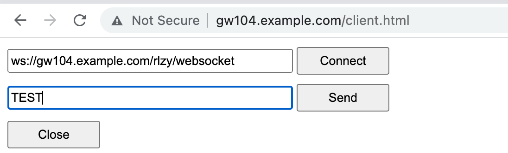
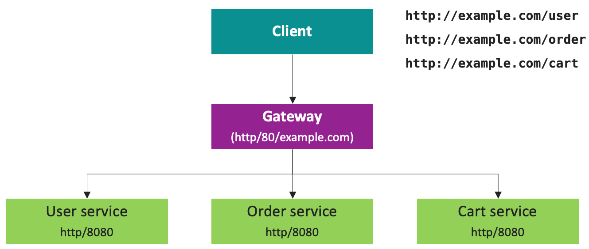
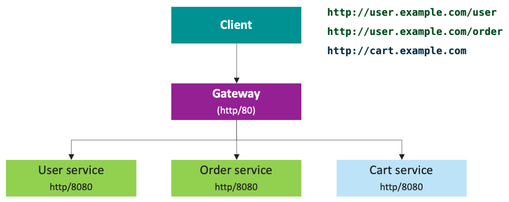

= NGINX Ingress Controller on GCP
:toc: manual

== Prerequisites

=== Prepare Projects

[source, bash]
.*Set PROJECT as Virable*
----
export PROJECT=$(gcloud config configurations list | grep PROJECT | awk '{print $2}')
----

=== Prepare Artifact Registry

[source, bash]
.*1. Enable Artifact Registry API*
----
gcloud services enable artifactregistry.googleapis.com
----

[source, bash]
.*2. Create Artifact Registry*
----
gcloud artifacts repositories create nginx --repository-format=docker --location=us-central1
----

[source, bash]
.*3. Configure authentication*
----
gcloud auth configure-docker us-central1-docker.pkg.dev
----

NOTE: Before you can push or pull images, configure Docker to use the Google Cloud CLI to authenticate requests to Artifact Registry.

=== Prepare Kubernetes

[source, bash]
.*1. Enable Container API*
----
gcloud services enable container.googleapis.com
----

[source, bash]
.*2. set the zone to run cluster and the cluster name*
----
export my_zone=us-central1-a
export my_cluster=standard-cluster-1
----

[source, bash]
.*3. Create cluster*
----
gcloud container clusters create $my_cluster --num-nodes=2 --zone=$my_zone --cluster-version=1.22.17-gke.7500 --enable-ip-alias
----

[source, bash]
.*4. Verify Install*
----
$ kubectl get nodes -o wide
NAME                                                STATUS   ROLES    AGE   VERSION             INTERNAL-IP   EXTERNAL-IP       OS-IMAGE                             KERNEL-VERSION   CONTAINER-RUNTIME
gke-standard-cluster-1-default-pool-96a64d1f-4h7q   Ready    <none>   29s   v1.22.17-gke.7500   10.128.0.3    104.198.201.247   Container-Optimized OS from Google   5.10.162+        containerd://1.5.18
gke-standard-cluster-1-default-pool-96a64d1f-jhb2   Ready    <none>   29s   v1.22.17-gke.7500   10.128.0.2    34.67.181.117     Container-Optimized OS from Google   5.10.162+        containerd://1.5.18
----

[source, bash]
.*5. Fetching cluster endpoint and auth data*
----
gcloud container clusters get-credentials $my_cluster --zone $my_zone
----

== Installation

=== Docker Image Build

[source, bash]
.*1. Get Code*
----
git clone https://github.com/nginxinc/kubernetes-ingress.git --branch v2.4.2
cd kubernetes-ingress/
----

[source, bash]
.*2. Copy certificate to project*
----
$ ls -l kubernetes-ingress/nginx-repo.*
-rw-r--r-- 1 cloud_user_p_636d55a2 1001 1532 May 18 07:30 kubernetes-ingress/nginx-repo.crt
-rw-r--r-- 1 cloud_user_p_636d55a2 1001 1732 May 18 07:30 kubernetes-ingress/nginx-repo.key
----

[source, bash]
.*3. Build Image*
----
$ make debian-image-plus PREFIX=us-central1-docker.pkg.dev/$PROJECT/nginx/nginx-plus-ingress TARGET=download
...
 => => naming to us-central1-docker.pkg.dev/playground-s-11-74402444/nginx/nginx-plus-ingress:2.4.2-SNAPSHOT-4252538  
----

[source, bash]
.*4. Push Image to Artifact Registry*
----
docker push us-central1-docker.pkg.dev/$PROJECT/nginx/nginx-plus-ingress:2.4.2-SNAPSHOT-4252538 
----

[source, bash]
.*5. Tag and Push Image*
----
docker tag us-central1-docker.pkg.dev/$PROJECT/nginx/nginx-plus-ingress:2.4.2-SNAPSHOT-4252538  us-central1-docker.pkg.dev/$PROJECT/nginx/nginx-plus-ingress:2.4.2
docker push us-central1-docker.pkg.dev/$PROJECT/nginx/nginx-plus-ingress:2.4.2
----

=== Prepare Test Image

[source, bash]
.*cafe*
----
docker pull cloudadc/cafe:1.1
docker tag cloudadc/cafe:1.1 us-central1-docker.pkg.dev/$PROJECT/nginx/cafe:1.1
docker push us-central1-docker.pkg.dev/$PROJECT/nginx/cafe:1.1
----

[source, bash]
.*backend*
----
docker pull cloudadc/backend:0.1.5
docker tag cloudadc/backend:0.1.5 us-central1-docker.pkg.dev/$PROJECT/nginx/backend:0.1.5
docker push us-central1-docker.pkg.dev/$PROJECT/nginx/backend:0.1.5
----

[source, bash]
.*ttcp*
----
docker pull cloudadc/ttcp:1.14-2
docker tag cloudadc/ttcp:1.14-2 us-central1-docker.pkg.dev/$PROJECT/nginx/ttcp:1.14-2
docker push us-central1-docker.pkg.dev/$PROJECT/nginx/ttcp:1.14-2

docker pull cloudadc/ttcp:1.14-2-cli
docker tag cloudadc/ttcp:1.14-2-cli us-central1-docker.pkg.dev/$PROJECT/nginx/ttcp:1.14-2-cli
docker push us-central1-docker.pkg.dev/$PROJECT/nginx/ttcp:1.14-2-cli

docker pull cloudadc/ttcp:1.14-2-udp
docker tag cloudadc/ttcp:1.14-2-udp us-central1-docker.pkg.dev/$PROJECT/nginx/ttcp:1.14-2-udp
docker push us-central1-docker.pkg.dev/$PROJECT/nginx/ttcp:1.14-2-udp
----

=== Installation

NOTE: The installation scripts are under `kubernetes-ingress/deployments`.

[source, bash]
.*1. Configure RBAC*
----
kubectl apply -f common/ns-and-sa.yaml
kubectl apply -f rbac/rbac.yaml
----

[source, bash]
.*2. Create Common Resources*
----
kubectl apply -f common/nginx-config.yaml
kubectl apply -f common/ingress-class.yaml
----

[source, bash]
.*3. Create Custom Resources*
----
kubectl apply -f common/crds/k8s.nginx.org_virtualservers.yaml
kubectl apply -f common/crds/k8s.nginx.org_virtualserverroutes.yaml
kubectl apply -f common/crds/k8s.nginx.org_transportservers.yaml
kubectl apply -f common/crds/k8s.nginx.org_policies.yaml
kubectl apply -f common/crds/k8s.nginx.org_globalconfigurations.yaml
----

[source, bash]
.*4. Deploy the Ingress Controller*
----
kubectl apply -f daemon-set/nginx-plus-ingress.yaml 
----

NOTE: Replace the default `nginx-plus-ingress:2.4.2` to `us-central1-docker.pkg.dev/playground-s-11-74402444/nginx/nginx-plus-ingress:2.4.2`, and comment out `-default-server-tls-secret`.

=== Enable Firewall for ingress HTTP request

[source, bash]
----
gcloud compute firewall-rules create allow-external-http-80 --direction=INGRESS --priority=1000 --network=default --action=ALLOW --rules=tcp:80 --source-ranges=0.0.0.0/0
gcloud compute firewall-rules create allow-external-http-8080 --direction=INGRESS --priority=1000 --network=default --action=ALLOW --rules=tcp:8080 --source-ranges=0.0.0.0/0
gcloud compute firewall-rules create allow-external-http-8898 --direction=INGRESS --priority=1000 --network=default --action=ALLOW --rules=tcp:8898 --source-ranges=0.0.0.0/0
----

=== Verify Installation

[source, bash]
.*View the Pod is running*
----
$ kubectl get pods -n nginx-ingress
NAME                  READY   STATUS    RESTARTS   AGE
nginx-ingress-9tfqp   1/1     Running   0          38s
nginx-ingress-qqfwg   1/1     Running   0          38s
----

[source, bash]
.*Get Node IP*
----
export IP=$(kubectl get nodes -o wide --no-headers | head -n 1 | awk '{print $7}')
----

[source, bash]
.*Use Node IP to access http 80*
----
$ curl http://$IP -I
HTTP/1.1 404 Not Found
Server: nginx/1.23.2
Date: Sat, 20 May 2023 02:33:18 GMT
Content-Type: text/html
Content-Length: 153
Connection: keep-alive
----

== Service Types

=== HTTP

[source, bash]
.*App*
----
kubectl apply -f 101/app.yaml 
----

* link:101/app.yaml[101/app.yaml]

[source, bash]
.*VirtualServer*
----
kubectl apply -f 101/vs.yaml 
----

* link:101/vs.yaml[101/vs.yaml]

[source, bash]
.*Test*
----
curl -H "Host: gw101.example.com" http://$IP
----

=== HTTPS

[source, bash]
.*App*
----
kubectl apply -f 102/app.yaml
----

* link:102/app.yaml[102/app.yaml]

[source, bash]
.*VirtualServer*
----
kubectl apply -f 102/secret.yaml 
kubectl apply -f 102/vs.yaml 
----

* link:102/secret.yaml[102/secret.yaml]
* link:102/vs.yaml[102/vs.yaml]

[source, bash]
.*Test*
----
// firewall
gcloud compute firewall-rules create allow-external-https-443 --direction=INGRESS --priority=1000 --network=default --action=ALLOW --rules=tcp:443 --source-ranges=0.0.0.0/0

// access
curl -H "Host: gw102.example.com" https://$IP --insecure
----

=== gRPC HTTP2

[source, bash]
.*App*
----
kubectl apply -f 103/app.yaml 
----

* link:103/app.yaml[103/app.yaml]

[source, bash]
.*VirtualServer*
----
kubectl apply -f 103/vs.yaml 
----

* link:103/vs.yaml[103/vs.yaml]

[source, bash]
.*Test*
----
echo "ADDRESS=gw103.example.com:80" > env.list
docker run --env-file ./env.list cloudadc/grpc-go-greeting:0.1 greeter_client "kylin SONG"
----

=== WebSocket

[source, bash]
.*App*
----
kubectl apply -f 104/app.yaml 
----

* link:104/app.yaml[104/app.yaml]

[source, bash]
.*VirtualServer*
----
kubectl apply -f 104/vs.yaml 
----

* link:104/vs.yaml[104/vs.yaml]

*TEST*

1. Aceess the websocket via http://gw104.example.com/client.html in broswer.
2. Enter `ws://gw104.example.com/rlzy/websocket` as connection URL, click *Connect* Button.
3. Enter `TEXT` as message to send via websocket.

 
=== TCP/UDP

[source, bash]
.*App*
----
kubectl apply -f 105/dns.yaml
kubectl apply -f 105/ttcp.yaml 
----

* link:105/dns.yaml[105/dns.yaml]
* link:105/ttcp.yaml[105/ttcp.yaml]

[source, bash]
.*GlobalConfiguration*
----
kubectl apply -f 105/listeners.yaml
----

* link:105/listeners.yaml[105/listeners.yaml]

NOTE: `-global-configuration` is necessary to use GlobalConfiguration.

[source, bash]
.*TransportServer*
----
kubectl apply -f 105/transport-server-tcp.yaml 
kubectl apply -f 105/transport-server-udp.yaml 
kubectl apply -f 105/transport-server-ttcp.yaml
----

* link:105/transport-server-tcp.yaml[105/transport-server-tcp.yaml]
* link:105/transport-server-udp.yaml[105/transport-server-udp.yaml]
* link:105/transport-server-ttcp.yaml[105/transport-server-ttcp.yaml]

[source, bash]
.*Test*
----
// 1. firewall
gcloud compute firewall-rules create allow-external-dns-5353 --direction=INGRESS --priority=1000 --network=default --action=ALLOW --rules=tcp:5353,udp:5353 --source-ranges=0.0.0.0/0
gcloud compute firewall-rules create allow-external-tcp-5001 --direction=INGRESS --priority=1000 --network=default --action=ALLOW --rules=tcp:5001 --source-ranges=0.0.0.0/0

// 2. dns lookup tcp
dig @$IP -p 5353 ksoong.org +tcp

// 3. dns lookup udp
dig @$IP -p 5353 ksoong.org

// 4. ttcp
docker run --rm  cloudadc/ttcp:1.14-2-cli ttcp -t $IP
----

== API Route

=== URL Based Route

[source, bash]
.*App*
----
kubectl apply -f 0001/app.yaml
----

* link:0001/app.yaml[0001/app.yaml]

[source, yaml]
.*VirtualServer*
----
  upstreams:
  - name: user-app
    service: user-svc
    port: 80
  - name: order-app
    service: order-svc
    port: 80
  - name: cart-app
    service: cart-svc
    port: 80
  routes:
  - path: /user
    action:
      pass: user-app
  - path: /order
    action:
      pass: order-app
  - path: /cart
    action:
      pass: cart-app
----

* link:0001/vs.yaml[0001/vs.yaml]

[source, bash]
.*Test*
----
curl -H "Host: gw0001.example.com" http://$IP/user
curl -H "Host: gw0001.example.com" http://$IP/order
curl -H "Host: gw0001.example.com" http://$IP/cart
----

=== Host and URL Based Route

[source, bash]
.*App*
----
kubectl apply -f 0002/app.yaml 
----

* link:0002/app.yaml[0002/app.yaml]

[source, yaml]
.*VirtualServer*
----
  host: user.example.com
  upstreams:
  - name: user-app
    service: user-svc
    port: 80
  - name: order-app
    service: order-svc
    port: 80
  routes:
  - path: /user
    action:
      pass: user-app
  - path: /order
    action:
      pass: order-app

  host: cart.example.com
  upstreams:
  - name: cart-app
    service: cart-svc
    port: 80
  routes:
  - path: /
    action:
      pass: cart-app
----

* link:0002/vs.yaml[0002/vs.yaml]

[source, bash]
.*Test*
----
curl -H "Host: gw00021.example.com" http://$IP/user
curl -H "Host: gw00021.example.com" http://$IP/order
curl -H "Host: gw00022.example.com" http://$IP
----

=== Host Based Route(HTTPS)

[source, bash]
.*App*
----
kubectl apply -f 0011/app.yaml 
----

* link:0011/app.yaml[0011/app.yaml]

[source, bash]
.*TransportServer*
----
kubectl apply -f 0011/ts.yaml
----

* link:0011/ts.yaml[0011/ts.yaml]

[source, bash]
.*Test*
----
curl --resolve foo.gw0011.example.com:443:$IP https://foo.gw0011.example.com --insecure
curl --resolve bar.gw0011.example.com:443:$IP https://bar.gw0011.example.com --insecure
----

=== Host and URL based Route(Cross Namespace)

[source, bash]
.*App*
----
kubectl apply -f 002/foo.yaml 
kubectl apply -f 002/bar.yaml 
----

* link:002/foo.yaml[002/foo.yaml]
* link:002/bar.yaml[002/bar.yaml]

[source, bash]
.*VirtualServer, VirtualServerRoute*
----
kubectl apply -f 002/foo-route.yaml 
kubectl apply -f 002/bar-route.yaml 
kubectl apply -f 002/vs.yaml 
----
* link:002/foo-route.yaml[002/foo-route.yaml]
* link:002/bar-route.yaml[002/bar-route.yaml]
* link:002/vs.yaml[002/vs.yaml]

[source, bash]
.*Test*
----
curl -H "Host: gw002.example.com" http://$IP/foo/user
curl -H "Host: gw002.example.com" http://$IP/foo/order
curl -H "Host: gw002.example.com" http://$IP/bar/user
curl -H "Host: gw002.example.com" http://$IP/bar/order
----

=== Ratio Based Canary Route

[source, bash]
.*App*
----
kubectl apply -f 003/app.yaml 
----

* link:003/app.yaml[003/app.yaml]

[source, bash]
.*VirtualServer*
----
kubectl apply -f 003/vs.yaml 
----

* link:003/vs.yaml[003/vs.yaml]

[source, bash]
.*Test*
----
$ for i in {1..100} ; do curl -s -H "Host: gw003.example.com" http://$IP/foo | grep name ; done > out.log

$ cat out.log | wc -l
     100

$ cat out.log | grep v1 | wc -l
      93

$ cat out.log | grep v2 | wc -l
       7
----

=== Cookie Based Canary Route

[source, bash]
.*App*
----
kubectl apply -f 004/app.yaml 
----

* link:004/app.yaml[004/app.yaml]

[source, bash]
.*VirtualServer*
----
kubectl apply -f 004/vs.yaml
----

* link:004/vs.yaml

[source, bash]
.*Test*
----
curl --cookie "version=v2" -H "Host: gw004.example.com" http://$IP/foo
----

=== Header Based Canary Route

[source, bash]
.*App*
----
kubectl apply -f 005/app.yaml 
----

* link:005/app.yaml[005/app.yaml]

[source, bash]
.*VirtualServer*
----
kubectl apply -f 005/vs.yaml 
----

[source, bash]
.*Test*
----
curl -H "test: v2" -H "Host: gw005.example.com" http://$IP/foo
----

=== Argument Based Canary Route

[source, bash]
.*App*
----
kubectl apply -f 0051/app.yaml
----

* link:0051/app.yaml[0051/app.yaml]

[source, bash]
.*VirtualServer*
----
kubectl apply -f 0051/vs.yaml 
----

[source, bash]
.*Test*
----
curl  -H "Host: gw0051.example.com" http://$IP/foo?test=v2
----

=== Source Address Based Canary Route

[source, bash]
.*App*
----
kubectl apply -f 0052/app.yaml
----

* link:0052/app.yaml[0052/app.yaml]

[source, bash]
.*VirtualServer*
----
kubectl apply -f 0052/vs.yaml
----

[source, bash]
.*Test*
----
curl  -H "Host: gw0052.example.com" http://$IP/variables
curl  -H "Host: gw0052.example.com" http://$IP/foo
----

=== Request URI Based Canary Route

[source, bash]
.*App*
----
kubectl apply -f 0053/app.yaml
----

* link:0053/app.yaml[0053/app.yaml]

[source, bash]
.*VirtualServer*
----
kubectl apply -f 0053/vs.yaml
----

[source, bash]
.*Test*
----
curl  -H "Host: gw0053.example.com" http://$IP/v2
----

=== Health Check

[source, bash]
.*App*
----
kubectl apply -f 006/app.yaml
----

* link:006/app.yaml[006/app.yaml]

[source, bash]
.*VirtualServer*
----
kubectl apply -f 006/vs.yaml
----

* link:006/vs.yaml[006/vs.yaml]

[source, bash]
.*Test*
----
$ curl  -H "Host: gw006.example.com" http://$IP/foo

$ curl -s -X 'GET' http:/$IP_DA:8898//api/8/http/upstreams/vs_gw-006_vs-006_foo | jq .peers[].health_checks
{
  "checks": 18,
  "fails": 0,
  "unhealthy": 0,
  "last_passed": true
}
{
  "checks": 18,
  "fails": 0,
  "unhealthy": 0,
  "last_passed": true
}
----

=== Cookie based session persistence

[source, bash]
.*App*
----
kubectl apply -f 007/app.yaml 
----

[source, bash]
.*VirtualServer*
----
kubectl apply -f 007/vs.yaml 
----

[source, bash]
.*Test*
----
$ curl -H "Host: gw007.example.com" http://$IP/foo -v
...
< Set-Cookie: srv_id=1d26bd38d10f1410bb8bd037ce631270; expires=Sat, 20-May-23 06:07:01 GMT; max-age=3600; domain=.example.com; secure; path=/
...
        server addr: 10.8.0.17:8080

$ for i in {1..5} ; do curl -s --cookie "srv_id=1d26bd38d10f1410bb8bd037ce631270; expires=Sat, 20-May-23 06:07:01 GMT; max-age=3600; domain=.example.com; secure; path=/" -H "Host: gw007.example.com" http://$IP/foo | grep "server addr" ; done
        server addr: 10.8.0.17:8080
        server addr: 10.8.0.17:8080
        server addr: 10.8.0.17:8080
        server addr: 10.8.0.17:8080
        server addr: 10.8.0.17:8080
----

=== URL Rewrite

[source, bash]
.*App*
----
kubectl apply -f 008/app.yaml 
----

* link:008/app.yaml[008/app.yaml]

[source, bash]
.*VirtualServer*
----
kubectl apply -f 008/vs.yaml
----

* link:008/vs.yaml[008/vs.yaml]

[source, bash]
.*Test*
----
$ curl -H "Host: gw008.example.com" http://$IP/foo

            request: GET /bar HTTP/1.1
                uri: /bar
         request id: e35712c76d06bfb604a199a260812267
               host: gw008.example.com
               date: 20/May/2023:05:20:36 +0000

        server name: foo-76cb8b6858-wtn4q
        client addr: 10.8.0.16:51444
        server addr: 10.8.0.18:8080

             cookie: 
                xff: 
         user agent: curl/7.64.1
----

=== HTTP Traffic Mirror

[source, bash]
.*App*
----
kubectl apply -f 009/app.yaml
----

* link:009/app.yaml[009/app.yaml]

[source, bash]
.*VirtualServer*
----
kubectl apply -f 009/vs.yaml 
----

* link:009/vs.yaml[009/vs.yaml]

[source, bash]
.*Test*
----
$ curl -H "Host: gw009.example.com" http://$IP/foo/test/mirror

$ POD=$(kubectl get pods -n gw-009 | grep v1 | awk '{print $1}') ; kubectl logs -f $POD -n gw-009
...
10.8.0.19 - - [20/May/2023:05:45:25 +0000] "GET /foo/test/mirror HTTP/1.1" 200 437 "-" "curl/7.64.1" "111.223.104.76"

$ POD=$(kubectl get pods -n gw-009 | grep v2 | awk '{print $1}') ; kubectl logs -f $POD -n gw-009
...
10.8.0.19 - - [20/May/2023:05:45:25 +0000] "GET /mirror HTTP/1.1" 200 419 "-" "curl/7.64.1" "111.223.104.76"
----

=== Load Balancing Algorithm

[source, bash]
.*App*
----
kubectl apply -f 010/app.yaml 
----

* link:010/app.yaml[010/app.yaml]

[source, bash]
.*VirtualServer*
----
kubectl apply -f 010/vs.yaml 
----

* link:010/vs.yaml[010/vs.yaml]

[source, bash]
.*Test*
----
$ for i in {1..5} ; do curl -s -H "Host: gw010.example.com" http://$IP/test | grep "server addr" ; done
        server addr: 10.8.1.21:8080
        server addr: 10.8.0.20:8080
        server addr: 10.8.1.21:8080
        server addr: 10.8.0.20:8080
        server addr: 10.8.1.21:8080
----

=== Client Source Address Disclose

[source, bash]
.*App*
----
kubectl apply -f 011/app.yaml 
----

* link:011/app.yaml[011/app.yaml]

[source, bash]
.*VirtualServer*
----
kubectl apply -f 011/vs.yaml 
----

* link:011/vs.yaml[011/vs.yaml]

[source, bash]
.*Test*
----
$ curl -s -H "Host: gw011.example.com" http://$IP/foo 
...
    Request Headers: x-real-ip: [111.223.104.76] x-forwarded-host: [gw011.example.com] x-forwarded-proto: [http] host: [gw011.example.com] x-forwarded-port: [80] connection: [close] user-agent: [curl/7.64.1] accept: [*/*] 

$ curl -H "X-Forwarded-For: 1.1.1.1, 1.1.1.2" -H "Host: gw011.example.com" http://$IP/foo
...
    Request Headers: x-real-ip: [111.223.104.76] x-forwarded-host: [gw011.example.com] x-forwarded-proto: [http] host: [gw011.example.com] x-forwarded-port: [80] connection: [close] x-forwarded-for: [1.1.1.1,1.1.1.2] user-agent: [curl/7.64.1] accept: [*/*] 
----

== API Access Control

=== Allow specified IP addresses/subnets

[source, bash]
.*App*
----
kubectl apply -f 201/app.yaml 
----

* link:201/app.yaml[201/app.yaml]

[source, bash]
.*Policy*
----
kubectl apply -f 201/policy.yaml
----

* link:201/policy.yaml[201/policy.yaml]

[source, bash]
.*VirtualServer*
----
kubectl apply -f 201/vs.yaml 
----

* link:201/vs.yaml[201/vs.yaml]

[source, bash]
.*Test*
----
curl -H "Host: gw201.example.com" http://$IP/foo
----

=== Basic Authentication

[source, bash]
.*App*
----
kubectl apply -f 202/app.yaml
----

* link:202/app.yaml[202/app.yaml]

[source, bash]
.*Policy*
----
// 1. use https://wtools.io/generate-htpasswd-online to generate credential pair, add pairs to secret.yaml

// 2. create secret
kubectl apply -f 202/secret.yaml 

// 3. create policy
kubectl apply -f 202/policy.yaml 
----

* link:202/secret.yaml[202/secret.yaml]
* link:202/policy.yaml[202/policy.yaml]

[source, bash]
.*VirtualServer*
----
kubectl apply -f 202/vs.yaml 
----

* link:202/vs.yaml[202/vs.yaml]

[source, bash]
.*Test*
----
curl -u "admin:admin" -H "Host: gw202.example.com" http://$IP/foo
curl -u "user:user" -H "Host: gw202.example.com" http://$IP/foo
curl -u "kylin:default" -H "Host: gw202.example.com" http://$IP/foo
----

=== JWT Validation

[source, bash]
.*App*
----
kubectl apply -f 203/app.yaml
----

* link:203/app.yaml[203/app.yaml]

[source, bash]
.*Policy*
----
kubectl apply -f 203/jwk-secret.yaml 
kubectl apply -f 203/jwt.yaml 
----

* link:203/jwk-secret.yaml[203/jwk-secret.yaml]
* link:203/jwt.yaml[203/jwt.yaml]

[source, bash]
.*VirtualServer*
----
kubectl apply -f 203/vs.yaml
----

* link:203/vs.yaml[203/vs.yaml]

[source, bash]
.*Test*
----
curl -H "Host: gw203.example.com" -H "token: `cat 203/token.jwt`" http://$IP/foo 
----

== API Rate Limit

=== Source Address Based Rate Limit

[source, bash]
.*App*
----
kubectl apply -f 301/app.yaml
----

* link:301/app.yaml[301/app.yaml]

[source, bash]
.*Policy*
----
kubectl apply -f 301/policy.yaml 
----

* link:301/policy.yaml[301/policy.yaml]

[source, bash]
.*VirtualServer*
----
kubectl apply -f 301/vs.yaml
----

* link:301/vs.yaml[301/vs.yaml]

[source, bash]
.*Test*
----
for i in {1..10} ; do curl -H "Host: gw301.example.com" http://$IP -I ; done
----

=== URI Based Based Rate Limit

[source, bash]
.*App*
----
kubectl apply -f 302/app.yaml 
----

* link:302/app.yaml[302/app.yaml]

[source, bash]
.*Policy*
----
kubectl apply -f 302/policy.yaml 
----

* link:302/policy.yaml[302/policy.yaml]

[source, bash]
.*VirtualServer*
----
kubectl apply -f 302/vs.yaml
----

* link:302/vs.yaml[302/vs.yaml]

[source, bash]
.*Test*
----
for i in {1..10} ; do curl -H "Host: gw302.example.com" http://$IP/test -I ; done
for i in {1..10} ; do curl -H "Host: gw302.example.com" http://$IP/test$i -I ; done
----

=== Header Based Rate Limit

[source, bash]
.*App*
----
kubectl apply -f 303/app.yaml
----

* link:303/app.yaml[303/app.yaml]

[source, bash]
.*Policy*
----
kubectl apply -f 303/policy.yaml
----

* link:303/policy.yaml[303/policy.yaml]

[source, bash]
.*VirtualServer*
----
kubectl apply -f 303/vs.yaml
----

* link:303/vs.yaml[303/vs.yaml]

[source, bash]
.*Test*
----
for i in {1..10} ; do curl -H "Host: gw303.example.com" -H "ratelimit: 1" http://$IP/test -I ; done
----

=== Cookie Based Rate Limit

[source, bash]
.*App*
----
kubectl apply -f 304/app.yaml
----

* link:304/app.yaml[304/app.yaml]

[source, bash]
.*Policy*
----
kubectl apply -f 304/policy.yaml 
----

* link:304/policy.yaml[304/policy.yaml]

[source, bash]
.*VirtualServer*
----
kubectl apply -f 304/vs.yaml
----

* link:304/vs.yaml[304/vs.yaml]

[source, bash]
.*Test*
----
for i in {1..10} ; do curl -H "Host: gw304.example.com"  --cookie "ratelimit=1" http://$IP/test -I ; done
----

=== Argument Based Rate Limit

[source, bash]
.*App*
----
kubectl apply -f 305/app.yaml
----

* link:305/app.yaml[305/app.yaml]

[source, bash]
.*Policy*
----
kubectl apply -f 305/policy.yaml
----

* link:305/policy.yaml[305/policy.yaml]

[source, bash]
.*VirtualServer*
----
kubectl apply -f 305/vs.yaml 
----

* link:305/vs.yaml[305/vs.yaml]

[source, bash]
.*Test*
----
for i in {1..10} ; do curl -H "Host: gw305.example.com" "http://$IP/test?ratelimit=1" -I ; done
----

== API Circuit Breaker

=== Max Connection 

[source, bash]
.*App*
----

----

[source, bash]
.*Policy*
----

----

[source, bash]
.*VirtualServer*
----

----

[source, bash]
.*Test*
----

----
