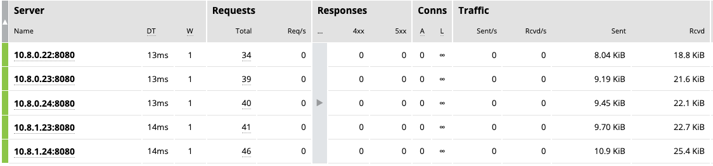

= NGINX Ingress Controller on GCP
:toc: manual

== Prerequisites

=== Prepare Projects

[source, bash]
.*Set PROJECT as Virable*
----
export PROJECT=$(gcloud config configurations list | grep PROJECT | awk '{print $2}')
----

=== Prepare Kubernetes

[source, bash]
.*1. Enable Container API*
----
gcloud services enable container.googleapis.com
----

[source, bash]
.*2. set the zone to run cluster and the cluster name*
----
export my_zone=us-central1-a
export my_cluster=standard-cluster-1
----

[source, bash]
.*3. Create cluster*
----
gcloud container clusters create $my_cluster --num-nodes=2 --zone=$my_zone --cluster-version=1.24.16-gke.500 --enable-ip-alias
----

[source, bash]
.*4. Verify Install*
----
kubectl get nodes -o wide
----

[source, bash]
.*5. Fetching cluster endpoint and auth data*
----
gcloud container clusters get-credentials $my_cluster --zone $my_zone
----

=== Prepare Artifact Registry

[source, bash]
.*1. Enable Artifact Registry API*
----
gcloud services enable artifactregistry.googleapis.com
----

[source, bash]
.*2. Create Artifact Registry*
----
gcloud artifacts repositories create nginx --repository-format=docker --location=us-central1
----

[source, bash]
.*3. Configure authentication*
----
gcloud auth configure-docker us-central1-docker.pkg.dev
----

NOTE: Before you can push or pull images, configure Docker to use the Google Cloud CLI to authenticate requests to Artifact Registry.

=== Firewall Setting Up

[source, bash]
----
gcloud compute firewall-rules create allow-external-ingress --direction=INGRESS --priority=1000 --network=default --action=ALLOW --rules=tcp:80,tcp:443,tcp:8898 --source-ranges=0.0.0.0/0
----

=== Test Application Iamge

|===
|NAME |x86 |aarch64

|cafe
|cloudadc/cafe:1.5
|cloudadc/cafe:1.5-aarch64

|backend
|cloudadc/backend:0.1.5
|cloudadc/backend:0.1.5-aarch64

|ttcp
|cloudadc/ttcp:1.14-2
|

|ttcp-cli
|cloudadc/ttcp:1.14-2-cli
|

|ttcp-udp
|cloudadc/ttcp:1.14-2-cli
|

|greetings
|cloudadc/grpc-go-greeting:1.1
|cloudadc/grpc-go-greeting:1.1-aarch64

|coredns
|coredns/coredns:1.10.0
|
|===

=== Troubleshooting Scripts

[source, bash]
.*Log Overview*
----
NS=test-02
IC_POD=$(kubectl get pods -n $NS --no-headers | head -n 1 | awk '{print $1}')
kubectl logs -f $IC_POD -n $NS

NS=test-02 && IC_POD=$(kubectl get pods -n $NS --no-headers | head -n 1 | awk '{print $1}') && kubectl logs -f $IC_POD -n $NS
----

[source, bash]
.*Dump configuration*
----
NS=test-02
IC_POD=$(kubectl get pods -n $NS -l app=nginx-ingress --no-headers | head -n 1 | awk '{print $1}')
kubectl exec $IC_POD -n $NS -- nginx -T 2>&1 | grep -v '^[[:space:]]*$'

NS=test-02 && IC_POD=$(kubectl get pods -n $NS -l app=nginx-ingress --no-headers | head -n 1 | awk '{print $1}') && kubectl exec $IC_POD -n $NS -- nginx -T 2>&1 | grep -v '^[[:space:]]*$'

NS=test-02 && IC_POD=$(kubectl get pods -n $NS -l app=nginx-ingress --no-headers | head -n 1 | awk '{print $1}') && kubectl exec $IC_POD -n $NS -- nginx -T 2>&1 | grep -v '^[[:space:]]*$' > nginx.conf
----

== Installation

=== Docker Image Build

[source, bash]
.*1. Get Code*
----
git clone https://github.com/nginxinc/kubernetes-ingress.git --branch v2.4.2
cd kubernetes-ingress/
----

[source, bash]
.*2. Copy certificate to project*
----
$ ls -l kubernetes-ingress/nginx-repo.*
-rw-r--r-- 1 cloud_user_p_636d55a2 1001 1532 May 18 07:30 kubernetes-ingress/nginx-repo.crt
-rw-r--r-- 1 cloud_user_p_636d55a2 1001 1732 May 18 07:30 kubernetes-ingress/nginx-repo.key
----

[source, bash]
.*3. Build Image*
----
$ make debian-image-plus PREFIX=us-central1-docker.pkg.dev/$PROJECT/nginx/nginx-plus-ingress TARGET=download
...
 => => naming to us-central1-docker.pkg.dev/playground-s-11-74402444/nginx/nginx-plus-ingress:2.4.2-SNAPSHOT-4252538  
----

[source, bash]
.*4. Push Image to Artifact Registry*
----
docker push us-central1-docker.pkg.dev/$PROJECT/nginx/nginx-plus-ingress:2.4.2-SNAPSHOT-4252538 
----

[source, bash]
.*5. Tag and Push Image*
----
docker tag us-central1-docker.pkg.dev/$PROJECT/nginx/nginx-plus-ingress:2.4.2-SNAPSHOT-4252538  us-central1-docker.pkg.dev/$PROJECT/nginx/nginx-plus-ingress:2.4.2
docker push us-central1-docker.pkg.dev/$PROJECT/nginx/nginx-plus-ingress:2.4.2
----

=== Installation

NOTE: The installation scripts are under `kubernetes-ingress/deployments`.

[source, bash]
.*1. Configure RBAC*
----
kubectl apply -f common/ns-and-sa.yaml
kubectl apply -f rbac/rbac.yaml
----

[source, bash]
.*2. Create Common Resources*
----
kubectl apply -f common/nginx-config.yaml
kubectl apply -f common/ingress-class.yaml
----

[source, bash]
.*3. Create Custom Resources*
----
kubectl apply -f common/crds/k8s.nginx.org_virtualservers.yaml
kubectl apply -f common/crds/k8s.nginx.org_virtualserverroutes.yaml
kubectl apply -f common/crds/k8s.nginx.org_transportservers.yaml
kubectl apply -f common/crds/k8s.nginx.org_policies.yaml
kubectl apply -f common/crds/k8s.nginx.org_globalconfigurations.yaml
----

[source, bash]
.*4. Deploy the Ingress Controller*
----
kubectl apply -f daemon-set/nginx-plus-ingress.yaml 
----

NOTE: Replace the default `nginx-plus-ingress:2.4.2` to `us-central1-docker.pkg.dev/playground-s-11-74402444/nginx/nginx-plus-ingress:2.4.2`, and comment out `-default-server-tls-secret`.

=== Verify Installation

[source, bash]
.*View the Pod is running*
----
$ kubectl get pods -n nginx-ingress
NAME                  READY   STATUS    RESTARTS   AGE
nginx-ingress-9tfqp   1/1     Running   0          38s
nginx-ingress-qqfwg   1/1     Running   0          38s
----

[source, bash]
.*Get Node IP*
----
export IP=$(kubectl get nodes -o wide --no-headers | head -n 1 | awk '{print $7}')
----

[source, bash]
.*Use Node IP to access http 80*
----
$ curl http://$IP -I
HTTP/1.1 404 Not Found
Server: nginx/1.23.2
Date: Sat, 20 May 2023 02:33:18 GMT
Content-Type: text/html
Content-Length: 153
Connection: keep-alive
----

== Service Types

=== HTTP

[source, bash]
.*App*
----
kubectl apply -f 101/app.yaml 
----

* link:101/app.yaml[101/app.yaml]

[source, bash]
.*VirtualServer*
----
kubectl apply -f 101/vs.yaml 
----

* link:101/vs.yaml[101/vs.yaml]

[source, bash]
.*Test*
----
curl -H "Host: gw101.example.com" http://$IP
----

=== HTTPS

[source, bash]
.*App*
----
kubectl apply -f 102/app.yaml
----

* link:102/app.yaml[102/app.yaml]

[source, bash]
.*VirtualServer*
----
kubectl apply -f 102/secret.yaml 
kubectl apply -f 102/vs.yaml 
----

* link:102/secret.yaml[102/secret.yaml]
* link:102/vs.yaml[102/vs.yaml]

[source, bash]
.*Test*
----
curl --resolve gw102.example.com:443:$IP https://gw102.example.com --insecure
----

=== gRPC HTTP2

[source, bash]
.*App*
----
kubectl apply -f 103/app.yaml 
----

* link:103/app.yaml[103/app.yaml]

[source, bash]
.*VirtualServer*
----
kubectl apply -f 103/secret.yaml 
kubectl apply -f 103/vs.yaml 
----

* link:103/secret.yaml[103/secret.yaml]
* link:103/vs.yaml[103/vs.yaml]

[source, bash]
.*Test*
----
git clone https://github.com/cloudadc/grpc-helloworld.git
cd grpc-helloworld/go/
grpcurl -proto helloworld/helloworld.proto -v -plaintext -d '{"name":"go Tester"}' gw103.example.com:80 helloworld.Greeter/SayHello
----

=== WebSocket

[source, bash]
.*App*
----
kubectl apply -f 104/app.yaml 
----

* link:104/app.yaml[104/app.yaml]

[source, bash]
.*VirtualServer*
----
kubectl apply -f 104/vs.yaml 
----

* link:104/vs.yaml[104/vs.yaml]

*TEST*

1. Aceess the websocket via http://gw104.example.com/client.html in broswer.
2. Enter `ws://gw104.example.com/rlzy/websocket` as connection URL, click *Connect* Button.
3. Enter `TEXT` as message to send via websocket.

image:104/gw104.png[Image,400,150]
 
Alternatively, test websocket use node client code:

[source, bash]
----
$ cd 104/client/ && npm install ws

$ node client.js ws://gw104.example.com/rlzy/websocket "Hello, World"
Connect to Server via  ws://gw104.example.com/rlzy/websocket
39e2cfd1-0a19-fdf6-7f77-f08a8ff58bfa join in !
{"session": "39e2cfd1-0a19-fdf6-7f77-f08a8ff58bfa", "msg": "Hello, World", "date": "Wed Jun 07 02:30:42 UTC 2023"}
----

=== TCP/UDP

[source, bash]
.*App*
----
kubectl apply -f 105/dns.yaml
kubectl apply -f 105/ttcp.yaml 
----

* link:105/dns.yaml[105/dns.yaml]
* link:105/ttcp.yaml[105/ttcp.yaml]

[source, bash]
.*GlobalConfiguration*
----
kubectl apply -f 105/listeners.yaml
----

* link:105/listeners.yaml[105/listeners.yaml]

NOTE: `-global-configuration` is necessary to use GlobalConfiguration.

[source, bash]
.*TransportServer*
----
kubectl apply -f 105/transport-server-tcp.yaml 
kubectl apply -f 105/transport-server-udp.yaml 
kubectl apply -f 105/transport-server-ttcp.yaml
----

* link:105/transport-server-tcp.yaml[105/transport-server-tcp.yaml]
* link:105/transport-server-udp.yaml[105/transport-server-udp.yaml]
* link:105/transport-server-ttcp.yaml[105/transport-server-ttcp.yaml]

[source, bash]
.*Test*
----
// 1. firewall
gcloud compute firewall-rules create allow-external-dns-5353 --direction=INGRESS --priority=1000 --network=default --action=ALLOW --rules=tcp:5353,udp:5353 --source-ranges=0.0.0.0/0
gcloud compute firewall-rules create allow-external-tcp-5001 --direction=INGRESS --priority=1000 --network=default --action=ALLOW --rules=tcp:5001 --source-ranges=0.0.0.0/0

// 2. dns lookup tcp
dig @$IP -p 5353 ksoong.org +tcp

// 3. dns lookup udp
dig @$IP -p 5353 ksoong.org

// 4. ttcp
docker run --rm  cloudadc/ttcp:1.14-2-cli ttcp -t $IP
----

== API Route

=== URL Based Route

[source, bash]
.*App*
----
kubectl apply -f 001/app.yaml
----

* link:001/app.yaml[001/app.yaml]

[source, yaml]
.*VirtualServer*
----
  upstreams:
  - name: user-app
    service: user-svc
    port: 80
  - name: order-app
    service: order-svc
    port: 80
  - name: cart-app
    service: cart-svc
    port: 80
  routes:
  - path: /user
    action:
      pass: user-app
  - path: /order
    action:
      pass: order-app
  - path: /cart
    action:
      pass: cart-app
----

* link:001/vs.yaml[001/vs.yaml]

[source, bash]
.*Test*
----
curl -H "Host: gw001.example.com" http://$IP/user
curl -H "Host: gw001.example.com" http://$IP/order
curl -H "Host: gw001.example.com" http://$IP/cart
----

=== Host and URL Based Route

image:002/api-route-host-port.png[Image,500,200]

[source, bash]
.*App*
----
kubectl apply -f 002/app.yaml 
----

* link:002/app.yaml[002/app.yaml]

[source, yaml]
.*VirtualServer*
----
  host: user.example.com
  upstreams:
  - name: user-app
    service: user-svc
    port: 80
  - name: order-app
    service: order-svc
    port: 80
  routes:
  - path: /user
    action:
      pass: user-app
  - path: /order
    action:
      pass: order-app

  host: cart.example.com
  upstreams:
  - name: cart-app
    service: cart-svc
    port: 80
  routes:
  - path: /
    action:
      pass: cart-app
----

* link:002/vs.yaml[002/vs.yaml]

[source, bash]
.*Test*
----
curl -H "Host: gw0021.example.com" http://$IP/user
curl -H "Host: gw0021.example.com" http://$IP/order
curl -H "Host: gw0022.example.com" http://$IP
----

=== Host Based Route(HTTPS)

[source, bash]
.*App*
----
kubectl apply -f 003/app.yaml 
----

* link:003/app.yaml[003/app.yaml]

[source, bash]
.*TransportServer*
----
  host: foo.gw003.example.com
  upstreams:
    - name: foo-app
      service: foo-svc
      port: 8443
  action:
    pass: foo-app

  host: bar.gw003.example.com
  upstreams:
    - name: bar-app
      service: bar-svc
      port: 8443
  action:
    pass: bar-app
----

* link:003/ts.yaml[003/ts.yaml]

NOTE: `-enable-tls-passthrough` and `-enable-custom-resources=true` are necessary for Host based HTTPS routing.

[source, bash]
.*Test*
----
curl --resolve foo.gw003.example.com:443:$IP https://foo.gw003.example.com --insecure
curl --resolve bar.gw003.example.com:443:$IP https://bar.gw003.example.com --insecure
----

=== Host and URL based Route(Cross Namespace)

image:004/api-route-muti-tenants.png[Image,500,250]

[source, bash]
.*App*
----
kubectl apply -f 004/user-order.yaml  
kubectl apply -f 004/cart.yaml
----

* link:004/user-order.yaml[004/user-order.yaml]
* link:004/cart.yaml[004/cart.yaml]

[source, bash]
.*VirtualServer, VirtualServerRoute*
----
  upstreams:
  - name: user
    service: user-svc
    port: 80
  - name: order
    service: order-svc
    port: 80
  subroutes:
  - path: /user
    action:
      pass: user
  - path: /order
    action:
      pass: order

  upstreams:
  - name: cart
    service: cart-svc
    port: 80
  subroutes:
  - path: /cart
    action:
      pass: cart

spec:
  host: gw004.example.com
  routes:
  - path: /
    route: gw-004-1/user-order-route
  - path: /cart
    route: gw-004-2/cart-route
----
* link:004/user-order-route.yaml[004/user-order-route.yaml]
* link:004/cart-route.yaml[004/cart-route.yaml]
* link:004/vs.yaml[004/vs.yaml]

[source, bash]
.*Test*
----
curl -H "Host: gw004.example.com" http://$IP/user
curl -H "Host: gw004.example.com" http://$IP/order
curl -H "Host: gw004.example.com" http://$IP/user
curl -H "Host: gw004.example.com" http://$IP/order
----

=== Canary Route

image:005/api-route-canary.png[Image,500,250]

==== Ratio

[source, bash]
.*App*
----
kubectl apply -f 005/app.yaml 
----

* link:005/app.yaml[005/app.yaml]

[source, bash]
.*VirtualServer*
----
kubectl apply -f 005/vs.yaml 
----

* link:005/vs.yaml[005/vs.yaml]

[source, bash]
.*Test*
----
$ for i in {1..100} ; do curl -s -H "Host: gw005.example.com" http://$IP/foo | grep name ; done > out.log

$ cat out.log | wc -l
     100

$ cat out.log | grep v1 | wc -l
      93

$ cat out.log | grep v2 | wc -l
       7
----

==== Cookie

[source, bash]
.*App*
----
kubectl apply -f 006/app.yaml 
----

* link:006/app.yaml[006/app.yaml]

[source, bash]
.*VirtualServer*
----
    - conditions:
      - cookie: version
        value: v2
      action:
        pass: foo-v2
    action:
      pass: foo-v1
----

* link:006/vs.yaml[006/vs.yaml]

[source, bash]
.*Test*
----
curl --cookie "version=v2" -H "Host: gw006.example.com" http://$IP/foo
----

==== Header

[source, bash]
.*App*
----
kubectl apply -f 007/app.yaml 
----

* link:007/app.yaml[007/app.yaml]

[source, bash]
.*VirtualServer*
----
    matches:
    - conditions:
      - header: test
        value: v2
      action:
        pass: foo-v2
    action:
      pass: foo-v1
----

* link:007/vs.yaml[007/vs.yaml]

[source, bash]
.*Test*
----
curl -H "test: v2" -H "Host: gw007.example.com" http://$IP/foo
----

==== Argument

[source, bash]
.*App*
----
kubectl apply -f 008/app.yaml
----

* link:008/app.yaml[008/app.yaml]

[source, bash]
.*VirtualServer*
----
    matches:
    - conditions:
      - argument: test
        value: v2
      action:
        pass: foo-v2
    action:
      pass: foo-v1
----

* link:008/vs.yaml[008/vs.yaml]

[source, bash]
.*Test*
----
curl  -H "Host: gw008.example.com" http://$IP/foo?test=v2
----

==== Source Address

[source, bash]
.*App*
----
kubectl apply -f 009/app.yaml
----

* link:009/app.yaml[009/app.yaml]

[source, bash]
.*VirtualServer*
----
    - conditions:
      - variable: $remote_addr
        value: ~^42.61.112
      action:
        pass: foo-v2
    action:
      pass: foo-v1
----

* link:009/vs.yaml[009/vs.yaml]

[source, bash]
.*Test*
----
curl  -H "Host: gw009.example.com" http://$IP/variables
curl  -H "Host: gw009.example.com" http://$IP/foo
----

==== Request URI

[source, bash]
.*App*
----
kubectl apply -f 010/app.yaml
----

* link:010/app.yaml[010/app.yaml]

[source, bash]
.*VirtualServer*
----
kubectl apply -f 010/vs.yaml
----

* link:010/vs.yaml[010/vs.yaml]

[source, bash]
.*Test*
----
curl  -H "Host: gw010.example.com" http://$IP/v2
----

=== Blue/green Route

[source, bash]
.*App*
----
kubectl apply -f 011/blue.yaml 
kubectl apply -f 011/green.yaml
----

* link:011/blue.yaml[011/blue.yaml]
* link:011/green.yaml[011/green.yaml]

[source, bash]
.*VirtualServer*
----
  http-snippets: |
    keyval_zone zone=abswitchzone:64k ;
    keyval abswitch $abswitchvalue zone=abswitchzone;
  host: gw011.example.com
  server-snippets: |
    add_header abswitch $abswitchvalue ;
  upstreams:
  - name: blue
    service: blue-svc
    port: 80
  - name: green
    service: green-svc
    port: 80
  routes:
  - path: /
    matches:
    - conditions:
      - header: abswitch
        value: "yes"
      action:
        pass: green
    action:
      pass: blue
----

* link:011/vs.yaml[011/vs.yaml]

[source, bash]
.*Test*
----
// access service, gateway will route to blue environment
curl -H "Host: gw011.example.com" http://$IP

// switch to green
curl -X POST http://$IP:8898/api/8/http/keyvals/abswitchzone -H "Content-Type: application/json" -d '{"abswitch": "yes"}'
curl -X PATCH http://$IP:8898/api/8/http/keyvals/abswitchzone -H "Content-Type: application/json" -d '{"abswitch": "no"}'

// access service, gateway will route to green environment
curl -H "Host: gw011.example.com" http://$IP
----

=== Shadow Route

[source, bash]
.*App*
----
kubectl apply -f 012/app.yaml 
----

* link:012/app.yaml[012/app.yaml]

[source, bash]
.*VirtualServer*
----
  - path: /
    location-snippets: "mirror /mirror;"
    action:
      pass: foo-v1
  - path: /mirror
    location-snippets: "internal;"
    action:
      pass: foo-v2
----

* link:012/vs.yaml[012/vs.yaml]

[source, bash]
.*Test*
----
curl -H "Host: gw012.example.com" http://$IP/test

// production traffic
10.8.1.5 - - [06/Jun/2023:15:19:21 +0000] "GET /test HTTP/1.1" 200 413 "-" "curl/7.64.1" "111.223.104.76"

// mirror traffic
10.8.1.5 - - [06/Jun/2023:15:19:21 +0000] "GET /mirror HTTP/1.1" 200 416 "-" "curl/7.64.1" "111.223.104.76"
----

=== Health Check

[source, bash]
.*App*
----
kubectl apply -f 013/app.yaml
----

* link:013/app.yaml[013/app.yaml]

[source, bash]
.*VirtualServer*
----
  upstreams:
  - name: foo
    service: foo-svc
    port: 80
    healthCheck:
      enable: true
      path: /health
      interval: 20s
      jitter: 3s
      fails: 5
      passes: 5
      port: 8080
      connect-timeout: 10s
      read-timeout: 10s
      send-timeout: 10s
      headers:
      - name: Host
        value: test.nginx.com
      statusMatch: "! 500"
----

* link:013/vs.yaml[013/vs.yaml]

[source, bash]
.*Test*
----
$ curl  -H "Host: gw013.example.com" http://$IP/foo

$ curl -s -X 'GET' http:/$IP:8898//api/8/http/upstreams/vs_gw-013_vs-013_foo | jq .peers[].health_checks
{
  "checks": 18,
  "fails": 0,
  "unhealthy": 0,
  "last_passed": true
}
{
  "checks": 18,
  "fails": 0,
  "unhealthy": 0,
  "last_passed": true
}
----

=== Cookie based session persistence

[source, bash]
.*App*
----
kubectl apply -f 014/app.yaml 
----

* link:014/app.yaml[014/app.yaml]

[source, bash]
.*VirtualServer*
----
    sessionCookie:
      enable: true
      name: srv_id
      path: /
      expires: 1h
      domain: .example.com
      httpOnly: false
      secure: true
----

* link:014/vs.yaml[014/vs.yaml]

[source, bash]
.*Test*
----
$ curl -H "Host: gw014.example.com" http://$IP/foo -v
...
< Set-Cookie: srv_id=1d26bd38d10f1410bb8bd037ce631270; expires=Sat, 20-May-23 06:07:01 GMT; max-age=3600; domain=.example.com; secure; path=/
...
        server addr: 10.8.0.17:8080

$ for i in {1..5} ; do curl -s --cookie "srv_id=1d26bd38d10f1410bb8bd037ce631270; expires=Sat, 20-May-23 06:07:01 GMT; max-age=3600; domain=.example.com; secure; path=/" -H "Host: gw014.example.com" http://$IP/foo | grep "server addr" ; done
        server addr: 10.8.0.17:8080
        server addr: 10.8.0.17:8080
        server addr: 10.8.0.17:8080
        server addr: 10.8.0.17:8080
        server addr: 10.8.0.17:8080
----

=== Load Balancing Algorithm

[source, bash]
.*App*
----
kubectl apply -f 015/app.yaml 
----

* link:015/app.yaml[015/app.yaml]

[source, bash]
.*VirtualServer*
----
    lb-method: round_robin
----

* link:015/vs.yaml[015/vs.yaml]

[source, bash]
.*Test*
----
$ for i in {1..5} ; do curl -s -H "Host: gw015.example.com" http://$IP/test | grep "server addr" ; done
        server addr: 10.8.1.21:8080
        server addr: 10.8.0.20:8080
        server addr: 10.8.1.21:8080
        server addr: 10.8.0.20:8080
        server addr: 10.8.1.21:8080
----

=== Client Source Address Disclose

[source, bash]
.*App*
----
kubectl apply -f 016/app.yaml
----

* link:016/app.yaml[016/app.yaml]

[source, bash]
.*VirtualServer*
----
kubectl apply -f 016/vs.yaml
----

* link:016/vs.yaml[016/vs.yaml]

[source, bash]
.*Test*
----
$ curl -s -H "Host: gw016.example.com" http://$IP/foo
...
    Request Headers: x-real-ip: [111.223.104.76] x-forwarded-host: [gw016.example.com] x-forwarded-proto: [http] host: [gw016.example.com] x-forwarded-port: [80] connection: [close] user-agent: [curl/7.64.1] accept: [*/*]

$ curl -H "X-Forwarded-For: 1.1.1.1, 1.1.1.2" -H "Host: gw016.example.com" http://$IP/foo
...
    Request Headers: x-real-ip: [111.223.104.76] x-forwarded-host: [gw016.example.com] x-forwarded-proto: [http] host: [gw016.example.com] x-forwarded-port: [80] connection: [close] x-forwarded-for: [1.1.1.1,1.1.1.2] user-agent: [curl/7.64.1] accept: [*/*]
----

=== HTTP Traffic Mirror

[source, bash]
.*App*
----
kubectl apply -f 017/app.yaml
----

* link:017/app.yaml[017/app.yaml]

[source, bash]
.*VirtualServer*
----
kubectl apply -f 017/vs.yaml
----

* link:017/vs.yaml[017/vs.yaml]

[source, bash]
.*Test*
----
$ curl -H "Host: gw017.example.com" http://$IP/foo/test/mirror

$ POD=$(kubectl get pods -n gw-009 | grep v1 | awk '{print $1}') ; kubectl logs -f $POD -n gw-009
...
10.8.0.19 - - [20/May/2023:05:45:25 +0000] "GET /foo/test/mirror HTTP/1.1" 200 437 "-" "curl/7.64.1" "111.223.104.76"

$ POD=$(kubectl get pods -n gw-009 | grep v2 | awk '{print $1}') ; kubectl logs -f $POD -n gw-009
...
10.8.0.19 - - [20/May/2023:05:45:25 +0000] "GET /mirror HTTP/1.1" 200 419 "-" "curl/7.64.1" "111.223.104.76"
----

=== URL Rewrite

[source, bash]
.*App*
----
kubectl apply -f 018/app.yaml 
----

* link:018/app.yaml[018/app.yaml]

[source, bash]
.*VirtualServer*
----
kubectl apply -f 018/vs.yaml
----

* link:018/vs.yaml[018/vs.yaml]

[source, bash]
.*Test*
----
$ curl -H "Host: gw018.example.com" http://$IP/foo

            request: GET /bar HTTP/1.1
                uri: /bar
         request id: e35712c76d06bfb604a199a260812267
               host: gw008.example.com
               date: 20/May/2023:05:20:36 +0000

        server name: foo-76cb8b6858-wtn4q
        client addr: 10.8.0.16:51444
        server addr: 10.8.0.18:8080

             cookie: 
                xff: 
         user agent: curl/7.64.1
----

== API Access Control

=== Allow specified IP addresses/subnets

[source, bash]
.*App*
----
kubectl apply -f 201/app.yaml 
----

* link:201/app.yaml[201/app.yaml]

[source, bash]
.*Policy*
----
kubectl apply -f 201/policy.yaml
----

* link:201/policy.yaml[201/policy.yaml]

[source, bash]
.*VirtualServer*
----
kubectl apply -f 201/vs.yaml 
----

* link:201/vs.yaml[201/vs.yaml]

[source, bash]
.*Test*
----
curl -H "Host: gw201.example.com" http://$IP/foo
----

=== Basic Authentication

[source, bash]
.*App*
----
kubectl apply -f 202/app.yaml
----

* link:202/app.yaml[202/app.yaml]

[source, bash]
.*Policy*
----
// 1. use https://wtools.io/generate-htpasswd-online to generate credential pair, add pairs to secret.yaml

// 2. create secret
kubectl apply -f 202/secret.yaml 

// 3. create policy
kubectl apply -f 202/policy.yaml 
----

* link:202/secret.yaml[202/secret.yaml]
* link:202/policy.yaml[202/policy.yaml]

[source, bash]
.*VirtualServer*
----
kubectl apply -f 202/vs.yaml 
----

* link:202/vs.yaml[202/vs.yaml]

[source, bash]
.*Test*
----
curl -u "admin:admin" -H "Host: gw202.example.com" http://$IP/foo
curl -u "user:user" -H "Host: gw202.example.com" http://$IP/foo
curl -u "kylin:default" -H "Host: gw202.example.com" http://$IP/foo
----

=== JWT Validation

[source, bash]
.*App*
----
kubectl apply -f 203/app.yaml
----

* link:203/app.yaml[203/app.yaml]

[source, bash]
.*Policy*
----
kubectl apply -f 203/jwk-secret.yaml 
kubectl apply -f 203/jwt.yaml 
----

* link:203/jwk-secret.yaml[203/jwk-secret.yaml]
* link:203/jwt.yaml[203/jwt.yaml]

[source, bash]
.*VirtualServer*
----
kubectl apply -f 203/vs.yaml
----

* link:203/vs.yaml[203/vs.yaml]

[source, bash]
.*Test*
----
curl -H "Host: gw203.example.com" -H "token: `cat 203/token.jwt`" http://$IP/foo 
----

== API Rate Limit

=== Source Address Based Rate Limit

[source, bash]
.*App*
----
kubectl apply -f 301/app.yaml
----

* link:301/app.yaml[301/app.yaml]

[source, bash]
.*Policy*
----
kubectl apply -f 301/policy.yaml 
----

* link:301/policy.yaml[301/policy.yaml]

[source, bash]
.*VirtualServer*
----
kubectl apply -f 301/vs.yaml
----

* link:301/vs.yaml[301/vs.yaml]

[source, bash]
.*Test*
----
for i in {1..10} ; do curl -H "Host: gw301.example.com" http://$IP -I ; done
----

=== URI Based Based Rate Limit

[source, bash]
.*App*
----
kubectl apply -f 302/app.yaml 
----

* link:302/app.yaml[302/app.yaml]

[source, bash]
.*Policy*
----
kubectl apply -f 302/policy.yaml 
----

* link:302/policy.yaml[302/policy.yaml]

[source, bash]
.*VirtualServer*
----
kubectl apply -f 302/vs.yaml
----

* link:302/vs.yaml[302/vs.yaml]

[source, bash]
.*Test*
----
for i in {1..10} ; do curl -H "Host: gw302.example.com" http://$IP/test -I ; done
for i in {1..10} ; do curl -H "Host: gw302.example.com" http://$IP/test$i -I ; done
----

=== Header Based Rate Limit

[source, bash]
.*App*
----
kubectl apply -f 303/app.yaml
----

* link:303/app.yaml[303/app.yaml]

[source, bash]
.*Policy*
----
kubectl apply -f 303/policy.yaml
----

* link:303/policy.yaml[303/policy.yaml]

[source, bash]
.*VirtualServer*
----
kubectl apply -f 303/vs.yaml
----

* link:303/vs.yaml[303/vs.yaml]

[source, bash]
.*Test*
----
for i in {1..10} ; do curl -H "Host: gw303.example.com" -H "ratelimit: 1" http://$IP/test -I ; done
----

=== Cookie Based Rate Limit

[source, bash]
.*App*
----
kubectl apply -f 304/app.yaml
----

* link:304/app.yaml[304/app.yaml]

[source, bash]
.*Policy*
----
kubectl apply -f 304/policy.yaml 
----

* link:304/policy.yaml[304/policy.yaml]

[source, bash]
.*VirtualServer*
----
kubectl apply -f 304/vs.yaml
----

* link:304/vs.yaml[304/vs.yaml]

[source, bash]
.*Test*
----
for i in {1..10} ; do curl -H "Host: gw304.example.com"  --cookie "ratelimit=1" http://$IP/test -I ; done
----

=== Argument Based Rate Limit

[source, bash]
.*App*
----
kubectl apply -f 305/app.yaml
----

* link:305/app.yaml[305/app.yaml]

[source, bash]
.*Policy*
----
kubectl apply -f 305/policy.yaml
----

* link:305/policy.yaml[305/policy.yaml]

[source, bash]
.*VirtualServer*
----
kubectl apply -f 305/vs.yaml 
----

* link:305/vs.yaml[305/vs.yaml]

[source, bash]
.*Test*
----
for i in {1..10} ; do curl -H "Host: gw305.example.com" "http://$IP/test?ratelimit=1" -I ; done
----

== API Circuit Breaker

=== Max Requests(Server) 

[source, bash]
.*App*
----
kubectl apply -f 401/app.yaml 
----

* link:401/app.yaml[401/app.yaml]

[source, bash]
.*VirtualServer*
----
  http-snippets: |
    limit_req_zone $server_name zone=max_req_zone:10m rate=1000r/s;
  server-snippets: |
    limit_req zone=max_req_zone;
----

link:401/vs.yaml[401/vs.yaml]

[source, bash]
.*Test*
----
curl -H "Host: gw401.example.com" http://$IP/test
----

=== Max Connection(Server)

[source, bash]
.*App*
----
kubectl apply -f 402/app.yaml 
----

* link:402/app.yaml[402/app.yaml]

[source, bash]
.*VirtualServer*
----
  http-snippets: |
    limit_conn_zone $server_name zone=perserver:10m;
  server-snippets: |
    limit_conn perserver 1000;
----

* link:402/vs.yaml[402/vs.yaml]

[source, bash]
.*Test*
----
curl -H "Host: gw402.example.com" http://$IP/test
----

=== Max Connection(Upstream)

[source, bash]
.*App*
----
kubectl apply -f 403/app.yaml
----

* link:403/app.yaml[403/app.yaml]

[source, bash]
.*VirtualServer*
----
  - name: foo
    service: foo-svc
    port: 80
    max-conns: 100
----

* link:403/vs.yaml[403/vs.yaml]

[source, bash]
.*Test*
----
curl -H "Host: gw403.example.com" http://$IP/test
----

=== Queue Based Max Connection(Upstream)

[source, bash]
.*App*
----
kubectl apply -f 404/app.yaml 
----

* link:404/app.yaml[404/app.yaml]

[source, bash]
.*VirtualServer*
----
  - name: foo
    service: foo-svc
    port: 80
    max-conns: 100
    queue:
      size: 10
      timeout: 60s
----

* link:404/vs.yaml[404/vs.yaml]

[source, bash]
.*Test*
----
curl -H "Host: gw404.example.com" http://$IP/test
----

=== L4 App Max Connection(Upstream)

[source, bash]
.*App*
----
kubectl apply -f 405/app.yaml 
----

* link:405/app.yaml[405/app.yaml]

[source, bash]
.*TransportServer*
----
  upstreams:
  - name: l4-app
    service: app-svc
    port: 8443
    maxConns: 100
----

* link:405/listeners.yaml[405/listeners.yaml]
* link:405/ts.yaml[405/ts.yaml]

[source, bash]
.*Test*
----
curl https://IP:8443
----

== Advanced Usage Case

=== Cookie persistence across instances

[source, bash]
.*App*
----
kubectl apply -f 501/app.yaml
----

link:501/app.yaml[501/app.yaml]

[source, bash]
.*VirtualServer*
----
    sessionCookie:
      enable: true
      name: srv_id
      path: /
      expires: 1h
      domain: .example.com
      httpOnly: false
      secure: true
----

* link:501/vs.yaml[501/vs.yaml]

==== 分别轮询访问NGINX节点，验证会话保持

image:501/nginx-cookie-arch-a.png[Image,500,175]

[source, bash]
.*1. View the user services*
----
$ kubectl get pods -n gw-501 -o wide
NAME                    READY   STATUS    RESTARTS   AGE     IP          NODE                                                NOMINATED NODE   READINESS GATES
user-74756c6c6f-89z69   1/1     Running   0          7m34s   10.8.1.9    gke-standard-cluster-1-default-pool-d44fc03b-3rtg   <none>           <none>
user-74756c6c6f-9l5p9   1/1     Running   0          7m34s   10.8.1.10   gke-standard-cluster-1-default-pool-d44fc03b-3rtg   <none>           <none>
user-74756c6c6f-wfqnc   1/1     Running   0          7m34s   10.8.0.10   gke-standard-cluster-1-default-pool-d44fc03b-9sz8   <none>           <none>
----

[source, bash]
.*2. View the nginx ingress*
----
$ kubectl get pods -n nginx-ingress -o wide
NAME                  READY   STATUS    RESTARTS   AGE     IP         NODE                                                NOMINATED NODE   READINESS GATES
nginx-ingress-h8cgq   1/1     Running   0          3h15m   10.8.1.6   gke-standard-cluster-1-default-pool-d44fc03b-3rtg   <none>           <none>
nginx-ingress-tpmhm   1/1     Running   0          3h15m   10.8.0.8   gke-standard-cluster-1-default-pool-d44fc03b-9sz8   <none>           <none>
----

[source, bash]
.*3. Access nginx ingress 1, and record the cookie*
----
% curl -s -H "Host: gw501.example.com" http://$IP_NODE1/user -v | grep addr
*   Trying 34.121.161.61:80...
* Connected to 34.121.161.61 (34.121.161.61) port 80 (#0)
> GET /user HTTP/1.1
> Host: gw501.example.com
> User-Agent: curl/7.88.1
> Accept: */*
> 
< HTTP/1.1 200 OK
< Server: nginx/1.23.2
< Date: Mon, 10 Jul 2023 06:17:12 GMT
< Content-Type: text/plain
< Content-Length: 412
< Connection: keep-alive
< Set-Cookie: srv_id=cdceac31c829aeb3227c893c7e2962cc; expires=Mon, 10-Jul-23 07:17:12 GMT; max-age=3600; domain=.example.com; secure; path=/
< 
{ [412 bytes data]
* Connection #0 to host 34.121.161.61 left intact
        client addr: 10.8.1.6:45816
        server addr: 10.8.0.10:8080
----

NOTE: `srv_id=cdceac31c829aeb3227c893c7e2962cc; expires=Mon, 10-Jul-23 07:17:12 GMT; max-age=3600; domain=.example.com; secure; path=/` is the cookie.

[source, bash]
.*4. Access nginx ingress 1 with cookie*
----
% for i in {1..5} ; do curl -s --cookie "srv_id=cdceac31c829aeb3227c893c7e2962cc; expires=Mon, 10-Jul-23 07:17:12 GMT; max-age=3600; domain=.example.com; secure; path=/" -H "Host: gw501.example.com" http://$IP_NODE1/user   | grep "addr" ; echo; done
        client addr: 10.8.1.6:34846
        server addr: 10.8.0.10:8080

        client addr: 10.8.1.6:34860
        server addr: 10.8.0.10:8080

        client addr: 10.8.1.6:34868
        server addr: 10.8.0.10:8080

        client addr: 10.8.1.6:34880
        server addr: 10.8.0.10:8080

        client addr: 10.8.1.6:34894
        server addr: 10.8.0.10:8080
----

[source, bash]
.*5. Access nginx ingress 2 with cookie*
----
% for i in {1..5} ; do curl -s --cookie "srv_id=cdceac31c829aeb3227c893c7e2962cc; expires=Mon, 10-Jul-23 07:17:12 GMT; max-age=3600; domain=.example.com; secure; path=/" -H "Host: gw501.example.com" http://$IP_NODE2/user   | grep "addr" ; echo; done
        client addr: 10.8.0.8:40986
        server addr: 10.8.0.10:8080

        client addr: 10.8.0.8:40992
        server addr: 10.8.0.10:8080

        client addr: 10.8.0.8:41000
        server addr: 10.8.0.10:8080

        client addr: 10.8.0.8:41004
        server addr: 10.8.0.10:8080

        client addr: 10.8.0.8:41006
        server addr: 10.8.0.10:8080
----

==== NLB 负载 NGINX 场景

[source, bash]
.*1. View the user services*
----
$ kubectl get pods -n gw-501 -o wide
NAME                    READY   STATUS    RESTARTS   AGE   IP          NODE                                                NOMINATED NODE   READINESS GATES
user-74756c6c6f-89z69   1/1     Running   0          69m   10.8.1.9    gke-standard-cluster-1-default-pool-d44fc03b-3rtg   <none>           <none>
user-74756c6c6f-9l5p9   1/1     Running   0          69m   10.8.1.10   gke-standard-cluster-1-default-pool-d44fc03b-3rtg   <none>           <none>
user-74756c6c6f-wfqnc   1/1     Running   0          69m   10.8.0.10   gke-standard-cluster-1-default-pool-d44fc03b-9sz8   <none>           <none>
----

[source, bash]
.*2. View the nginx ingress*
----
$ kubectl get pods -n nginx-ingress -o wide
NAME                             READY   STATUS    RESTARTS   AGE   IP          NODE                                                NOMINATED NODE   READINESS GATES
nginx-ingress-7796869d48-895br   1/1     Running   0          50s   10.8.1.11   gke-standard-cluster-1-default-pool-d44fc03b-3rtg   <none>           <none>
nginx-ingress-7796869d48-gl6s2   1/1     Running   0          17s   10.8.0.11   gke-standard-cluster-1-default-pool-d44fc03b-9sz8   <none>           <none>
----

[source, bash]
.*3. View NLB Endpoint*
----
$ kubectl get svc -n nginx-ingress                                                                                                                                                                                
NAME       TYPE           CLUSTER-IP    EXTERNAL-IP     PORT(S)        AGE
nginx-lb   LoadBalancer   10.12.6.218   34.132.61.145   80:31216/TCP   39s
----

[source, bash]
.*4. Access NLB, and record the cookie*
----
% curl -s -H "Host: gw501.example.com" http://$LB/user -v
*   Trying 34.132.61.145:80...
* Connected to 34.132.61.145 (34.132.61.145) port 80 (#0)
> GET /user HTTP/1.1
> Host: gw501.example.com
> User-Agent: curl/7.88.1
> Accept: */*
> 
< HTTP/1.1 200 OK
< Server: nginx/1.23.2
< Date: Mon, 10 Jul 2023 06:58:16 GMT
< Content-Type: text/plain
< Content-Length: 413
< Connection: keep-alive
< Set-Cookie: srv_id=cdceac31c829aeb3227c893c7e2962cc; expires=Mon, 10-Jul-23 07:58:16 GMT; max-age=3600; domain=.example.com; secure; path=/
< 

            request: GET /user HTTP/1.1
                uri: /user
         request id: 1835d23f1dd5a28e1352efc937b8e464
               host: gw501.example.com
               date: 10/Jul/2023:06:58:16 +0000

        server name: user-74756c6c6f-wfqnc
        client addr: 10.8.0.11:60974
        server addr: 10.8.0.10:8080
----

NOTE: `srv_id=cdceac31c829aeb3227c893c7e2962cc; expires=Mon, 10-Jul-23 07:58:16 GMT; max-age=3600; domain=.example.com; secure; path=/` is the cookie.

[source, bash]
.*5. Access NLB with cookie*
----
% for i in {1..10} ; do curl -s --cookie "srv_id=cdceac31c829aeb3227c893c7e2962cc; expires=Mon, 10-Jul-23 07:58:16 GMT; max-age=3600; domain=.example.com; secure; path=/" -H "Host: gw501.example.com" http://$LB/user   | grep "addr" ; echo; done
        client addr: 10.8.1.11:56906
        server addr: 10.8.0.10:8080

        client addr: 10.8.0.11:36064
        server addr: 10.8.0.10:8080

        client addr: 10.8.1.11:49850
        server addr: 10.8.0.10:8080

        client addr: 10.8.1.11:49856
        server addr: 10.8.0.10:8080

        client addr: 10.8.1.11:49868
        server addr: 10.8.0.10:8080

        client addr: 10.8.0.11:38428
        server addr: 10.8.0.10:8080

        client addr: 10.8.1.11:49874
        server addr: 10.8.0.10:8080

        client addr: 10.8.0.11:38442
        server addr: 10.8.0.10:8080

        client addr: 10.8.1.11:49884
        server addr: 10.8.0.10:8080

        client addr: 10.8.1.11:49896
        server addr: 10.8.0.10:8080
----

== Ingress Resource

=== Standard Ingress Process

[source, bash]
.*1. Deploy Ingress Controller*
----
kubectl apply test-01/ns-sa-cm.yaml
kubectl apply test-01/nginx-plus-ingress.yaml
----

* link:test-01/ns-sa-cm.yaml[test-01/ns-sa-cm.yaml]
* link:test-01/nginx-plus-ingress.yaml[test-01/nginx-plus-ingress.yaml]

[source, bash]
.*2. Deploy App*
----
kubectl apply test-01/app.yaml
----

* link:test-01/app.yaml[test-01/app.yaml]

[source, bash]
.*3. Deploy Ingress*
----
kubectl apply -f test-01/ingress.yaml
----

* link:test-01/ingress.yaml[test-01/ingress.yaml]

[source, bash]
.*4. Test*
----
 % curl -H "Host: test01.example.com" http://35.232.140.121/coffee

            request: GET /coffee HTTP/1.1
                uri: /coffee
         request id: c503fd30898547ca238d21aeb5051baf
               host: test01.example.com
               date: 20/Aug/2023:13:20:47 +0000

        server name: coffee-865fd8b9d8-b9x9z
        client addr: 10.8.1.11:37510
        server addr: 10.8.1.12:8080

             cookie: 
                xff: 
         user agent: curl/7.88.1

 % curl -H "Host: test01.example.com" http://35.232.140.121/tea   

            request: GET /tea HTTP/1.1
                uri: /tea
         request id: 17e8f6e6c88e1aa02433ca615ce6124c
               host: test01.example.com
               date: 20/Aug/2023:13:20:57 +0000

        server name: tea-794b6fc64-x8nsf
        client addr: 10.8.0.7:43904
        server addr: 10.8.0.9:8080

             cookie: 
                xff: 
         user agent: curl/7.88.1
----

=== Cookie Session Persistence 

[source, bash]
.*1. Deploy Ingress Controller*
----
kubectl apply -f test-02/ns-sa-cm.yaml 
kubectl apply -f test-02/nginx-plus-ingress.yaml 
----

* link:test-02/ns-sa-cm.yaml[test-02/ns-sa-cm.yaml]
* link:test-02/nginx-plus-ingress.yaml[test-02/nginx-plus-ingress.yaml]

[source, bash]
.*2. Deploy App*
----
kubectl apply -f test-02/app.yaml
----

* link:test-02/app.yaml[test-02/app.yaml]

[source, bash]
.*3. Deploy Ingress*
----
kubectl apply -f test-02/ingress.yaml
----

* link:test-02/ingress.yaml[test-02/ingress.yaml]

[source, bash]
.*4. Test*
----
// 1. Get cookie
% curl -H "Host: test02.example.com" http://$LB/coffee -v
*   Trying 34.135.3.93:80...
* Connected to 34.135.3.93 (34.135.3.93) port 80 (#0)
> GET /coffee HTTP/1.1
> Host: test02.example.com
> User-Agent: curl/7.88.1
> Accept: */*
> 
< HTTP/1.1 200 OK
< Server: nginx/1.23.2
< Date: Sun, 20 Aug 2023 15:01:35 GMT
< Content-Type: text/plain
< Content-Length: 420
< Connection: keep-alive
< Set-Cookie: srv_id=8755b11e774743dcb825f2681132b16d; expires=Sun, 20-Aug-23 16:01:35 GMT; max-age=3600; path=/coffee
< 

            request: GET /coffee HTTP/1.1
                uri: /coffee
         request id: ceda1aefba64e87132262560baca3a1b
               host: test02.example.com
               date: 20/Aug/2023:15:01:35 +0000

        server name: coffee-865fd8b9d8-pzvnl
        client addr: 10.8.1.20:50866
        server addr: 10.8.0.13:8080

// 2. Access the application 5 times with the cookie srv_id:
% for i in {1..5} ; do curl -s -H "Host: test02.example.com" --cookie "srv_id=8755b11e774743dcb825f2681132b16d; expires=Sun, 20-Aug-23 16:01:35 GMT; max-age=3600; path=/coffee" http://$LB/coffee | grep "addr" ; echo ; done
        client addr: 10.8.0.15:39212
        server addr: 10.8.0.13:8080

        client addr: 10.8.0.15:39224
        server addr: 10.8.0.13:8080

        client addr: 10.8.1.20:52322
        server addr: 10.8.0.13:8080

        client addr: 10.8.1.20:52332
        server addr: 10.8.0.13:8080

        client addr: 10.8.1.20:52348
        server addr: 10.8.0.13:8080

// 3. Analysis

    1) The step 1 response the 'Set-Cookie' the value is '8755b11e774743dcb825f2681132b16d', the '10.8.1.20' is NGINX INGRESS CONTROLLER POD IP, the '10.8.0.13:8080' is selected Application entrypoint.

    2) The Cookie Hash Algorithm:

        % echo -n "10.8.0.13:8080" | md5
          8755b11e774743dcb825f2681132b16d          

      The '8755b11e774743dcb825f2681132b16d' are same as Set-Cookie response.

    3) The NGINX INGRESS CONTROLLER IP are 10.8.0.15 and 10.8.1.20

        $ kubectl get pods -n test-02 -l app=nginx-ingress -o wide --no-headers
          nginx-ingress-f8cf6b98b-fcf8v   1/1   Running   0     34m   10.8.1.20   gke-standard-cluster-1-default-pool-49336727-1l9t 
          nginx-ingress-f8cf6b98b-xdfhb   1/1   Running   0     34m   10.8.0.15   gke-standard-cluster-1-default-pool-49336727-lx4p

    4) The Application has 3 pods, and IPs are 10.8.0.11, 10.8.0.13 and 10.8.1.15

        $ kubectl get pods -n test-02 -l app=coffee -o wide --no-headers
          coffee-865fd8b9d8-b9dmk   1/1   Running   0     60m   10.8.1.15   gke-standard-cluster-1-default-pool-49336727-1l9t
          coffee-865fd8b9d8-lj6np   1/1   Running   0     60m   10.8.0.11   gke-standard-cluster-1-default-pool-49336727-lx4p 
          coffee-865fd8b9d8-pzvnl   1/1   Running   0     41m   10.8.0.13   gke-standard-cluster-1-default-pool-49336727-lx4p

    5) The step 2 has 5 times application access, and all goes into application pod `10.8.0.13:8080` 
----

=== NGINX Management API and Dashboard

[source, bash]
.*1. Deploy Ingress Controller*
----
kubectl apply -f test-03/ns-sa-cm.yaml
kubectl apply -f test-03/nginx-plus-ingress.yaml 
----

* link:test-03/ns-sa-cm.yaml[test-03/ns-sa-cm.yaml]
* link:test-03/nginx-plus-ingress.yaml[test-03/nginx-plus-ingress.yaml]

[source, bash]
.*2. Deploy App*
----
kubectl apply -f test-03/app.yaml
----

[source, bash]
.*3. Deploy Ingress*
----
kubectl apply -f test-03/ingress.yaml 
----

[source, bash]
.*4. Test*
----
curl -s -X GET  http://$LB:8898/api/8/ -H "accept: application/json" 

curl -s -X GET  http://$LB:8898/api/8/nginx -H "accept: application/json"

curl -s -X GET  http://$LB:8898/api/8/connections -H "accept: application/json"

curl -s -X GET  http://$LB:8898/api/8/http/server_zones -H "accept: application/json"
curl -s -X GET  http://$LB:8898/api/8/http/server_zones/test03.example.com -H "accept: application/json"

curl -s -X GET  http://$LB:8898/api/8/http/location_zones -H "accept: application/json"
curl -s -X GET  http://$LB:8898/api/8/http/location_zones/test03.example.com -H "accept: application/json"

curl -s -X GET  http://$LB:8898/api/8/http/upstreams -H "accept: application/json"
curl -s -X GET  http://$LB:8898/api/8/http/upstreams/test-03-cafe-ingress-test03.example.com-coffee-svc-80 -H "accept: application/json"
curl -s -X GET  http://$LB:8898/api/8/http/upstreams/test-03-cafe-ingress-test03.example.com-coffee-svc-80/servers -H "accept: application/json"
----

* https://demo.nginx.com/swagger-ui/

=== Active Health Checks

[source, bash]
.*1. Deploy Ingress Controller*
----
kubectl apply -f test-04/ns-sa-cm.yaml 
kubectl apply -f test-04/nginx-plus-ingress.yaml 
----

[source, bash]
.*2. Deploy App*
----
kubectl apply -f test-04/app.yaml
----

[source, bash]
.*3. Deploy Ingress*
----
kubectl apply -f test-04/ingress.yaml 
----

[source, bash]
.*4. Test*
----
 % curl -s -X GET http://$IP:8898/api/8/http/upstreams/test-04-cafe-ingress-test04.example.com-coffee-svc-80 | jq .peers | jq '.[].health_checks'         
{
  "checks": 497,
  "fails": 0,
  "unhealthy": 0,
  "last_passed": true
}
{
  "checks": 497,
  "fails": 0,
  "unhealthy": 0,
  "last_passed": true
}
{
  "checks": 497,
  "fails": 0,
  "unhealthy": 0,
  "last_passed": true
}
----

=== Load-Balancing Method

[source, bash]
.*1. Deploy Ingress Controller*
----
kubectl apply -f test-05/ns-sa-cm.yaml 
kubectl apply -f test-05/nginx-plus-ingress.yaml 
----

* link:test-05/ns-sa-cm.yaml[test-05/ns-sa-cm.yaml]
* link:test-05/nginx-plus-ingress.yaml[test-05/nginx-plus-ingress.yaml]

[source, bash]
.*2. Deploy App*
----
kubectl apply -f test-05/app-v1.yaml

----

* link:test-05/app.yaml[test-05/app-v1.yaml]

[source, bash]
.*3. Deploy Ingress*
----
kubectl apply -f test-05/ingress.yaml 
----

==== Default Behavior(random + least_conn)

[source, bash]
.*1. NGINX Configuration*
----
upstream test-05-cafe-ingress-test05.example.com-coffee-svc-80 {
        zone test-05-cafe-ingress-test05.example.com-coffee-svc-80 512k;
        random two least_conn;
        server 10.8.0.22:8080 max_fails=1 fail_timeout=10s max_conns=0;
        server 10.8.0.23:8080 max_fails=1 fail_timeout=10s max_conns=0;
        server 10.8.0.24:8080 max_fails=1 fail_timeout=10s max_conns=0;
        server 10.8.1.23:8080 max_fails=1 fail_timeout=10s max_conns=0;
        server 10.8.1.24:8080 max_fails=1 fail_timeout=10s max_conns=0;
        queue 500 timeout=4s;
}
----

* *two* parameter instructs nginx to randomly select two servers and then choose a server using the specified method. The default method is least_conn which passes a request to a server with the least number of active connections.

[source, bash]
.*2. Test*
----
% for i in {1..200} ; do curl -s -H "Host: test05.example.com" http://$IP/coffee | grep "server addr"; done > t.8

% cat t.8 | grep 10.8.1.23 | wc -l
      37

% cat t.8 | grep 10.8.1.24 | wc -l
      33

% cat t.8 | grep 10.8.0.22 | wc -l
      44

% cat t.8 | grep 10.8.0.23 | wc -l
      48

% cat t.8 | grep 10.8.0.24 | wc -l
      38
----

==== random + least_time

[source, bash]
.*1. Ingress Annotation*
----
nginx.org/lb-method: "random two least_time=last_byte"
----

[source, bash]
.*2. NGINX Configuration*
----
upstream test-05-cafe-ingress-test05.example.com-coffee-svc-80 {
        zone test-05-cafe-ingress-test05.example.com-coffee-svc-80 512k;
        random two least_time=last_byte;
        server 10.8.0.22:8080 max_fails=1 fail_timeout=10s max_conns=0;
        server 10.8.0.23:8080 max_fails=1 fail_timeout=10s max_conns=0;
        server 10.8.0.24:8080 max_fails=1 fail_timeout=10s max_conns=0;
        server 10.8.1.23:8080 max_fails=1 fail_timeout=10s max_conns=0;
        server 10.8.1.24:8080 max_fails=1 fail_timeout=10s max_conns=0;
        queue 500 timeout=4s;
}
----

==== least_time

[source, bash]
.*1. Ingress Annotation*
----
nginx.org/lb-method: "least_time last_byte"
----

[source, bash]
.*2. NGINX Configuration*
----
upstream test-05-cafe-ingress-test05.example.com-coffee-svc-80 {
        zone test-05-cafe-ingress-test05.example.com-coffee-svc-80 512k;
        least_time last_byte;
        server 10.8.0.22:8080 max_fails=1 fail_timeout=10s max_conns=0;
        server 10.8.0.23:8080 max_fails=1 fail_timeout=10s max_conns=0;
        server 10.8.0.24:8080 max_fails=1 fail_timeout=10s max_conns=0;
        server 10.8.1.23:8080 max_fails=1 fail_timeout=10s max_conns=0;
        server 10.8.1.24:8080 max_fails=1 fail_timeout=10s max_conns=0;
        queue 500 timeout=4s;
}
----

image:test-05/nginx-lb-least-time.jpg[Image,600,140]

==== least_conn

[source, bash]
.*1. Ingress Annotation*
----
nginx.org/lb-method: "least_conn"
----

[source, bash]
.*2. NGINX Configuration*
----
upstream test-05-cafe-ingress-test05.example.com-coffee-svc-80 {
        zone test-05-cafe-ingress-test05.example.com-coffee-svc-80 512k;
        least_conn;
        server 10.8.0.22:8080 max_fails=1 fail_timeout=10s max_conns=0;
        server 10.8.0.23:8080 max_fails=1 fail_timeout=10s max_conns=0;
        server 10.8.0.24:8080 max_fails=1 fail_timeout=10s max_conns=0;
        server 10.8.1.23:8080 max_fails=1 fail_timeout=10s max_conns=0;
        server 10.8.1.24:8080 max_fails=1 fail_timeout=10s max_conns=0;
        queue 500 timeout=4s;
}
----

[source, bash]
.*3. Test*
----
% for i in {1..10} ; do curl -s -H "Host: test05.example.com" http://$IP/coffee | grep "server addr"; done 
        server addr: 10.8.0.23:8080
        server addr: 10.8.0.24:8080
        server addr: 10.8.1.23:8080
        server addr: 10.8.1.24:8080
        server addr: 10.8.0.22:8080
        server addr: 10.8.0.23:8080
        server addr: 10.8.0.24:8080
        server addr: 10.8.1.23:8080
        server addr: 10.8.1.24:8080
        server addr: 10.8.0.22:8080
----

==== round_robin

[source, bash]
.*1. Ingress Annotation*
----
nginx.org/lb-method: "round_robin"
----

[source, bash]
.*2. NGINX Configuration*
----
upstream test-05-cafe-ingress-test05.example.com-coffee-svc-80 {
        zone test-05-cafe-ingress-test05.example.com-coffee-svc-80 512k;
        server 10.8.0.22:8080 max_fails=1 fail_timeout=10s max_conns=0;
        server 10.8.0.23:8080 max_fails=1 fail_timeout=10s max_conns=0;
        server 10.8.0.24:8080 max_fails=1 fail_timeout=10s max_conns=0;
        server 10.8.1.23:8080 max_fails=1 fail_timeout=10s max_conns=0;
        server 10.8.1.24:8080 max_fails=1 fail_timeout=10s max_conns=0;
        queue 500 timeout=4s;
}
----

[source, bash]
.*3. Test*
----
% for i in {1..10} ; do curl -s -H "Host: test05.example.com" http://$IP/coffee | grep "server addr"; done 
        server addr: 10.8.0.22:8080
        server addr: 10.8.0.23:8080
        server addr: 10.8.0.24:8080
        server addr: 10.8.1.23:8080
        server addr: 10.8.1.24:8080
        server addr: 10.8.0.22:8080
        server addr: 10.8.0.23:8080
        server addr: 10.8.0.24:8080
        server addr: 10.8.1.23:8080
        server addr: 10.8.1.24:8080
----

==== ip_hash

[source, bash]
.*1. Ingress Annotation*
----
nginx.org/lb-method: "ip_hash"
----

[source, bash]
.*2. NGINX Configuration*
----
upstream test-05-cafe-ingress-test05.example.com-coffee-svc-80 {
        zone test-05-cafe-ingress-test05.example.com-coffee-svc-80 512k;
        ip_hash;
        server 10.8.0.22:8080 max_fails=1 fail_timeout=10s max_conns=0;
        server 10.8.0.23:8080 max_fails=1 fail_timeout=10s max_conns=0;
        server 10.8.0.24:8080 max_fails=1 fail_timeout=10s max_conns=0;
        server 10.8.1.23:8080 max_fails=1 fail_timeout=10s max_conns=0;
        server 10.8.1.24:8080 max_fails=1 fail_timeout=10s max_conns=0;
        queue 500 timeout=4s;
}
----

[source, bash]
.*3. Test*
----
% for i in {1..10} ; do curl -s -H "Host: test05.example.com" http://$IP/coffee | grep "server addr"; done 
        server addr: 10.8.1.24:8080
        server addr: 10.8.0.24:8080
        server addr: 10.8.0.24:8080
        server addr: 10.8.1.24:8080
        server addr: 10.8.1.24:8080
        server addr: 10.8.1.24:8080
        server addr: 10.8.0.24:8080
        server addr: 10.8.0.24:8080
        server addr: 10.8.1.24:8080
        server addr: 10.8.0.24:8080
----

* There are 2 potential source ip address, so the request goes into 2 server

==== hash

[source, bash]
.*1. Ingress Annotation*
----
nginx.org/lb-method: "hash $request_uri consistent"
----

[source, bash]
.*2. NGINX Configuration*
----
upstream test-05-cafe-ingress-test05.example.com-coffee-svc-80 {
        zone test-05-cafe-ingress-test05.example.com-coffee-svc-80 512k;
        hash $request_uri consistent;
        server 10.8.0.22:8080 max_fails=1 fail_timeout=10s max_conns=0;
        server 10.8.0.23:8080 max_fails=1 fail_timeout=10s max_conns=0;
        server 10.8.0.24:8080 max_fails=1 fail_timeout=10s max_conns=0;
        server 10.8.1.23:8080 max_fails=1 fail_timeout=10s max_conns=0;
        server 10.8.1.24:8080 max_fails=1 fail_timeout=10s max_conns=0;
        queue 500 timeout=4s;
}
----

[source, bash]
.*3. Test*
----
% for i in {1..10} ; do curl -s -H "Host: test05.example.com" http://$IP/coffee | grep "server addr"; done 
        server addr: 10.8.0.23:8080
        server addr: 10.8.0.23:8080
        server addr: 10.8.0.23:8080
        server addr: 10.8.0.23:8080
        server addr: 10.8.0.23:8080
        server addr: 10.8.0.23:8080
        server addr: 10.8.0.23:8080
        server addr: 10.8.0.23:8080
        server addr: 10.8.0.23:8080
        server addr: 10.8.0.23:8080
----

* Because request to same uri, so all request goes to one server.

=== Server Slow-Start

[source, bash]
.*1. Deploy Ingress Controller*
----
kubectl apply -f test-06/ns-sa-cm.yaml
kubectl apply -f test-06/nginx-plus-ingress.yaml
----

* link:test-06/ns-sa-cm.yaml[test-06/ns-sa-cm.yaml]
* link:test-06/nginx-plus-ingress.yaml[test-06/nginx-plus-ingress.yaml]

[source, bash]
.*2. Deploy App*
----
kubectl apply -f test-06/app.yaml 
----

* link:test-06/app.yaml[test-06/app.yaml]

[source, bash]
.*3. Deploy Ingress*
----
kubectl apply -f test-06/ingress.yaml
----

* link:test-06/ingress.yaml[test-06/ingress.yaml]

[source, bash]
.*4. Test*
----
% curl -s -H "Host: test06.example.com" http://$IP/coffee

            request: GET /coffee HTTP/1.1
                uri: /coffee
         request id: aff2a478b2524a3954db8da92dcab979
               host: test06.example.com
               date: 21/Aug/2023:11:07:11 +0000

        server name: coffee-567c786db-vdpdc
        client addr: 10.8.0.27:54184
        server addr: 10.8.0.29:8080
----

=== Advanced Configuration

[source, bash]
.*1. Deploy Ingress Controller*
----
kubectl apply -f test-07/ns-sa-cm.yaml
kubectl apply -f test-07/nginx-plus-ingress.yaml
----

* link:test-07/ns-sa-cm.yaml[test-07/ns-sa-cm.yaml]
* link:test-07/nginx-plus-ingress.yaml[test-07/nginx-plus-ingress.yaml]

[source, bash]
.*2. Deploy App*
----
kubectl apply -f test-07/app.yaml 
----

* link:test-07/app.yaml[test-07/app.yaml]

[source, bash]
.*3. Deploy Ingress*
----
kubectl apply -f test-07/ingress.yaml
----

* link:test-07/ingress.yaml[test-07/ingress.yaml]

[source, bash]
.*4. Test*
----
// 1) Ingress status report 
$ kubectl get ingress -n test-07
NAME           CLASS   HOSTS                ADDRESS       PORTS   AGE
cafe-ingress   nginx   test07.example.com   34.28.97.19   80      15s

// 2) Content Health Check Path
% curl -s -H "Host: test07.example.com" http://$LB/nginx-health   
healthy

// 3) Add load
for i in {1..1000} ; do curl -s -H "Host: test07.example.com" http://$IP/coffee/test ; done

// 4) Review Prometheus Metrics
https://github.com/nginxinc/nginx-prometheus-exporter#exported-metrics

// 5) Review Log

// 6) Review KV Table, Limit Zone
----

=== Programmable Capability - Custom Templates

[source, bash]
.*1. Deploy Ingress Controller*
----
kubectl apply -f test-08/ns-sa-cm.yaml
kubectl apply -f test-08/nginx-plus-ingress.yaml
----

* link:test-08/ns-sa-cm.yaml[test-08/ns-sa-cm.yaml]
* link:test-08/nginx-plus-ingress.yaml[test-08/nginx-plus-ingress.yaml]

Key changes in tamplete:

[source, bash]
----
        keyval_zone zone=tableKV:64k;
        keyval abswitch $abswitchvalue zone=tableKV;
        keyval $uri $enablelimit zone=tableKV;
        keyval key1 $value1 zone=tableKV;
        keyval key2 $value2 zone=tableKV;
        keyval key3 $value3 zone=tableKV;

        map $enablelimit $limit_key {
            default "";
            1  $binary_remote_addr;
            2  "jwt_token_jwt_claim";
        }

        limit_req_zone $limit_key zone=standard_zone:1m rate=1r/s;
        limit_req_zone $limit_key zone=premium_zone:1m rate=1000r/s;
----

[source, bash]
.*2. Deploy App*
----
kubectl apply -f test-08/app.yaml
----

* link:test-08/app.yaml[test-08/app.yaml]

[source, bash]
.*3. Deploy Ingress*
----
kubectl apply -f test-08/ingress.yaml 
----

* link:test-08/ingress.yaml[test-08/ingress.yaml]

[source, bash]
.*4. Test*
----
% for i in {1..5} ; do curl -s -H "Host: test08.example.com" http://$LB/coffee -o /dev/null -w "%{http_code}" ;echo; done
200
200
200
200
200

% curl -X POST http://$IP:8898/api/8/http/keyvals/tableKV -H "Content-Type: application/json" -d '{"/coffee": "1"}'
% curl -X POST http://$IP:8898/api/8/http/keyvals/tableKV -H "Content-Type: application/json" -d '{"/api/users": "2"}' 
% curl -X POST http://$IP:8898/api/8/http/keyvals/tableKV -H "Content-Type: application/json" -d '{"/api/orders": "2"}' 
% curl -s -X GET http://$IP:8898/api/8/http/keyvals/tableKV 
{
  "/api/orders": "2",
  "/coffee": "1",
  "/api/users": "2"
}

% for i in {1..5} ; do curl -s -H "Host: test08.example.com" http://$LB/coffee -o /dev/null -w "%{http_code}" ;echo; done
200
200
503
200
503
----

=== Programmable Capability - Custom Annotations

[source, bash]
.*1. Deploy Ingress Controller*
----
kubectl apply -f test-09/ns-sa-cm.yaml
kubectl apply -f test-09/nginx-plus-ingress.yaml
----

* link:test-09/ns-sa-cm.yaml[test-09/ns-sa-cm.yaml]
* link:test-09/nginx-plus-ingress.yaml[test-09/nginx-plus-ingress.yaml]

Key changes in tamplete

[source, bash]
----
    # handling custom.nginx.org/rate-limiting` and custom.nginx.org/rate-limiting-rate
    {{if index $.Ingress.Annotations "cmbc.com.cn/rate-limiting"}}
    {{$rate := index $.Ingress.Annotations "cmbc.com.cn/rate-limiting-rate"}}
    limit_req_zone $binary_remote_addr zone={{$.Ingress.Namespace}}-{{$.Ingress.Name}}:10m rate={{if $rate}}{{$rate}}{{else}}1r/s{{end}};
    {{end}}

    # handling custom.nginx.org/rate-limiting and custom.nginx.org/rate-limiting-burst
    {{if index $.Ingress.Annotations "cmbc.com.cn/rate-limiting-burst"}}
    {{$burst := index $.Ingress.Annotations "cmbc.com.cn/rate-limiting-burst"}}
    limit_req zone={{$.Ingress.Namespace}}-{{$.Ingress.Name}} burst={{if $burst}}{{$burst}}{{else}}3{{end}} nodelay;
    {{end}}
----

[source, bash]
.*2. Deploy App*
----
kubectl apply -f test-09/app.yaml
----

* link:test-09/app.yaml[test-09/app.yaml]

[source, bash]
.*3. Deploy Ingress*
----
kubectl apply -f test-09/ingress.yaml
----

* link:test-09/ingress.yaml[test-09/ingress.yaml]

Use the customized annotations:

[source, bash]
----
     cmbc.com.cn/rate-limiting: "on"
     cmbc.com.cn/rate-limiting-rate: "1r/s"
     cmbc.com.cn/rate-limiting-burst: "1"
----

[source, bash]
.*4. Test*
----
% for i in {1..5} ; do curl -s -H "Host: test09.example.com" http://$LB/coffee -o /dev/null -w "%{http_code}" ;echo; done
200
200
200
503
200
----

=== HTTP Request Path Rewrite

[source, bash]
.*1. Deploy Ingress Controller*
----
kubectl apply -f test-10/ns-sa-cm.yaml
kubectl apply -f test-10/nginx-plus-ingress.yaml 
----

* link:test-10/ns-sa-cm.yaml[test-10/ns-sa-cm.yaml]
* link:test-10/nginx-plus-ingress.yaml[test-10/nginx-plus-ingress.yaml]

[source, bash]
.*2. Deploy App*
----
kubectl apply -f test-10/app.yaml
----

* link:test-10/app.yaml[test-10/app.yaml]

[source, bash]
.*3. Deploy Ingress*
----
kubectl apply -f test-10/ingress.yaml 
----

* link:test-10/ingress.yaml[test-10/ingress.yaml]

[source, bash]
.*4. Test*
----
% curl -s -H "Host: test10.example.com" http://$LB/coffee/ | grep request
            request: GET /beans/ HTTP/1.1
         request id: 1a0a31a4306ac8a81ee476d3690b50d0

% curl -s -H "Host: test10.example.com" http://$LB/coffee/test | grep request
            request: GET /beans/test HTTP/1.1
         request id: 0957d124cba5060d2dc3b64201f1caf2

% curl -s -H "Host: test10.example.com" http://$LB/tea/ | grep request       
            request: GET / HTTP/1.1
         request id: efdf0c583b7021d834c864ac47431b93

% curl -s -H "Host: test10.example.com" http://$LB/tea/abc | grep request
            request: GET /abc HTTP/1.1
         request id: 363cbd85cfff4f15b090913ceddb9849
----

=== Host Path Route across multiple namespace

[source, bash]
.*1. Deploy Ingress Controller*
----
kubectl apply -f test-11/ns-sa-cm.yaml
kubectl apply -f test-11/nginx-plus-ingress.yaml 
----

* link:test-11/ns-sa-cm.yaml[test-11/ns-sa-cm.yaml]
* link:test-11/nginx-plus-ingress.yaml[test-11/nginx-plus-ingress.yaml]

[source, bash]
.*2. Deploy App*
----
kubectl apply -f test-11/app-coffee-tea.yaml
kubectl apply -f test-11/app-user-order.yaml 
kubectl apply -f test-11/app-cart.yaml 
----

* link:test-11/app-coffee-tea.yaml[test-11/app-coffee-tea.yaml]
* link:test-11/app-user-order.yaml[test-11/app-user-order.yaml]
* link:test-11/app-cart.yaml[test-11/app-cart.yaml]

[source, bash]
.*3. Deploy Ingress*
----
kubectl apply -f test-11/ingress-main.yaml
kubectl apply -f test-11/ingress-coffee.yaml
kubectl apply -f test-11/ingress-tea.yaml
kubectl apply -f test-11/ingress-user.yaml
kubectl apply -f test-11/ingress-order.yaml
kubectl apply -f test-11/ingress-cart.yaml 
----

* link:test-11/ingress-main.yaml[test-11/ingress-main.yaml]
* link:test-11/ingress-coffee.yaml[test-11/ingress-coffee.yaml]
* link:test-11/ingress-tea.yaml[test-11/ingress-tea.yaml]
* link:test-11/ingress-user.yaml[test-11/ingress-user.yaml]
* link:test-11/ingress-order.yaml[test-11/ingress-order.yaml]
* link:test-11/ingress-cart.yaml[test-11/ingress-cart.yaml]

[source, bash]
.*4. Test*
----
$ kubectl get ingress -n test-11
coffee         nginx   test11.example.com             80      4m42s
ingress-main   nginx   test11.example.com             80      5m9s
tea            nginx   test11.example.com             80      4m17s

$ kubectl get ingress -n test-11-1
order   nginx   test11.example.com             80      2m43s
user    nginx   test11.example.com             80      3m47s

$ kubectl get ingress -n test-11-2
cart   nginx   test11.example.com             80      2m54s

for i in coffee tea user order cart ; do curl -s -H "Host: test11.example.com" http://$LB/$i ; done
----

=== ExternalName Services Ingress

==== External Application

[source, bash]
.*1. Deploy Application*
----
gcloud compute instances create myservice-server01 \
   --zone=us-central1-a \
   --machine-type=e2-micro \
   --network-interface=stack-type=IPV4_ONLY \
   --create-disk=auto-delete=no,boot=yes,device-name=myservice,image=projects/debian-cloud/global/images/debian-11-bullseye-v20230814,mode=rw,size=10,type=pd-balanced \
   --metadata=startup-script='#!/bin/bash
      apt-get update
      apt-get install -y nginx
      curl -k -s https://raw.githubusercontent.com/cloudadc/cloud-quickstarts/main/gcp/network/lb/app.conf -o /etc/nginx/conf.d/app.conf
      update-rc.d nginx enable
      service nginx restart'

gcloud compute instances create myservice-server02 \
   --zone=us-central1-a \
   --machine-type=e2-micro \
   --network-interface=stack-type=IPV4_ONLY \
   --create-disk=auto-delete=no,boot=yes,device-name=myservice,image=projects/debian-cloud/global/images/debian-11-bullseye-v20230814,mode=rw,size=10,type=pd-balanced \
   --metadata=startup-script='#!/bin/bash
      apt-get update
      apt-get install -y nginx
      curl -k -s https://raw.githubusercontent.com/cloudadc/cloud-quickstarts/main/gcp/network/lb/app.conf -o /etc/nginx/conf.d/app.conf
      update-rc.d nginx enable
      service nginx restart'
----

[source, bash]
.*2. View Application IP address*
----
$ gcloud compute instances list | grep INTERNAL_IP:
INTERNAL_IP: 10.128.0.8
INTERNAL_IP: 10.128.0.9
----

[source, bash]
.*3. Test Application*
----
$ curl 10.128.0.8:8080 | grep host

               host: 10.128.0.8
           hostname: myservice-server01

$ curl 10.128.0.9:8080 | grep host

               host: 10.128.0.9
           hostname: myservice-server02
----

==== Internal DNS

[source, bash]
.*1. Enable Cloud DNS API*
----
gcloud services enable dns.googleapis.com
----

[source, bash]
.*2. Create Zone*
----
gcloud dns managed-zones create example --description=test --dns-name=example.com --networks=default --visibility=private
----

[source, bash]
.*3. Create A record*
----
gcloud dns record-sets create myservice.example.com. --zone=example --type=A --ttl=5 --rrdatas=10.128.0.8,10.128.0.9
----

[source, bash]
.*4. Test Application via host*
----
$ curl http://myservice.example.com:8080/test

            request: GET /test HTTP/1.1
               host: myservice.example.com
           hostname: myservice-server02

        client addr: 10.128.0.3:57508
        server addr: 10.128.0.9:8080

$ curl http://myservice.example.com:8080/test

            request: GET /test HTTP/1.1
               host: myservice.example.com
           hostname: myservice-server01

        client addr: 10.128.0.3:46628
        server addr: 10.128.0.8:8080
----

==== ExternalName Services Ingress

[source, bash]
.*1. Deploy Ingress Controller*
----
kubectl apply -f test-12/ns-sa-cm.yaml 
kubectl apply -f test-12/nginx-plus-ingress.yaml 
----

* link:test-12/ns-sa-cm.yaml[test-12/ns-sa-cm.yaml]
* link:test-12/nginx-plus-ingress.yaml[test-12/nginx-plus-ingress.yaml]

[source, bash]
.*2. Deploy App*
----
kubectl apply -f test-12/external-app.yaml 
kubectl apply -f test-12/app.yaml
----

* link:test-12/external-app.yaml[test-12/external-app.yaml]

[source, bash]
.*3. Deploy Ingress*
----
kubectl apply -f test-12/ingress.yaml 
----

[source, bash]
.*4. Test*
----
curl -s -H "Host: test12.example.com" http://$LB/test
----

NGINX Configuration

[source, bash]
----
upstream test-12-my-ingress-test12.example.com-external-service-8080 {
        zone test-12-my-ingress-test12.example.com-external-service-8080 512k;
        random two least_conn;
        server myservice.example.com:8080 max_fails=1 fail_timeout=10s max_conns=0 resolve;
}
server {
        listen 80;
        listen [::]:80;
        server_tokens "on";
        server_name test12.example.com;
        status_zone test12.example.com;
        set $resource_type "ingress";
        set $resource_name "my-ingress";
        set $resource_namespace "test-12";
        location / {
                set $service "external-service";
                proxy_http_version 1.1;
                proxy_connect_timeout 60s;
                proxy_read_timeout 60s;
                proxy_send_timeout 60s;
                client_max_body_size 1m;
                proxy_set_header Host $host;
                proxy_set_header X-Real-IP $remote_addr;
                proxy_set_header X-Forwarded-For $proxy_add_x_forwarded_for;
                proxy_set_header X-Forwarded-Host $host;
                proxy_set_header X-Forwarded-Port $server_port;
                proxy_set_header X-Forwarded-Proto $scheme;
                proxy_buffering on;
                proxy_pass http://test-12-my-ingress-test12.example.com-external-service-8080;
        }
}
----

Add another server to DNS:

[source, bash]
----
gcloud dns record-sets update myservice.example.com. --zone=example --type=A --rrdatas=10.128.0.8,10.128.0.9,10.128.0.10
----

=== Cookie Session Persistence(Apache httpd Keepalive)

==== Apache httpd reverse proxy

[source, bash]
.*1. Deploy App*
----
sudo docker run -it --rm --name app -d -p 8080:8080 cloudadc/cafe:1.5-aarch64
#sudo docker run -it --rm --name app -d -p 8080:8080 cloudadc/backend:0.1.5-aarch64
----

NOTE: If you want backend do not reponse keep-alive, use `cloudadc/backend:0.1.5-aarch64`.

[source, bash]
.*2. Test App*
----
% curl http://10.1.10.129:8080 -I           
HTTP/1.1 200 OK
Server: nginx/1.25.2
Date: Sat, 26 Aug 2023 02:24:29 GMT
Content-Type: text/plain
Content-Length: 392
Connection: keep-alive
----

[source, bash]
.*3. Start httpd reverse proxy*
----
docker run -it --rm --name apache -p 8007:8007 -v $(pwd)/test-13/httpd.conf:/usr/local/apache2/conf/httpd.conf arm64v8/httpd:2.4
----

[source, bash]
.*4. Test App via Proxy*
----
% curl http://10.1.10.129:8080 -I           
HTTP/1.1 200 OK
Server: nginx/1.25.2
Date: Sat, 26 Aug 2023 02:24:29 GMT
Content-Type: text/plain
Content-Length: 392
Connection: keep-alive
----

Access the following HTTP get 3 tiems in Broswer:

* http://127.0.0.1:8007/test/apache/append1
* http://127.0.0.1:8007/test/apache/append2
* http://127.0.0.1:8007/test/apache/append3

Overview the Http Packages:

==== Cookie Session Persistence

[source, bash]
.*1. Deploy Ingress Controller*
----
kubectl apply -f test-13/ns-sa-cm.yaml 
kubectl apply -f test-13/nginx-plus-ingress.yaml
----

* link:test-13/ns-sa-cm.yaml[test-13/ns-sa-cm.yaml]
* link:test-13/nginx-plus-ingress.yaml[test-13/nginx-plus-ingress.yaml]

[source, bash]
.*2. Deploy App*
----
kubectl apply -f test-13/app.yaml
----

* link:test-13/app.yaml[test-13/app.yaml]

[source, bash]
.*3. Deploy Ingress*
----
kubectl apply -f test-13/ingress.yaml 
----

* link:test-13/ingress.yaml[test-13/ingress.yaml]

==== Deploy Apache Httpd

[source, bash]
.*1. Create HTTPD Configuration*
----
// a) review the NGINX Port
$ kubectl get svc nginx-ingress-svc -n test-13 --no-headers
nginx-ingress-svc   NodePort   10.12.2.140   <none>   80:32127/TCP   9m51s

// b) review the K8S Node IP
$ kubectl get nodes -o wide --no-headers
gke-standard-cluster-1-default-pool-d5754ed3-461z   Ready   <none>   5h9m   v1.24.16-gke.500   10.128.0.3   34.134.8.20    Container-Optimized OS from Google   5.10.176+   containerd://1.6.20
gke-standard-cluster-1-default-pool-d5754ed3-s0xl   Ready   <none>   5h9m   v1.24.16-gke.500   10.128.0.4   34.28.232.95   Container-Optimized OS from Google   5.10.176+   containerd://1.6.20

// c) modify the httpd configuration, change the proxy ip and port
$ grep ProxyPass test-13/httpd.conf
ProxyPass "/"  "http://10.128.0.3:32127/"
ProxyPassReverse "/"  "http://10.128.0.3:32127/"

// d) Create HTTPD Configuration
kubectl create cm httpd-reverse-proxy-config --from-file=test-13/httpd.conf -n test-13
----

* link:test-13/httpd.conf[test-13/httpd.conf]

[source, bash]
.*2. Deploy Apache Httpd*
----
kubectl apply -f test-13/httpd.yaml
----

* link:test-13/httpd.yaml[test-13/httpd.yaml]

==== Test

[source, bash]
.*1. Enable Firewall*
----
gcloud compute firewall-rules create allow-external-ingress --direction=INGRESS --priority=1000 --network=default --action=ALLOW --rules=tcp:8007 --source-ranges=0.0.0.0/0
----

[source, bash]
.*2. Review the external IP*
----
$ kubectl get pods httpd-reverse-proxy -n test-13 -o wide --no-headers
httpd-reverse-proxy   1/1   Running   0     5m17s   10.128.0.4   gke-standard-cluster-1-default-pool-d5754ed3-s0xl   <none>   <none>

$ kubectl get nodes -o wide | grep 10.128.0.4
gke-standard-cluster-1-default-pool-d5754ed3-s0xl   Ready    <none>   5h27m   v1.24.16-gke.500   10.128.0.4    34.28.232.95   Container-Optimized OS from Google   5.10.176+        containerd://1.6.20
----

[source, bash]
.*3. Test*
----
IP=34.28.232.95

%  curl -s -H "Host: test13.example.com" http://$IP:8007/coffee -v | grep addr
...
< Set-Cookie: srv_id=e17920da25a33d2e197e51e7cc40a286

        client addr: 10.8.1.10:34792
        server addr: 10.8.1.13:8080

% for i in {1..5} ; do curl -s --cookie "srv_id=e17920da25a33d2e197e51e7cc40a286" -H "Host: test13.example.com" http://$IP:8007/coffee | grep addr ; echo;  done
        client addr: 10.8.1.10:34294
        server addr: 10.8.1.13:8080

        client addr: 10.8.0.12:41854
        server addr: 10.8.1.13:8080

        client addr: 10.8.0.12:34598
        server addr: 10.8.1.13:8080

        client addr: 10.8.1.10:44300
        server addr: 10.8.1.13:8080

        client addr: 10.8.1.10:44316
        server addr: 10.8.1.13:8080
----

NOTE: The client addr is the NGINX POD ip which round robin betwen `10.8.0.12 and `10.8.1.10`, and the server addr always is `10.8.1.13`, which same as initial response server 

=== Monitor with Prometheus

[source, bash]
.*1. Deploy Ingress Controller*
----
kubectl apply -f test-14/ns-sa-cm.yaml 
kubectl apply -f test-14/nginx-plus-ingress.yaml
----

* link:test-14/ns-sa-cm.yaml[test-14/ns-sa-cm.yaml]
* link:test-14/nginx-plus-ingress.yaml[test-14/nginx-plus-ingress.yaml]

[source, bash]
.*2. Deploy App*
----
kubectl apply -f test-14/app.yaml
----

link:test-14/app.yaml[test-14/app.yaml]

[source, bash]
.*3. Deploy Ingress*
----
kubectl apply -f test-14/ingress.yaml
----

* link:test-14/ingress.yaml[test-14/ingress.yaml]

[source, bash]
.*4. Test*
----
for i in {1..10000} ; do curl -s -H "Host: test14.example.com" http://$LB/coffee ; curl -s -H "Host: test14.example.com" http://$LB/tea ; sleep 1 ; done
----

==== Set up Prometheus

[source, bash]
.*1. Deploy Prometheus*
----
kubectl create cm prometheus-config --from-file=test-14/prometheus/prometheus.yaml -n test-14
kubectl apply -f test-14/prometheus/rbac.yaml 
kubectl apply -f test-14/prometheus/deployment.yaml 
kubectl apply -f test-14/prometheus/service.yaml
----

* link:test-14/prometheus/rbac.yaml[test-14/prometheus/rbac.yaml]
* link:test-14/prometheus/deployment.yaml[test-14/prometheus/deployment.yaml]
* link:test-14/prometheus/service.yaml[test-14/prometheus/service.yaml]

[source, bash]
.*2. Get prometheus-server endpoint*
----
$ kubectl get svc prometheus-server -n test-14 --no-headers
prometheus-server   LoadBalancer   10.12.10.109   34.132.45.39   9090:32324/TCP   8m26s
----

*3. Review Targets*

Access the http://34.132.45.39:9090/ from broswer, and navigate to target page:

Overview the NGINX POD IP address:

[source, bash]
----
$ kubectl get pods -n test-14 -o wide -l app=nginx-ingress --no-headers
nginx-ingress-d998dd58-klzdx   1/1   Running   0     5m14s   10.8.0.11   gke-standard-cluster-1-default-pool-d5754ed3-461z   <none>   <none>
nginx-ingress-d998dd58-rsgpx   1/1   Running   0     35m     10.8.1.5    gke-standard-cluster-1-default-pool-d5754ed3-s0xl   <none>   <none>
----

==== Set up Grafana

[source, bash]
.*1. Deploy Grafana*
----
kubectl apply -f test-14/grafana/deployment.yaml
----

* link:test-14/grafana/deployment.yaml[test-14/grafana/deployment.yaml]

[source, bash]
.*2. Get grafana endpoint*
----
$ kubectl get svc grafana -n test-14 --no-headers
grafana   LoadBalancer   10.12.7.95   35.222.47.174   3000:32547/TCP   114s
----

*3. Login to Grafana*

Login http://35.222.47.174:3000 via default username `admin` and default password `admin`.

Configurating Data Source as the following steps:

* Navigate to lefthand panel of grafana
* Hover on the gearwheel icon for Connections and Click *Data Source*
* Click *Add data source*
* Select *Prometheus*
* Set *prometheus-nginx* as Data Source name, and *http://prometheus-server:9090* as Prometheus Server URL
* Click *Save & test*

*4. Build Dashboard*

* Left menu (hover over +) -> *Dashboard*
* Click *Import*
* Select the link:test-14/grafana/nginx.json[test-14/grafana/nginx.json]
* Click *Import* and overview the Dashboard 

=== External Service Ingress with Configmap

[source, bash]
.*1. Deploy Ingress Controller*
----
kubectl apply -f test-15/ns-sa-cm.yaml
kubectl apply -f test-15/nginx-plus-ingress.yaml
----

* link:test-15/ns-sa-cm.yaml[test-15/ns-sa-cm.yaml]
* link:test-15/nginx-plus-ingress.yaml[test-15/nginx-plus-ingress.yaml]

[source, bash]
.*2. Deploy App*
----
kubectl apply -f test-15/app.yaml 
----

* link:test-15/app.yaml[test-15/app.yaml]

[source, bash]
.*3. Deploy Ingress*
----
kubectl apply -f test-15/ingress.yaml 
----

* link:test-15/ingress.yaml[test-15/ingress.yaml]

[source, bash]
.*4. Test*
----
curl -s -H "Host: test15.example.com" http://$IP/coffee 
----

[source, bash]
.*5. Deploy External APP*
----
kubectl apply -f test-15/external-app-user.yaml 
kubectl apply -f test-15/external-app-order.yaml 
----

* link:test-15/external-app-user.yaml[test-15/external-app-user.yaml]
* link:test-15/external-app-order.yaml[test-15/external-app-order.yaml]

[source, bash]
.*6. Test External APP*
----
curl 10.128.0.3:31008
curl 10.128.0.4:31008
curl 10.128.0.3:31009
curl 10.128.0.4:31009
----

[source, bash]
.*7. External Service Ingress with Configmap*
----
  http-snippets: |
    upstream test-15-user.test15.example.com-31008 {
        zone test-15-user.test15.example.com-31008 512k;
        random two least_conn;
        server 10.128.0.3:31008 max_fails=1 fail_timeout=10s max_conns=0;
        server 10.128.0.4:31008 max_fails=1 fail_timeout=10s max_conns=0;
        sticky cookie nginx_user-svc_31008;
        queue 500 timeout=4s;
    }
    match user_server_ok {
        status 200-399;
        body ~ "health";
    }
    server {
        listen 80;
        listen [::]:80;
        server_tokens "off";
        server_name user.test15.example.com;
        status_zone user.test15.example.com;
        location / {
                proxy_http_version 1.1;
                proxy_connect_timeout 60s;
                proxy_read_timeout 60s;
                proxy_send_timeout 60s;
                client_max_body_size 1m;
                proxy_set_header Host $host;
                proxy_set_header X-Real-IP $remote_addr;
                proxy_set_header X-Forwarded-For $proxy_add_x_forwarded_for;
                proxy_set_header X-Forwarded-Host $host;
                proxy_set_header X-Forwarded-Port $server_port;
                proxy_set_header X-Forwarded-Proto $scheme;
                proxy_buffering on;
                health_check interval=10 passes=2 fails=3 uri=/health match=user_server_ok;
                proxy_pass http://test-15-user.test15.example.com-31008;
        }
    }

    upstream test-15-order.test15.example.com-31009 {
        zone test-15-order.test15.example.com-31009 512k;
        random two least_conn;
        server 10.128.0.3:31009 max_fails=1 fail_timeout=10s max_conns=0;
        server 10.128.0.4:31009 max_fails=1 fail_timeout=10s max_conns=0;
        sticky cookie nginx_order-svc_31009;
        queue 500 timeout=4s;
    }
    match order_server_ok {
        status 200-399;
        body ~ "health";
    }
    server {
        listen 80;
        listen [::]:80;
        server_tokens "off";
        server_name order.test15.example.com;
        status_zone order.test15.example.com;
        location / {
                proxy_http_version 1.1;
                proxy_connect_timeout 60s;
                proxy_read_timeout 60s;
                proxy_send_timeout 60s;
                client_max_body_size 1m;
                proxy_set_header Host $host;
                proxy_set_header X-Real-IP $remote_addr;
                proxy_set_header X-Forwarded-For $proxy_add_x_forwarded_for;
                proxy_set_header X-Forwarded-Host $host;
                proxy_set_header X-Forwarded-Port $server_port;
                proxy_set_header X-Forwarded-Proto $scheme;
                proxy_buffering on;
                health_check interval=10 passes=2 fails=3 uri=/health match=order_server_ok;
                proxy_pass http://test-15-order.test15.example.com-31009;
        }
    }
----

Apply the configmap to make external service be ingressed:

[source, bash]
----
kubectl apply -f test-15/ns-sa-cm-v2.yaml
----

* link:test-15/ns-sa-cm-v2.yaml[test-15/ns-sa-cm-v2.yaml]

[source, bash]
.*8. Test*
----
curl -s -H "Host: test15.example.com" http://$IP/coffee 
curl -s -H "Host: user.test15.example.com" http://$IP/user 
curl -s -H "Host: order.test15.example.com" http://$IP/order
----

=== Running Multiple Ingress Controllers

[source, bash]
.*1. Create IngressClass*
----
kubectl apply -f test-16/ingress-class.yaml
----

* link:test-16/ingress-class.yaml[test-16/ingress-class.yaml]

[source, bash]
.*2. Deploy Ingress Controller*
----
kubectl apply -f test-16/ns-sa-cm.yaml
kubectl apply -f test-16/nginx-plus-ingress.yaml
kubectl apply -f test-16/nginx-plus-ingress-a.yaml
----

* link:test-16/ns-sa-cm.yaml[test-16/ns-sa-cm.yaml]
* link:test-16/nginx-plus-ingress-a.yaml[test-16/nginx-plus-ingress-a.yaml]

[source, bash]
.*3. Deploy App*
----
kubectl apply -f test-16/app.yaml 
----

* link:test-16/app.yaml[test-16/app.yaml]

[source, bash]
.*4. Deploy Ingress*
----
kubectl apply -f test-16/ingress.yaml
----

* link:test-16/ingress.yaml[test-16/ingress.yaml]

[source, bash]
.*5. Review nginx config*
----
$ NS=test-16 && IC_POD=$(kubectl get pods -n $NS -l app=nginx-ingress --no-headers | head -n 1 | awk '{print $1}') && kubectl exec $IC_POD -n $NS -- nginx -T 2>&1 | grep -v '^[[:space:]]*$'
...
# configuration file /etc/nginx/conf.d/test-16-coffee-ingress.conf:
# configuration for test-16/coffee-ingress
upstream test-16-coffee-ingress-test16.example.com-coffee-svc-80 {
        zone test-16-coffee-ingress-test16.example.com-coffee-svc-80 512k;
        random two least_conn;
        server 10.8.0.8:8080 max_fails=1 fail_timeout=10s max_conns=0;
}
server {
        listen 80;
        listen [::]:80;
        server_tokens "on";
        server_name test16.example.com;
        status_zone test16.example.com;
        set $resource_type "ingress";
        set $resource_name "coffee-ingress";
        set $resource_namespace "test-16";
        location /coffee {
                set $service "coffee-svc";
                proxy_http_version 1.1;
                proxy_connect_timeout 60s;
                proxy_read_timeout 60s;
                proxy_send_timeout 60s;
                client_max_body_size 1m;
                proxy_set_header Host $host;
                proxy_set_header X-Real-IP $remote_addr;
                proxy_set_header X-Forwarded-For $proxy_add_x_forwarded_for;
                proxy_set_header X-Forwarded-Host $host;
                proxy_set_header X-Forwarded-Port $server_port;
                proxy_set_header X-Forwarded-Proto $scheme;
                proxy_buffering on;
                proxy_pass http://test-16-coffee-ingress-test16.example.com-coffee-svc-80;
        }
}
----

[source, bash]
.*6. Review nginx-a config*
----
$ NS=test-16 && IC_POD=$(kubectl get pods -n $NS -l app=nginx-ingress-a --no-headers | head -n 1 | awk '{print $1}') && kubectl exec $IC_POD -n $NS -- nginx -T 2>&1 | grep -v '^[[:space:]]*$'
...
# configuration file /etc/nginx/conf.d/test-16-tea-ingress.conf:
# configuration for test-16/tea-ingress
upstream test-16-tea-ingress-test16.example.com-tea-svc-80 {
        zone test-16-tea-ingress-test16.example.com-tea-svc-80 512k;
        random two least_conn;
        server 10.8.1.10:8080 max_fails=1 fail_timeout=10s max_conns=0;
}
server {
        listen 80;
        listen [::]:80;
        server_tokens "on";
        server_name test16.example.com;
        status_zone test16.example.com;
        set $resource_type "ingress";
        set $resource_name "tea-ingress";
        set $resource_namespace "test-16";
        location /tea {
                set $service "tea-svc";
                proxy_http_version 1.1;
                proxy_connect_timeout 60s;
                proxy_read_timeout 60s;
                proxy_send_timeout 60s;
                client_max_body_size 1m;
                proxy_set_header Host $host;
                proxy_set_header X-Real-IP $remote_addr;
                proxy_set_header X-Forwarded-For $proxy_add_x_forwarded_for;
                proxy_set_header X-Forwarded-Host $host;
                proxy_set_header X-Forwarded-Port $server_port;
                proxy_set_header X-Forwarded-Proto $scheme;
                proxy_buffering on;
                proxy_pass http://test-16-tea-ingress-test16.example.com-tea-svc-80;
        }
}
----

[source, bash]
.*7. Test*
----
$ kubectl get svc -n test-16 | grep nginx-ingress
nginx-ingress-a-svc   LoadBalancer   10.12.0.2     35.224.1.80      80:30903/TCP   13m
nginx-ingress-svc     LoadBalancer   10.12.3.229   34.122.228.124   80:32333/TCP   36m

LB1=34.122.228.124
LB2=35.224.1.80

curl -s -H "Host: test16.example.com" http://$LB1/coffee 
curl -s -H "Host: test16.example.com" http://$LB2/tea 
----

=== WebSocket Application Ingress

[source, bash]
.*1. Deploy Ingress Controller*
----
kubectl apply -f test-17/ns-sa-cm.yaml
kubectl apply -f test-17/nginx-plus-ingress.yaml
----

* link:test-17/ns-sa-cm.yaml[test-17/ns-sa-cm.yaml]
* link:test-17/nginx-plus-ingress.yaml[test-17/nginx-plus-ingress.yaml]

[source, bash]
.*2. Deploy App*
----
kubectl apply -f test-17/app.yaml 
----

* link:test-17/app.yaml[test-17/app.yaml]

[source, bash]
.*3. Deploy Ingress*
----
kubectl apply -f test-17/ingress.yaml
----

* link:test-17/ingress.yaml[test-17/ingress.yaml]

*4. Test*

Review the configuration difference:

[source, bash]
----
        location /coffee {
                set $service "coffee-svc";
                proxy_http_version 1.1;
                proxy_connect_timeout 60s;
                proxy_read_timeout 60s;
                proxy_send_timeout 60s;
                client_max_body_size 1m;
                proxy_set_header Host $host;
                proxy_set_header X-Real-IP $remote_addr;
                proxy_set_header X-Forwarded-For $proxy_add_x_forwarded_for;
                proxy_set_header X-Forwarded-Host $host;
                proxy_set_header X-Forwarded-Port $server_port;
                proxy_set_header X-Forwarded-Proto $scheme;
                proxy_buffering on;
                proxy_pass http://test-17-coffee-ingress-test17.example.com-coffee-svc-80;
        }
        location / {
                set $service "ws-app-svc";
                proxy_http_version 1.1;
                proxy_set_header Upgrade $http_upgrade;
                proxy_set_header Connection $connection_upgrade;
                proxy_connect_timeout 60s;
                proxy_read_timeout 60s;
                proxy_send_timeout 60s;
                client_max_body_size 1m;
                proxy_set_header Host $host;
                proxy_set_header X-Real-IP $remote_addr;
                proxy_set_header X-Forwarded-For $proxy_add_x_forwarded_for;
                proxy_set_header X-Forwarded-Host $host;
                proxy_set_header X-Forwarded-Port $server_port;
                proxy_set_header X-Forwarded-Proto $scheme;
                proxy_buffering on;
                proxy_pass http://test-17-coffee-ingress-test17.example.com-ws-app-svc-80;
        }
----

Test non websocket application:

[source, bash]
----
curl -s -H "Host: test17.example.com" http://$LB/coffee
curl -s -H "Host: test17.example.com" http://$LB/foo
curl -s -H "Host: test17.example.com" http://$LB/bar
----

Test websocket application, open broswer, file http://test17.example.com/client.html, 

* add `ws://test17.example.com/rlzy/ws` as websocket url
* click `Connect button`
* enter a txt, clieck `send`

image:test-17/web-socket-test.jpg[Image,800,225]

=== TODO--

[source, bash]
.*1. Deploy Ingress Controller*
----

----

[source, bash]
.*2. Deploy App*
----

----

[source, bash]
.*3. Deploy Ingress*
----

----

[source, bash]
.*4. Test*
----

----
