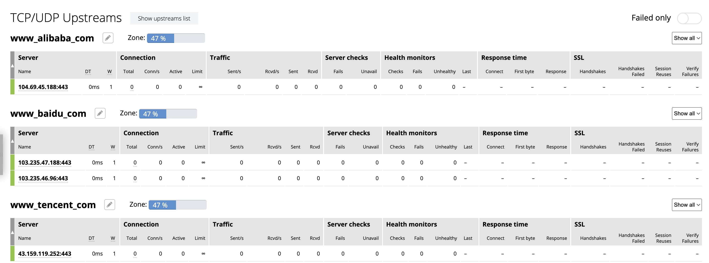

= HOST Based HTTPS Routing
:toc: manual

== NGINX Open Source Subscription

=== Key Configuration

[source, bash]
----
stream {

    map $ssl_preread_server_name $name {
        www.baidu.com            www_baidu_com;
        www.tencent.com          www_tencent_com;
        www.alibaba.com          www_alibaba_com;
        default                  deny_access;
    }

    upstream www_baidu_com {
        server www.baidu.com:443;
    }

    upstream www_tencent_com {
        server www.tencent.com:443;
    }

    upstream www_alibaba_com {
        server www.alibaba.com:443;
    }

    upstream deny_access {
        server 0.0.0.1:1;
    }

    server {
        listen      8443;
        proxy_pass  $name;
        ssl_preread on;
    }
}
----

=== Start NGINX

[source, bash]
----
docker run -it --rm --name test -p 8443:8443 -v /Users/k.song/src/cloud-quickstarts/api-gw/nginx/tls-passthrough/nginx-oss.conf:/etc/nginx/nginx.conf:ro nginx:1.27.1
----

=== Test

[source, bash]
.*Test 1*
----
% curl --resolve www.baidu.com:8443:127.0.0.1 https://www.baidu.com:8443 --insecure -I
HTTP/1.1 302 Found
Connection: keep-alive
Content-Length: 17931
Content-Type: text/html
Date: Thu, 12 Sep 2024 07:33:32 GMT
Etag: "54d9748e-460b"
Server: bfe/1.0.8.18
----

[source, bash]
.*Test 2*
----
% curl --resolve www.alibaba.com:8443:127.0.0.1 https://www.alibaba.com:8443 --insecure -I     
HTTP/2 200 
content-type: text/html;charset=UTF-8
link: <https://s.alicdn.com>; rel=preconnect;
x-content-type-options: nosniff
x-xss-protection: 1; mode=block
cache-control: no-cache, no-store, max-age=0, must-revalidate
pragma: no-cache
expires: 0
x-frame-options: DENY
strict-transport-security: max-age=31536000
timing-allow-origin: *
eagleid: 21016fbf17261264286085361e18e6
server-timing: rt;dur=0.010,eagleid;desc=21016fbf17261264286085361e18e6
access-control-allow-headers: Content-Type, Access-Control-Allow-Headers, Authorization, X-Requested-With
access-control-allow-methods: POST, GET, OPTIONS, DELETE
access-control-allow-credentials: true
date: Thu, 12 Sep 2024 07:33:48 GMT
set-cookie: ali_apache_id=33.1.111.191.1726126428612.407172.6; path=/; domain=.alibaba.com; expires=Wed, 30-Nov-2084 01:01:01 GMT
set-cookie: JSESSIONID=5E58EBE275E8C7E843F6A71CEC8E3DDF; Path=/; HttpOnly
set-cookie: cna=XIdpH/buC18CAS/2pJHJqPLe; Domain=.alibaba.com; Path=/; Expires=Tue, 30-Sep-2092 10:47:55 GMT; Secure; SameSite=None
set-cookie: ug_se_c=organic_1726126428617; Domain=.alibaba.com; Expires=Sun, 21-May-2056 09:20:27 GMT; Path=/; Secure
alt-svc: h3=":443"; ma=2592000
server-timing: akamai;dur=24;desc=cache-miss
object-status: ttl=-1,age=0
edge-type: akamai
----

[source, bash]
.*Test 3*
----
% curl --resolve www.tencent.com:8443:127.0.0.1 https://www.tencent.com:8443 --insecure -I     
HTTP/1.1 200 OK
Content-Type: application/octet-stream
Server: nginx
X-XSS-Protection: 0
Content-Length: 0
Connection: keep-alive
Date: Thu, 12 Sep 2024 07:34:13 GMT
EO-LOG-UUID: 868728983423577587
EO-Cache-Status: MISS
----

== NGINX Plus

=== Key Configuration

[source, bash]
----
stream {

    resolver 114.114.114.114 valid=30s;

    map $ssl_preread_server_name $name {
        www.baidu.com            www_baidu_com;
        www.tencent.com          www_tencent_com;
        www.alibaba.com          www_alibaba_com;
        default                  deny_access;
    }

    upstream www_baidu_com {
        zone www_baidu_com 64k;
        server www.baidu.com:443 resolve;
    }

    upstream www_tencent_com {
        zone www_tencent_com 64k;
        server www.tencent.com:443 resolve;
    }

    upstream www_alibaba_com {
        zone www_alibaba_com 64k;
        server www.alibaba.com:443 resolve;
    }

    upstream deny_access {
        server 0.0.0.1:1;
    }

    server {
        listen      8443;
        status_zone tcp_server;
        proxy_pass  $name;
        ssl_preread on;
    }

}
----

=== Start NGINX

[source, bash]
----
docker run -it --rm --name test -p 8443:8443 -p 8001:8001 -v /Users/k.song/src/cloud-quickstarts/api-gw/nginx/tls-passthrough/nginx-plus.conf:/etc/nginx/nginx.conf:ro private-registry.nginx.com/nginx-plus/base:r32-ubi-9
----

=== Test Access Service

[source, bash]
.*Test 1*
----
% curl --resolve www.baidu.com:8443:127.0.0.1 https://www.baidu.com:8443 --insecure -I
HTTP/1.1 302 Found
Connection: keep-alive
Content-Length: 17931
Content-Type: text/html
Date: Thu, 12 Sep 2024 08:21:42 GMT
Etag: "54d9748e-460b"
Server: bfe/1.0.8.18
----

[source, bash]
.*Test 2*
----
% curl --resolve www.alibaba.com:8443:127.0.0.1 https://www.alibaba.com:8443 --insecure -I
HTTP/2 200 
content-type: text/html;charset=UTF-8
link: <https://s.alicdn.com>; rel=preconnect;
x-content-type-options: nosniff
x-xss-protection: 1; mode=block
cache-control: no-cache, no-store, max-age=0, must-revalidate
pragma: no-cache
expires: 0
x-frame-options: DENY
strict-transport-security: max-age=31536000
timing-allow-origin: *
eagleid: 2102f5be17261293406908550edd9a
server-timing: rt;dur=0.010,eagleid;desc=2102f5be17261293406908550edd9a
access-control-allow-headers: Content-Type, Access-Control-Allow-Headers, Authorization, X-Requested-With
access-control-allow-methods: POST, GET, OPTIONS, DELETE
access-control-allow-credentials: true
date: Thu, 12 Sep 2024 08:22:20 GMT
set-cookie: ali_apache_id=33.2.245.190.1726129340689.622147.9; path=/; domain=.alibaba.com; expires=Wed, 30-Nov-2084 01:01:01 GMT
set-cookie: JSESSIONID=B04CD0BB55B12C881CDFBC40A3BE6944; Path=/; HttpOnly
set-cookie: cna=vJJpH60Qkh4CAS/2pJVE83XA; Domain=.alibaba.com; Path=/; Expires=Tue, 30-Sep-2092 11:36:27 GMT; Secure; SameSite=None
set-cookie: ug_se_c=organic_1726129340700; Domain=.alibaba.com; Expires=Sun, 21-May-2056 10:08:59 GMT; Path=/; Secure
alt-svc: h3=":443"; ma=2592000
server-timing: akamai;dur=32;desc=cache-miss
object-status: ttl=-1,age=0
edge-type: akamai
----

[source, bash]
.*Test 3*
----
% curl --resolve www.tencent.com:8443:127.0.0.1 https://www.tencent.com:8443 --insecure -I
HTTP/1.1 200 OK
Content-Type: application/octet-stream
Server: nginx
X-XSS-Protection: 0
Content-Length: 0
Connection: keep-alive
Date: Thu, 12 Sep 2024 08:22:54 GMT
EO-LOG-UUID: 18172828094686237771
EO-Cache-Status: MISS
----

=== NGINX Observability

== NGINX Ingress

=== Install

Refer to link:../README.adoc[Installation Section] to Install NGINX Ingress Controller to Install NGINX Ingress, Related Configuration as below:

* link:ingress/install/nginx-config.yaml[nginx-config.yaml] - used to define NGINX referenced DNS
* link:ingress/install/nginx-global-config.yaml[nginx-global-config.yaml] - used to define tls passthrough listened port
* link:ingress/install/nginx-plus-ingress.yaml[nginx-plus-ingress.yaml] - used to define nginx ingress deployment
* link:ingress/install/lb.yaml[lb.yaml] - used to expose the nginx ingress 

[source, bash]
.*View NGINX Ingress Service*
----
NAME            TYPE           CLUSTER-IP     EXTERNAL-IP     PORT(S)         AGE
nginx-ingress   LoadBalancer   34.118.234.4   35.184.40.115   443:31138/TCP   58m
----

=== Deploy Service(Dev)

* link:ingress/service-baidu.yam[service-baidu.yam] 
* link:ingress/service-alibaba.yaml[service-alibaba.yaml]
* link:ingress/service-tencent.yaml[service-tencent.yaml]

[source, bash]
----
kubectl apply -f service-baidu.yaml 
kubectl apply -f service-tencent.yaml 
kubectl apply -f service-alibaba.yaml 
----

[source, bash]
.*View External Service*
----
NAME                       TYPE           CLUSTER-IP   EXTERNAL-IP       PORT(S)   AGE
external-service-alibaba   ExternalName   <none>       www.alibaba.com   <none>    29m
external-service-baidu     ExternalName   <none>       www.baidu.com     <none>    21m
external-service-tencent   ExternalName   <none>       www.tencent.com   <none>    21m
----

=== Deliver Service(Ops)

* link:ingress/ts-baidu.yam[ts-baidu.yam]        
* link:ingress/ts-alibaba.yaml[ts-alibaba.yaml]
* link:ingress/ts-tencent.yaml[ts-tencent.yaml]

[source, bash]
----
kubectl apply -f ts-baidu.yaml 
kubectl apply -f ts-alibaba.yaml 
kubectl apply -f ts-tencent.yaml 
----

[source, bash]
.*View TransportServer*
----
$ kubectl get TransportServer -n cmbc
NAME      STATE   REASON           AGE
alibaba   Valid   AddedOrUpdated   31m
baidu     Valid   AddedOrUpdated   24m
tencent   Valid   AddedOrUpdated   23m
----

=== Test Access Service

[source, bash]
.*Test baidu*
----
% curl --resolve www.baidu.com:443:$IP https://www.baidu.com --insecure -I
HTTP/1.1 200 OK
Accept-Ranges: bytes
Cache-Control: private, no-cache, no-store, proxy-revalidate, no-transform
Connection: keep-alive
Content-Length: 277
Content-Type: text/html
Date: Fri, 13 Sep 2024 04:02:52 GMT
Etag: "575e1f6f-115"
Last-Modified: Mon, 13 Jun 2016 02:50:23 GMT
Pragma: no-cache
Server: bfe/1.0.8.18
----

[source, bash]
.*Test Alibaba*
----
% curl --resolve www.alibaba.com:443:$IP https://www.alibaba.com --insecure -I
HTTP/2 200 
content-type: text/html;charset=UTF-8
link: <https://s.alicdn.com>; rel=preconnect;
x-content-type-options: nosniff
x-xss-protection: 1; mode=block
cache-control: no-cache, no-store, max-age=0, must-revalidate
pragma: no-cache
expires: 0
x-frame-options: DENY
strict-transport-security: max-age=31536000
timing-allow-origin: *
eagleid: 2103270717262002866734883ef916
server-timing: rt;dur=0.008,eagleid;desc=2103270717262002866734883ef916
access-control-allow-headers: Content-Type, Access-Control-Allow-Headers, Authorization, X-Requested-With
access-control-allow-methods: POST, GET, OPTIONS, DELETE
access-control-allow-credentials: true
date: Fri, 13 Sep 2024 04:04:46 GMT
set-cookie: ali_apache_id=33.3.39.7.1726200286673.480882.4; path=/; domain=.alibaba.com; expires=Wed, 30-Nov-2084 01:01:01 GMT
set-cookie: JSESSIONID=9ACFDBF2E8B06FD0DFF501A2B950A1A9; Path=/; HttpOnly
set-cookie: cna=3qdqH10fPykCAS/2gNxdAX8q; Domain=.alibaba.com; Path=/; Expires=Wed, 01-Oct-2092 07:18:53 GMT; Secure; SameSite=None
set-cookie: ug_se_c=organic_1726200286680; Domain=.alibaba.com; Expires=Mon, 22-May-2056 05:51:25 GMT; Path=/; Secure
alt-svc: h3=":443"; ma=2592000
server-timing: akamai;dur=23;desc=cache-miss
object-status: ttl=-1,age=0
edge-type: akamai
----

[source, bash]
.*Test Tencent*
----
% curl --resolve www.tencent.com:443:$IP https://www.tencent.com --insecure -I
HTTP/1.1 200 OK
Content-Type: application/octet-stream
Server: nginx
X-XSS-Protection: 0
Content-Length: 0
Connection: keep-alive
Date: Fri, 13 Sep 2024 04:05:18 GMT
EO-LOG-UUID: 14658198949084812091
EO-Cache-Status: MISS
----

=== Review NGINX Configuration

[source, bash]
----
upstream ts_cmbc_alibaba_external-alibaba {
    zone ts_cmbc_alibaba_external-alibaba 512k;
    random two least_conn;
    server www.alibaba.com:443 max_fails=1 fail_timeout=10s max_conns=0 resolve;
}
server {
    listen unix:/var/lib/nginx/passthrough-cmbc_alibaba.sock proxy_protocol;
    set_real_ip_from unix:;
    status_zone www.alibaba.com;
    proxy_pass ts_cmbc_alibaba_external-alibaba;
    proxy_timeout 10m;
    proxy_connect_timeout 60s;
}
    zone ts_cmbc_baidu_external-baidu 512k;
    random two least_conn;
    server www.baidu.com:443 max_fails=1 fail_timeout=10s max_conns=0 resolve;
}
server {
    listen unix:/var/lib/nginx/passthrough-cmbc_baidu.sock proxy_protocol;
    set_real_ip_from unix:;
    status_zone www.baidu.com;
    proxy_pass ts_cmbc_baidu_external-baidu;
    proxy_timeout 10m;
    proxy_connect_timeout 60s;
}
    zone ts_cmbc_tencent_external-tencent 512k;
    random two least_conn;
    server www.tencent.com:443 max_fails=1 fail_timeout=10s max_conns=0 resolve;
}
server {
    listen unix:/var/lib/nginx/passthrough-cmbc_tencent.sock proxy_protocol;
    set_real_ip_from unix:;
    status_zone www.tencent.com;
    proxy_pass ts_cmbc_tencent_external-tencent;
    proxy_timeout 10m;
    proxy_connect_timeout 60s;
}
----

* link:ingress/conf/nginx-origin.conf[nginx-origin.conf]
* link:ingress/conf/nginx-ts.conf[nginx-ts.conf]

== NGINX Gateway

=== Install

[source, bash]
.*1. Install the Gateway API resources*
----
kubectl kustomize "https://github.com/nginxinc/nginx-gateway-fabric/config/crd/gateway-api/standard?ref=v1.4.0" | kubectl apply -f -
----

[source, bash]
.*2. Deploy the NGINX Gateway Fabric CRDs*
----
kubectl apply -f https://raw.githubusercontent.com/nginxinc/nginx-gateway-fabric/v1.4.0/deploy/crds.yaml
----

[source, bash]
.*3. Deploy NGINX Gateway Fabric*
----
kubectl apply -f https://raw.githubusercontent.com/nginxinc/nginx-gateway-fabric/v1.4.0/deploy/default/deploy.yaml
----

[source, bash]
.*4. Verify the Deployment*
----
$ kubectl get pods -n nginx-gateway
NAME                           READY   STATUS    RESTARTS   AGE
nginx-gateway-7bbb54d7-978xs   2/2     Running   0          40s
----

=== Deploy External Serives

link:gw/tls-toute.yaml[tls-toute.yaml]

[source, bash]
----
kubectl apply -f tls-toute.yaml
----

