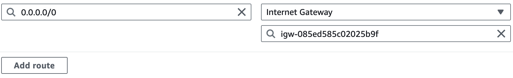
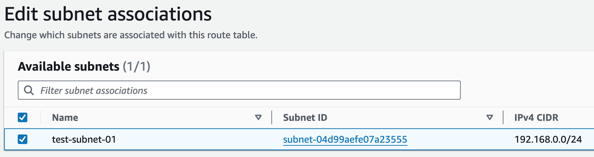

= Launch an EC2 Instance in a Virtual Private Cloud (VPC)
:toc: manual

== Create a VPC

1. Navigate to *VPC* > *Your VPCs*.
2. Click *Create VPC*, and set the following values:
* Select: `VPC Only`
* Name tag: `test-vpc`
* IPv4 CIDR block: `192.168.0.0/20`
3. Leave the IPv6 CIDR block and Tenancy fields as their default values.
4. Click `Create VPC`.

image:img/aws-vpc-700-700.jpg[Image,700,700]

== Create a Public Subnet

1. Click *Subnets* in the left-hand menu.
2. Click *Create subnet*, and set the following values:
* VPC ID: `test-vpc`
* Subnet name: `test-subnet-01`
* Availability Zone: `us-east-1b`
* IPv4 CIDR block: `192.168.0.0/24`
3. Click *Create subnet*.

image:img/aws-vpc-subnet-600-345.jpg[Image,600,345]

== Create Routes and Configure Internet Gateway

1. With `test-subnet-01` selected, click *Actions* > *Edit subnet settings*.
2. Check the box to *Enable auto-assign public IPv4 address*.
3. Click *Save*.

image:img/aws-vpc-route-732-176.jpg[Image,732,176]

4. Click *Internet Gateways* in the left-hand menu.
5. Click *Create internet gateway*.
6. Set Name tag as `test-internet-gateway`.
7. Click *Create internet gateway*.

image:img/aws-vpc-internet-ga-600-130.jpg[Image,600,130]

8. On the next screen, click *Actions* > *Attach to VPC*.
9. In the Available VPCs dropdown, select `test-vpc`.
10. Click *Attach internet gateway*.
11. Click *Route Tables* in the left-hand menu.
12. Click *Create route table*, and set the following values:
* Name: `test-vpc-public-route`
* VPC: `test-vpc`
13. Click *Create route table*.

image:img/aws-vpc-route-table-setting-600-200.jpg[Image,600,200]

14. On the next screen, click *Edit routes*.
15. Click *Add route*, and set the following values:
* Destination: `0.0.0.0/0`
* Target: `Internet Gateway`, `test-internet-gateway`
16. Click *Save changes*.

17. Click the *Subnet associations* tab.
18. Click *Edit subnet associations*.
19. Select the box for `test-public-subnet`.
20. Click *Save associations*.

== Launch EC2 Instance in Subnet

1. Navigate to *EC2* > *Instances*.
2. Click *Launch instances*.
3. EC2 Instance name `test-public-instance`.
4. On the AMI page, select the Amazon Linux AMI.
5. Ensure t2.micro is selected.
6. Click *Create new key pair*.
7. Give it a Key pair name of `test-key-pair`.
8. Click *Create Key Pair*.
9. Click Advanced Networking setting, add 2 security rule, allow http and ssh
10. Click *Launch Instance*.

image:img/aws-ec2-instance-758-520.jpg[Image,758,520]

== Set up Application

1. In the EC2 Instance list, select `test-public-instance`
2. Click *Connect*
3. With the Default settings and click *Connect*
4. In the online SSH console execute `sudo yum install nginx -y ; sudo systemctl start nginx`
5. Test application via curl as below

[source, bash]
----
% curl http://$EC2_PUBLIC_IP -I
HTTP/1.1 200 OK
Server: nginx/1.24.0
Date: Tue, 20 Aug 2024 14:12:02 GMT
Content-Type: text/html
Content-Length: 615
Last-Modified: Fri, 13 Oct 2023 13:33:26 GMT
Connection: keep-alive
ETag: "65294726-267"
Accept-Ranges: bytes
----
