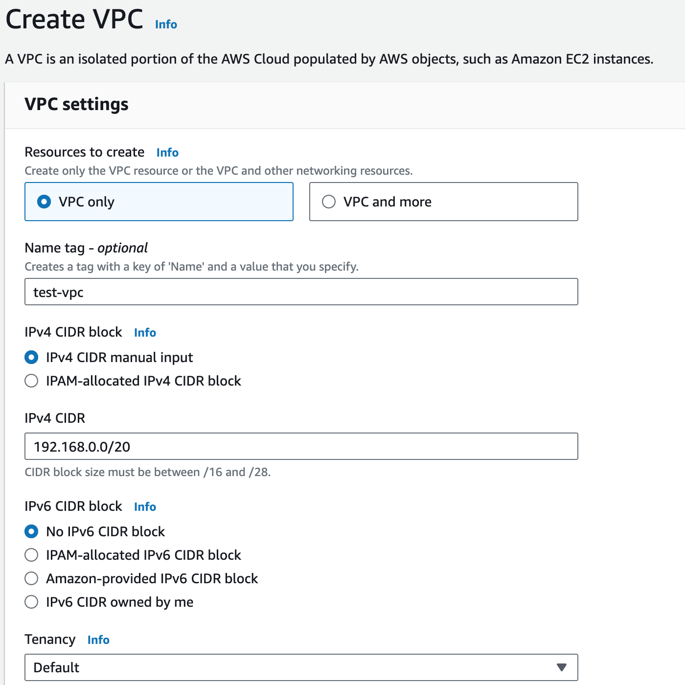
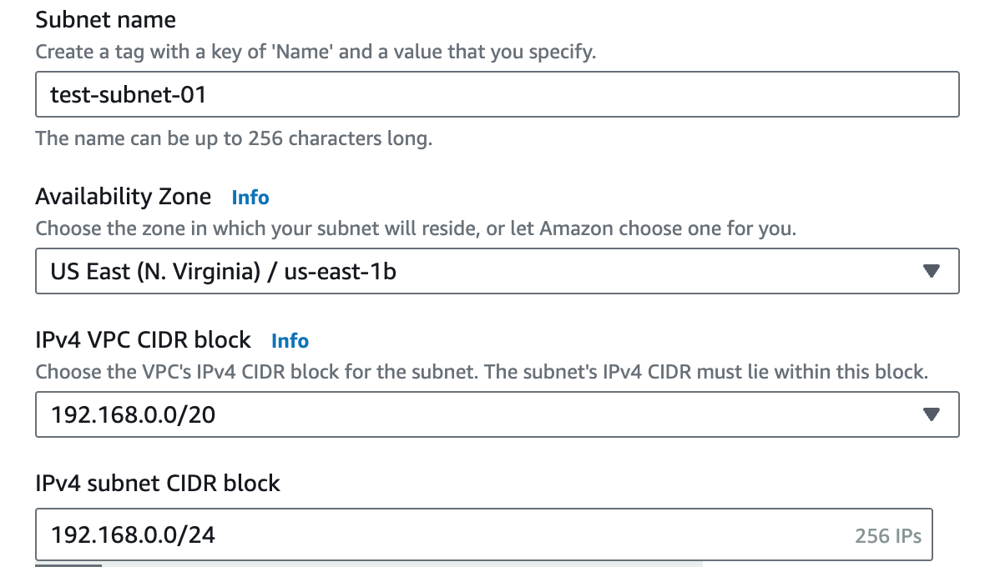
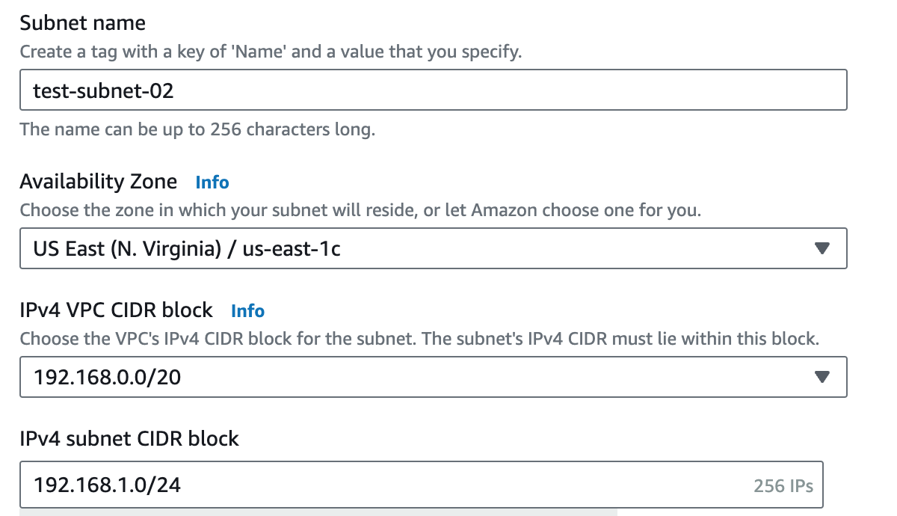
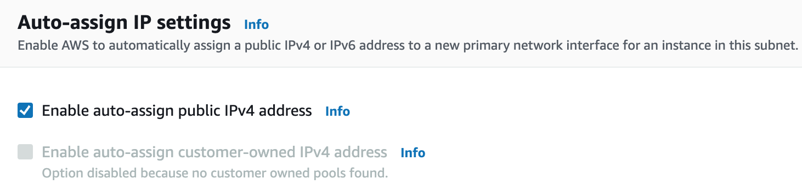
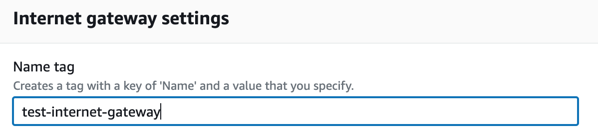
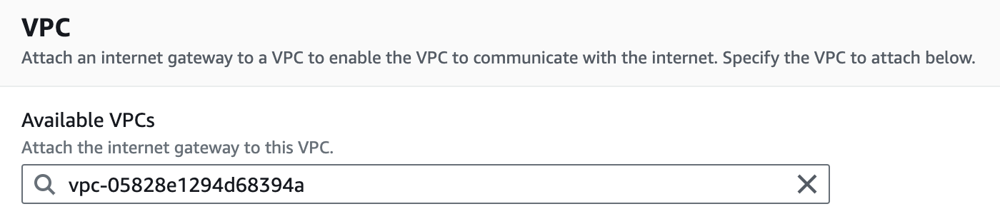
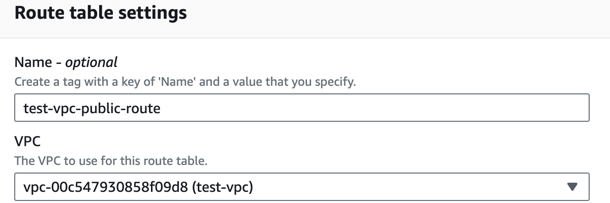
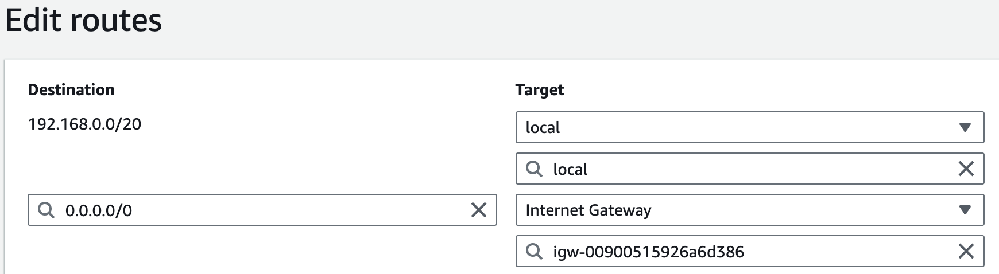
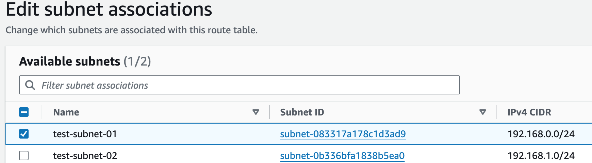
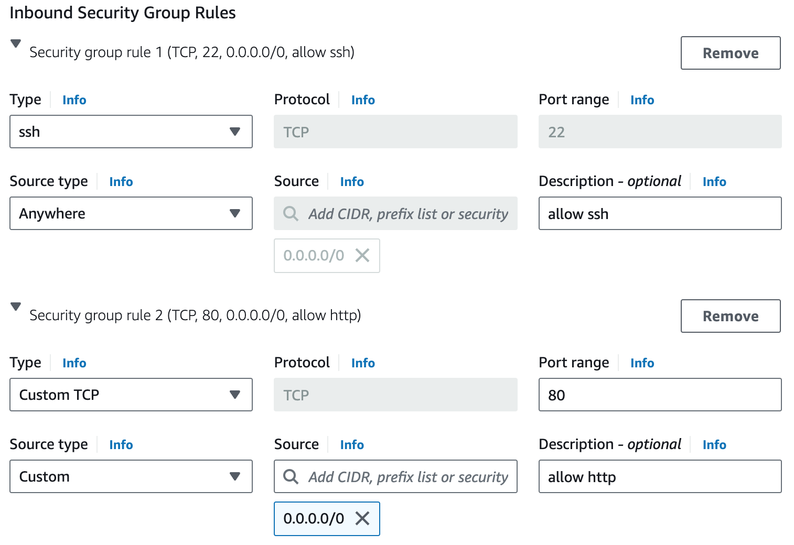

= Virtual Private Cloud (VPC)
:toc: manual

== Create a VPC

1. Navigate to *VPC* > *Your VPCs*.
2. Click *Create VPC*, and set the following values:
* Select: `VPC Only`
* Name tag: `test-vpc`
* IPv4 CIDR block: `192.168.0.0/20`
3. Leave the IPv6 CIDR block and Tenancy fields as their default values.
4. Click `Create VPC`.

== Create Subnets

In this section will create 2 subnets `test-subnet-01` and `test-subnet-02`, one for public, and the other for private.

1. Click *Subnets* in the left-hand menu.
2. Click *Create subnet*, and set the following values:
* VPC ID: `test-vpc`
* Subnet name: `test-subnet-01`
* Availability Zone: `us-east-1b`
* IPv4 CIDR block: `192.168.0.0/24`

1. Click *Add new subnet*
2. Under *Subnet 2 of 2*, set the following fields:
* VPC ID: `test-vpc`
* Subnet name: `test-subnet-02`
* Availability Zone: `us-east-1c`
* IPv4 CIDR block: `192.168.1.0/24`

1. Click *Create subnet*.

== Create Routes and Internet Gateway

=== Enable Auto-assign public IPv4 addresses

1. From the Subnets page, in the left-hand menu, select *Subnets*.
2. With `test-subnet-01` selected, click *Actions* > *Edit subnet settings*.
3. Check the box to *Enable auto-assign public IPv4 address*.
4. Click *Save*.

=== Configure an Internet Gateway

Internet Gateways allows communication between instances in your VPC and the internet, enabling internet access for your resources.

1. Click *Internet Gateways* in the left-hand menu.
2. Click *Create internet gateway*.
3. Set Name tag as `test-internet-gateway`.
4. Click *Create internet gateway*.

1. From the internet gateway's page, in the top right, click *Actions* > *Attach to VPC*.
2. In the Available VPCs dropdown, select `test-vpc`.
3. Click *Attach internet gateway*.

=== Configuring a Public Route Table

Route Tables in AWS contain a set of rules (routes) that determine where network traffic from associated subnets are directed, such as to the internet via an Internet Gateway or between subnets.

1. Click *Route Tables* in the left-hand menu.
2. Click *Create route table*, and set the following values:
* Name: `test-vpc-public-route`
* VPC: `test-vpc`
3. Click *Create route table*.

1. On the next screen, click *Edit routes*.
2. Click *Add route*, and set the following values:
* Destination: `0.0.0.0/0`
* Target: `Internet Gateway`, `test-internet-gateway`
3. Click *Save changes*.

Note that, there are routes in the Route Table, one for local traffic routing, the other for route internal network traffic to internet.

=== Associate the Public Route Table with the Public Subnet

1. Click the *Subnet associations* tab.
2. Click *Edit subnet associations*.
3. Select the box for `test-public-subnet`.
4. Click *Save associations*.

== Launch EC2 Instance in Subnet

1. Navigate to *EC2* > *Instances*.
2. Click *Launch instances*.
3. EC2 Instance name `test-public-instance`.
4. On the AMI page, select the Amazon Linux AMI.
5. Ensure t2.micro is selected.
6. Click *Create new key pair*.
7. Give it a Key pair name of `test-key-pair`.
8. Click *Create Key Pair*.
9. Click Advanced Networking setting, add 2 security rule, allow http and ssh
10. Click *Launch Instance*.

== Set up Application

1. In the EC2 Instance list, select `test-public-instance`
2. Click *Connect*
3. With the Default settings and click *Connect*
4. In the online SSH console execute `sudo yum install nginx -y ; sudo systemctl start nginx`
5. Test application via curl as below

[source, bash]
----
% curl http://$EC2_PUBLIC_IP -I
HTTP/1.1 200 OK
Server: nginx/1.24.0
Date: Tue, 20 Aug 2024 14:12:02 GMT
Content-Type: text/html
Content-Length: 615
Last-Modified: Fri, 13 Oct 2023 13:33:26 GMT
Connection: keep-alive
ETag: "65294726-267"
Accept-Ranges: bytes
----
