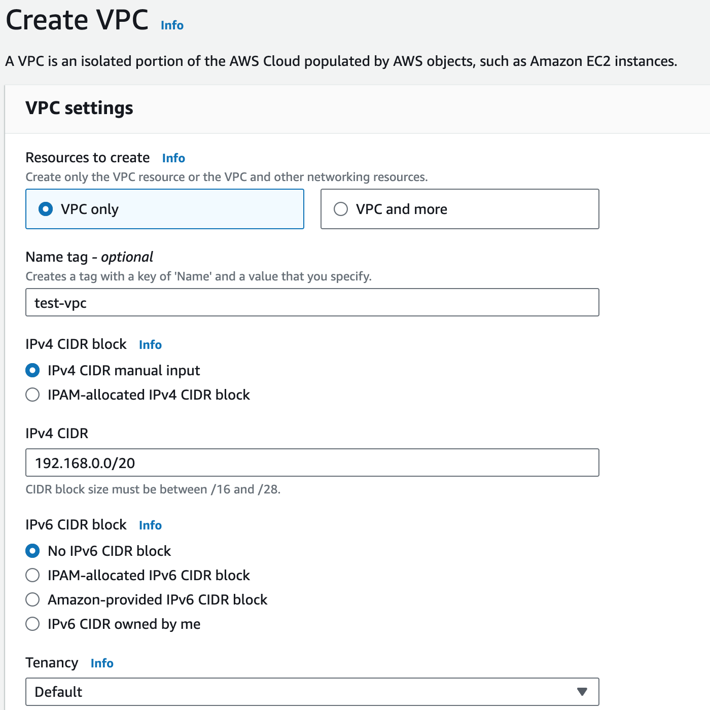
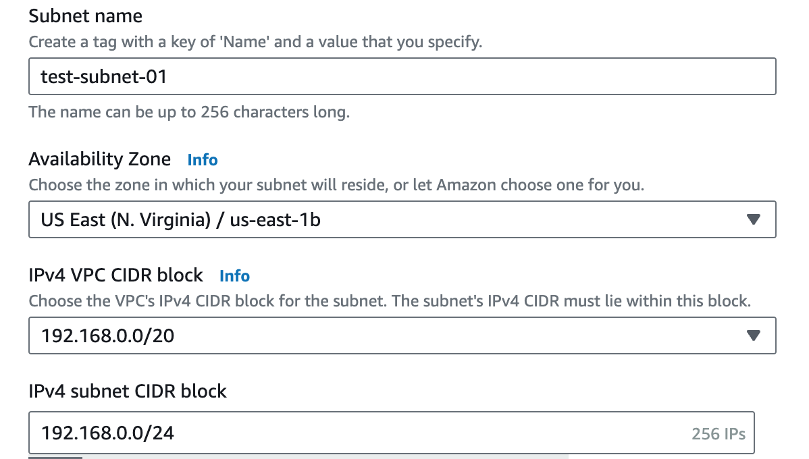
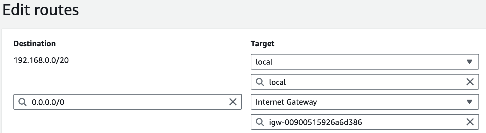
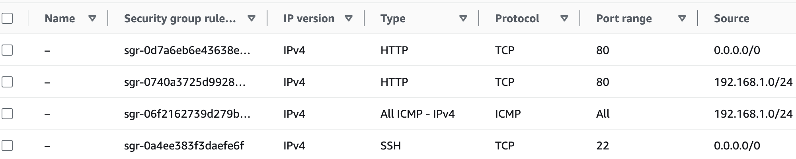
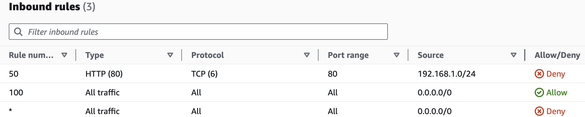
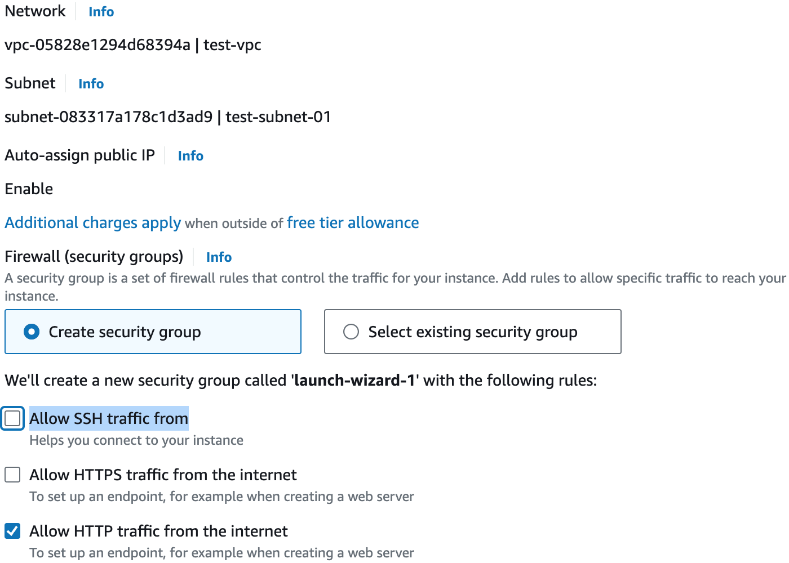
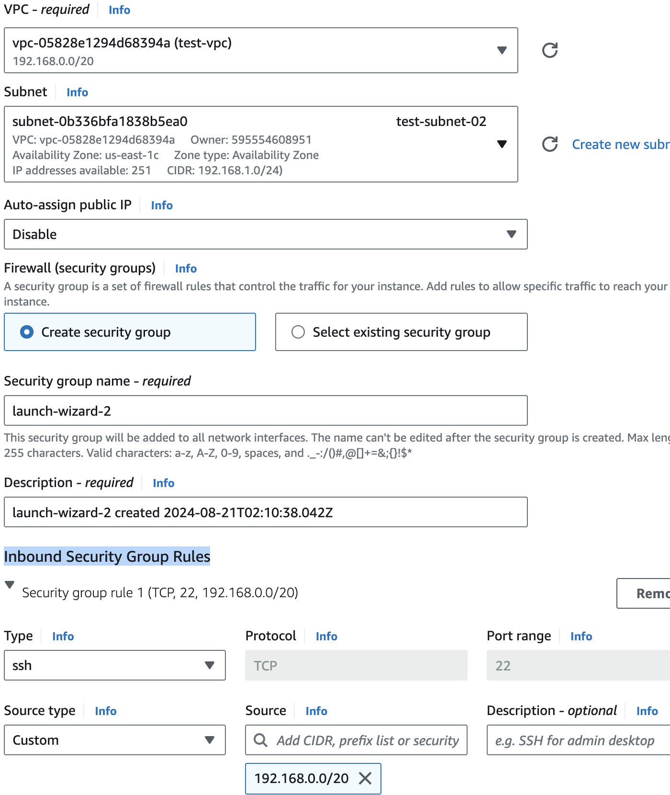

= Virtual Private Cloud (VPC)
:toc: manual

== Create a VPC

1. Navigate to *VPC* > *Your VPCs*.
2. Click *Create VPC*, and set the following values:
* Select: `VPC Only`
* Name tag: `test-vpc`
* IPv4 CIDR block: `192.168.0.0/20`
3. Leave the IPv6 CIDR block and Tenancy fields as their default values.
4. Click `Create VPC`.

== Create Subnets

In this section will create 2 subnets `test-subnet-01` and `test-subnet-02`, one for public, and the other for private.

1. Click *Subnets* in the left-hand menu.
2. Click *Create subnet*, and set the following values:
* VPC ID: `test-vpc`
* Subnet name: `test-subnet-01`
* Availability Zone: `us-east-1b`
* IPv4 CIDR block: `192.168.0.0/24`

1. Click *Add new subnet*
2. Under *Subnet 2 of 2*, set the following fields:
* VPC ID: `test-vpc`
* Subnet name: `test-subnet-02`
* Availability Zone: `us-east-1c`
* IPv4 CIDR block: `192.168.1.0/24`

image:img/aws-vpc-subnet-private-600-345.jpg[Image,600,345]

1. Click *Create subnet*.

== Create Routes and Internet Gateway

=== Enable Auto-assign public IPv4 addresses

1. From the Subnets page, in the left-hand menu, select *Subnets*.
2. With `test-subnet-01` selected, click *Actions* > *Edit subnet settings*.
3. Check the box to *Enable auto-assign public IPv4 address*.
4. Click *Save*.

image:img/aws-vpc-route-732-176.jpg[Image,732,176]

=== Configure an Internet Gateway

Internet Gateways allows communication between instances in your VPC and the internet, enabling internet access for your resources.

1. Click *Internet Gateways* in the left-hand menu.
2. Click *Create internet gateway*.
3. Set Name tag as `test-internet-gateway`.
4. Click *Create internet gateway*.

image:img/aws-vpc-internet-ga-600-130.jpg[Image,600,130]

1. From the internet gateway's page, in the top right, click *Actions* > *Attach to VPC*.
2. In the Available VPCs dropdown, select `test-vpc`.
3. Click *Attach internet gateway*.

image:img/aws-vpc-attach-internet-gw-to-vpc.jpg[Image,700,150]

=== Configuring a Public Route Table

Route Tables in AWS contain a set of rules (routes) that determine where network traffic from associated subnets are directed, such as to the internet via an Internet Gateway or between subnets.

1. Click *Route Tables* in the left-hand menu.
2. Click *Create route table*, and set the following values:
* Name: `test-vpc-public-route`
* VPC: `test-vpc`
3. Click *Create route table*.

image:img/aws-vpc-route-table-setting-600-200.jpg[Image,600,200]

1. On the next screen, click *Edit routes*.
2. Click *Add route*, and set the following values:
* Destination: `0.0.0.0/0`
* Target: `Internet Gateway`, `test-internet-gateway`
3. Click *Save changes*.

Note that, there are routes in the Route Table, one for local traffic routing, the other for route internal network traffic to internet.

=== Associate the Public Route Table with the Public Subnet

1. Click the *Subnet associations* tab.
2. Click *Edit subnet associations*.
3. Select the box for `test-public-subnet`.
4. Click *Save associations*.

image:img/aws-vpc-route-subnet-associations.jpg[Image,870,240]

== Security Control

=== Use Security Group to control Internal Access

Skip this section till the *VPC Testing* hints to do.

1. Select `test-public-instance` related Security Group
2. Click *Inbound rules*
3. Click *Add rule* to add Allow SSH and HTTP from `192.168.1.0/24`
4. Click *Save rules*
5. There will be 4 rules displayed

 

=== Use Network ACLs to control Internal Access

Skip this section till the *VPC Testing* hints to do.

1. Naviate to VPC Dashboard
2. Click the *Network ACLs* in the left-hand menu.
3. Select the existed Network ACLs
4. Click *Edit Inbound rules*, set deny the HTTP from `192.168.1.0/24`
5. Click *Save rules*

== VPC Testing

=== Launch EC2 Instances

1. Navigate to *EC2* > *Instances*.
2. Click *Launch instances*.
3. EC2 Instance name `test-public-instance`.
4. On the AMI page, select the Amazon Linux AMI.
5. Ensure t2.micro is selected.
6. Click *Create new key pair*.
7. Give it a Key pair name of `test-key-pair`.
8. Click *Create Key Pair*.
9. In *Networking settings* section, make sure both `Allow SSH traffic from` and `Allow HTTP traffic from internet` are selected
10. Click *Launch Instance*.

1. Navigate to *EC2* > *Instances*.
2. Click *Launch instances*.
3. EC2 Instance name `test-private-instance`.
4. On the AMI page, select the Amazon Linux AMI.
5. Ensure t2.micro is selected.
6. Click *Create new key pair*.
7. Give it a Key pair name of `test-key-pair-private`.
8. Click *Create Key Pair*.
9. In the *Networking settings* section, click *Edit* and select
* VPC: `test-vpc`
* Subnet: `test-subnet-02`
* Inbound Security Group Rules: Source Type as `Custom`, Source as `192.168.0.0/20`
10. Click *Launch Instance*.

=== Test Connect EC2 Instance from AWS Console

1. In the EC2 Instance list, select `test-public-instance`
2. Click *Connect*
3. With the Default settings and click *Connect*
4. In the online SSH console execute `sudo yum install nginx -y ; sudo systemctl start nginx`

=== Test Access EC2 Instance Application

1. Copy the public ip address from `test-public-instance`
2. Test application via curl as below

[source, bash]
----
% curl http://$EC2_PUBLIC_IP -I
HTTP/1.1 200 OK
Server: nginx/1.24.0
Date: Wed, 21 Aug 2024 02:18:59 GMT
Content-Type: text/html
Content-Length: 615
Last-Modified: Fri, 13 Oct 2023 13:33:26 GMT
Connection: keep-alive
ETag: "65294726-267"
Accept-Ranges: bytes
----

=== Test SSH remote connect to EC2 Instance

1. Chmod the `test-key-pair.pem`, make sure the key pair is not public viewable via `chmod 400 test-key-pair.pem`
2. SSH connect to `test-public-instance` via `ssh -i "test-key-pair.pem" ec2-user@$EC2_PUBLIC_IP`, and you will ssh to the `test-key-pair.pem`

[source, bash]
----
   ,     #_
   ~\_  ####_        Amazon Linux 2023
  ~~  \_#####\
  ~~     \###|
  ~~       \#/ ___   https://aws.amazon.com/linux/amazon-linux-2023
   ~~       V~' '->
    ~~~         /
      ~~._.   _/
         _/ _/
       _/m/'
Last login: Wed Aug 21 02:18:19 2024 from 18.206.107.27
[ec2-user@ip-192-168-0-21 ~]$
----

=== Test SSH remote connect to private EC2 Instance

1. Use the step in *Test SSH remote connect to EC2 Instance* connect to a public EC2 Instance
2. create a file test-key-pair-private.pem, add the download contents from `test-key-pair-private.pem` in above steps
3. ssh to private ec2 instance

[source, bash]
----
$ chmod 400 test-key-pair-private.pem 
$ ls -l test-key-pair-private.pem
$ ssh -i test-key-pair-private.pem ec2-user@192.168.1.228
   ,     #_
   ~\_  ####_        Amazon Linux 2023
  ~~  \_#####\
  ~~     \###|
  ~~       \#/ ___   https://aws.amazon.com/linux/amazon-linux-2023
   ~~       V~' '->
    ~~~         /
      ~~._.   _/
         _/ _/
       _/m/'
[ec2-user@ip-192-168-1-228 ~]$
----

=== Test connectivity between subnets

1. Finish the setps in *Use Security Group to control Internal Access* section
2. ping test-public-instance private ip
3. access the http service on test-public-instance

[source, bash]
----
[ec2-user@ip-192-168-1-228 ~]$ ping 192.168.0.21 -c3
PING 192.168.0.21 (192.168.0.21) 56(84) bytes of data.
64 bytes from 192.168.0.21: icmp_seq=1 ttl=127 time=0.984 ms
64 bytes from 192.168.0.21: icmp_seq=2 ttl=127 time=0.930 ms
64 bytes from 192.168.0.21: icmp_seq=3 ttl=127 time=0.956 ms

[ec2-user@ip-192-168-1-228 ~]$ curl 192.168.0.21 -I
HTTP/1.1 200 OK
Server: nginx/1.24.0
Date: Wed, 21 Aug 2024 02:55:20 GMT
Content-Type: text/html
Content-Length: 615
Last-Modified: Fri, 13 Oct 2023 13:33:26 GMT
Connection: keep-alive
ETag: "65294726-267"
Accept-Ranges: bytes
----

=== Test Network ACLs block internal connectivity between subnets

1. Finish the setps in *Use Network ACLs to control Internal Access* section
2. Access the http service on test-public-instance
3. The Http Access be blocked

[source, bash]
----
[ec2-user@ip-192-168-1-228 ~]$ curl 192.168.0.21 -m 3
curl: (28) Connection timed out after 3002 milliseconds
----
