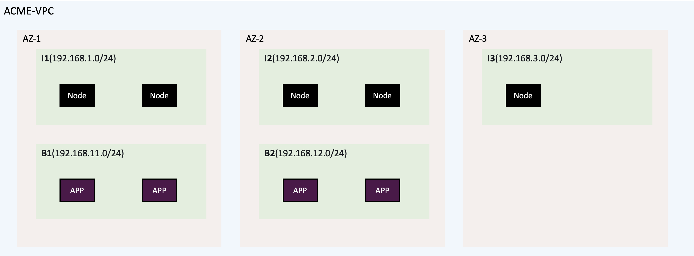

= VPC Basic Networking
:toc: manual

== Network Topology

== Setup Networking via CLI

[source, bash]
.*create vpc*
----
aws ec2 create-vpc --cidr-block 192.168.0.0/20 --tag-specifications 'ResourceType=vpc,Tags=[{Key=Name,Value=ACME-VPC}]'
----

[source, bash]
.*create internet gaytway*
----
aws ec2 create-internet-gateway --tag-specifications 'ResourceType=internet-gateway,Tags=[{Key=Name,Value=IGW}]'
aws ec2 attach-internet-gateway --internet-gateway-id igw-0ebad86890a5efe35 --vpc-id vpc-043cbcf5d1a9ccb13
----

NOTE: All `--*-id` referenced value should be replaced in this section, the id value can be extract from commands output. 

[source, bash]
.*create public subnet*
----
aws ec2 create-subnet --vpc-id vpc-043cbcf5d1a9ccb13 --cidr-block 192.168.1.0/24 --availability-zone us-east-1a --tag-specifications 'ResourceType=subnet,Tags=[{Key=Name,Value=I1}]'
aws ec2 create-subnet --vpc-id vpc-043cbcf5d1a9ccb13 --cidr-block 192.168.2.0/24 --availability-zone us-east-1b --tag-specifications 'ResourceType=subnet,Tags=[{Key=Name,Value=I2}]'
aws ec2 create-subnet --vpc-id vpc-043cbcf5d1a9ccb13 --cidr-block 192.168.3.0/24 --availability-zone us-east-1c --tag-specifications 'ResourceType=subnet,Tags=[{Key=Name,Value=I3}]'

aws ec2 modify-subnet-attribute --subnet-id subnet-027a0395dec8dd6cb --map-public-ip-on-launch
aws ec2 modify-subnet-attribute --subnet-id subnet-0b5e2909983ab8dbb --map-public-ip-on-launch
aws ec2 modify-subnet-attribute --subnet-id subnet-07eb0b7f9d0c248f0 --map-public-ip-on-launch
----

[source, bash]
.*create private subnet*
----
aws ec2 create-subnet --vpc-id vpc-043cbcf5d1a9ccb13 --cidr-block 192.168.11.0/24 --availability-zone us-east-1a --tag-specifications 'ResourceType=subnet,Tags=[{Key=Name,Value=B1}]'
aws ec2 create-subnet --vpc-id vpc-043cbcf5d1a9ccb13 --cidr-block 192.168.12.0/24 --availability-zone us-east-1b --tag-specifications 'ResourceType=subnet,Tags=[{Key=Name,Value=B2}]'
----

[source, bash]
.*create route to make public subnet servere access internet*
----
aws ec2 create-route-table --vpc-id vpc-043cbcf5d1a9ccb13 --tag-specifications 'ResourceType=route-table,Tags=[{Key=Name,Value=PublicRT}]'

aws ec2 associate-route-table --route-table-id rtb-06f8286600e4c445d --subnet-id subnet-027a0395dec8dd6cb
aws ec2 associate-route-table --route-table-id rtb-06f8286600e4c445d --subnet-id subnet-0b5e2909983ab8dbb
aws ec2 associate-route-table --route-table-id rtb-06f8286600e4c445d --subnet-id subnet-07eb0b7f9d0c248f0

aws ec2 create-route --route-table-id rtb-06f8286600e4c445d --destination-cidr-block 0.0.0.0/0 --gateway-id igw-0ebad86890a5efe35
----

[source, bash]
.*create security group for production DMZ(I1, I2)*
----
aws ec2 create-security-group --group-name production-dmz --description "Security group for Production DMZ" --vpc-id vpc-043cbcf5d1a9ccb13
aws ec2 authorize-security-group-ingress --group-id sg-0534112799e3f0cc8 --protocol tcp --port 80 --cidr 0.0.0.0/0
aws ec2 authorize-security-group-ingress --group-id sg-0534112799e3f0cc8 --protocol tcp --port 22 --cidr 192.168.3.0/24
aws ec2 authorize-security-group-ingress --group-id sg-0534112799e3f0cc8 --protocol icmp --port 1 --cidr 192.168.3.0/24
----

[source, bash]
.*create security group for test(I3)*
----
aws ec2 create-security-group --group-name testing-I3 --description "Security group for testing" --vpc-id vpc-043cbcf5d1a9ccb13
aws ec2 authorize-security-group-ingress --group-id sg-092d213ac5d2f6048 --protocol all --port all --cidr 0.0.0.0/0
----

[source, bash]
.*create security group for B1*
----
aws ec2 create-security-group --group-name production-backend-B1 --description "Security group for B1" --vpc-id vpc-043cbcf5d1a9ccb13
aws ec2 authorize-security-group-ingress --group-id sg-07fb01d77e0879560 --protocol tcp --port 80 --cidr 192.168.1.0/24
aws ec2 authorize-security-group-ingress --group-id sg-07fb01d77e0879560 --protocol tcp --port 80 --cidr 192.168.3.0/24
aws ec2 authorize-security-group-ingress --group-id sg-07fb01d77e0879560 --protocol tcp --port 22 --cidr 192.168.3.0/24
aws ec2 authorize-security-group-ingress --group-id sg-07fb01d77e0879560 --protocol icmp --port 1 --cidr 192.168.3.0/24
----

[source, bash]
.*create security group for B2*
----
aws ec2 create-security-group --group-name production-backend-B2 --description "Security group for B2" --vpc-id vpc-043cbcf5d1a9ccb13
aws ec2 authorize-security-group-ingress --group-id sg-0322098e4aed9ff2d --protocol tcp --port 80 --cidr 192.168.2.0/24
aws ec2 authorize-security-group-ingress --group-id sg-0322098e4aed9ff2d --protocol tcp --port 80 --cidr 192.168.3.0/24
aws ec2 authorize-security-group-ingress --group-id sg-0322098e4aed9ff2d --protocol tcp --port 22 --cidr 192.168.3.0/24
aws ec2 authorize-security-group-ingress --group-id sg-0322098e4aed9ff2d --protocol icmp --port 1 --cidr 192.168.3.0/24
----

