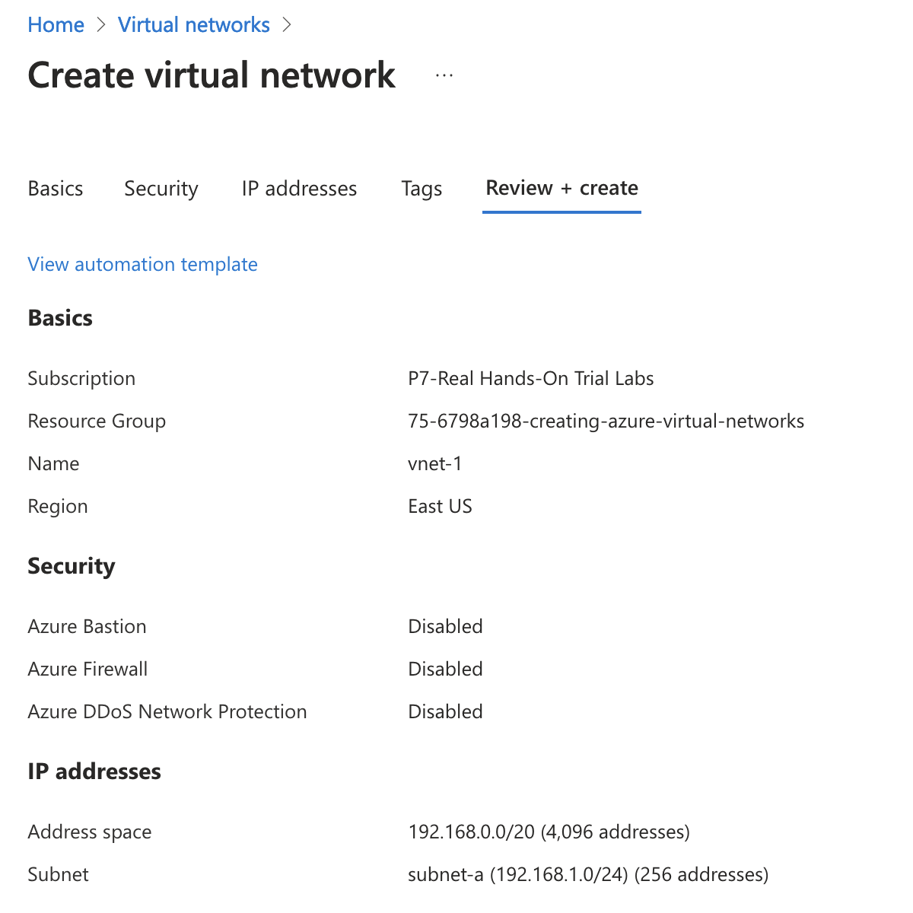
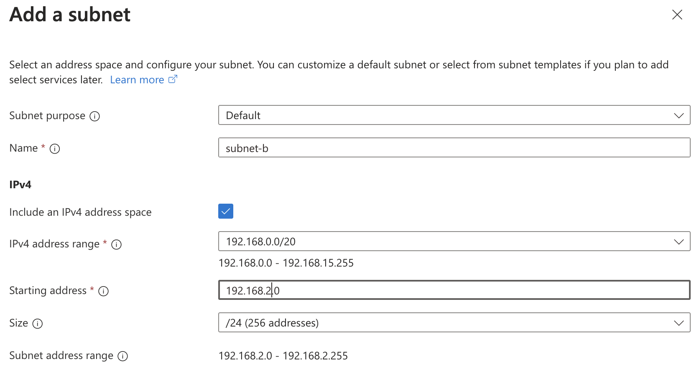
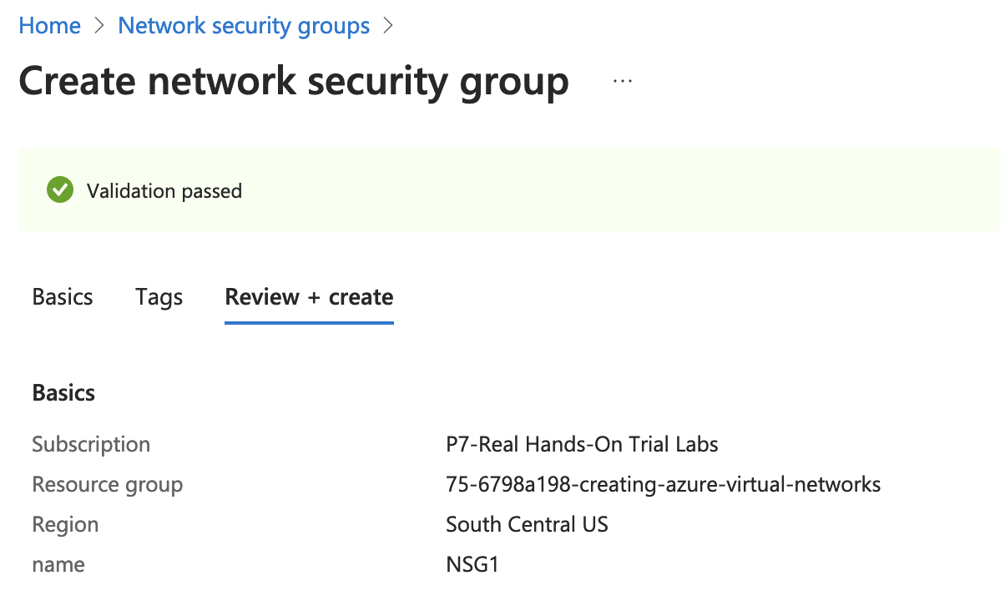
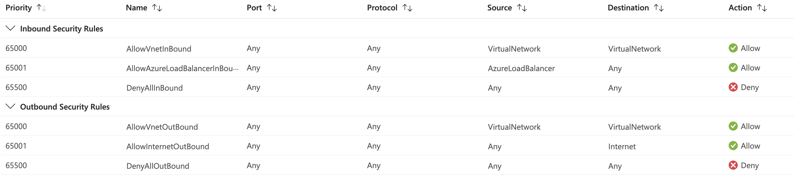

= Virtual Private Cloud (VPC)
:toc: manual

== Create Virtual network

In a Resource Group, Create a Virtual network:

[source, bash]
----
az network vnet create --name vnet1 --resource-group 329-cd2a1f77 --address-prefixes "192.168.0.0/20" --subnet-name subnet-a --subnet-prefixes "192.168.1.0/24"
----

== Create Subnet

In Virtual network Setting section create subnet: 

[source, bash]
----
az network vnet subnet create --name subnet-b --vnet-name vnet1 --address-prefixes "192.168.2.0/24" --resource-group 329-cd2a1f77
----

== Create Security Group

