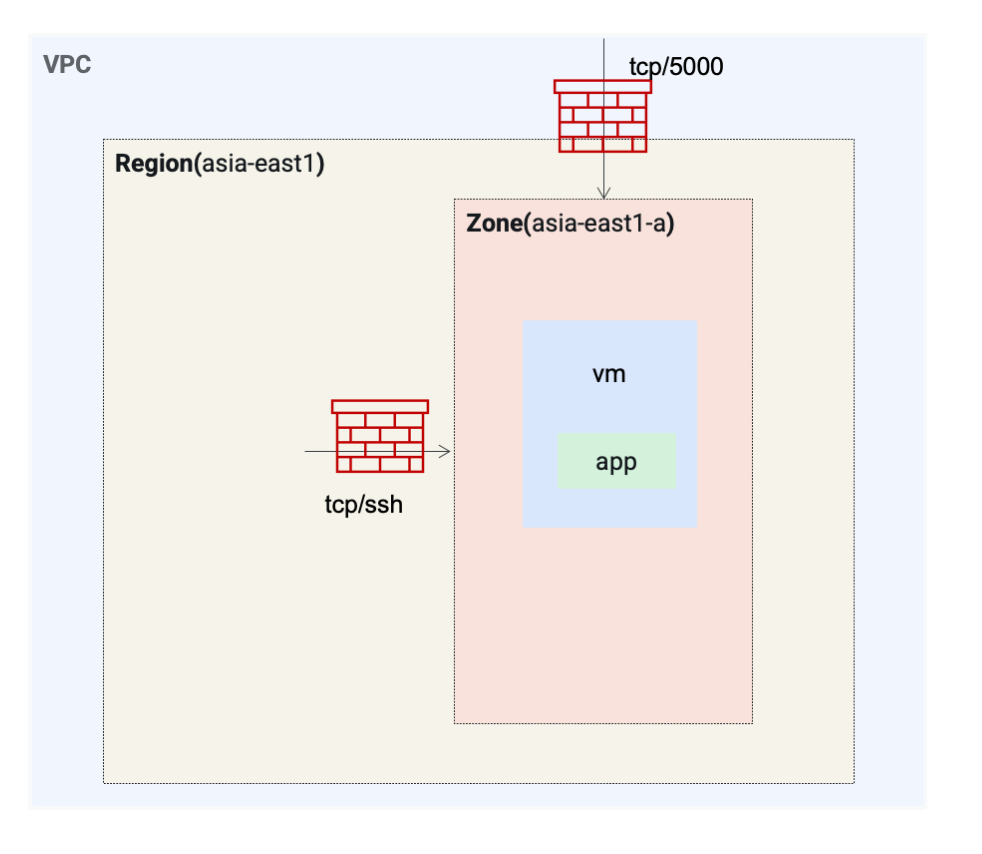

= One vm on one zone
:toc: manual

* Create 1 vm on one zone
* Create network in custom mode
* Create subnet
* Create firewall rules

[source, bash]
.*Deploy*
----
terraform init
terraform plan
terraform apply
----

[source, bash]
.*Clean*
----
terraform destroy
----
