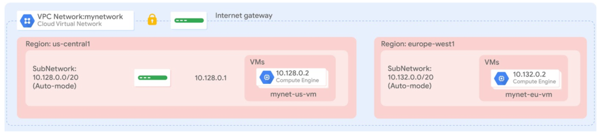

= Two VMs in two region
:toc: manual

* Deploy 2 vms in 2 regions
* Create network in auto mode
* Create firewall rule

[source, bash]
.*Deploy*
----
terraform init
terraform plan
terraform apply
----

[source, bash]
.*Clean*
----
terraform destroy
----
