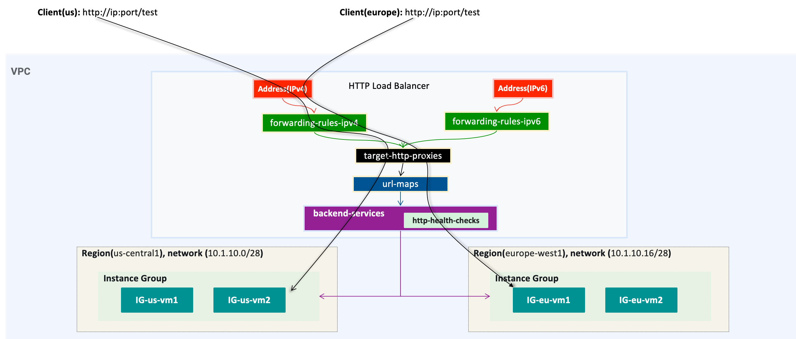
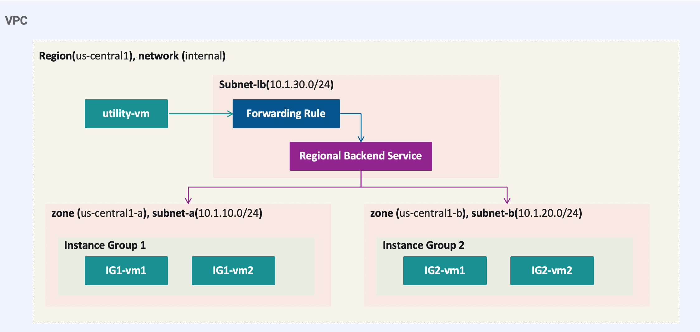
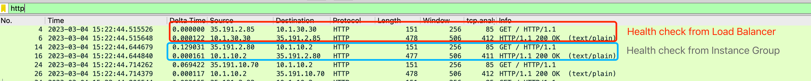
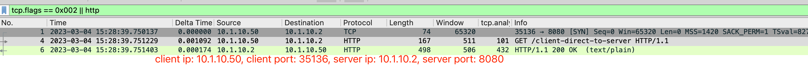
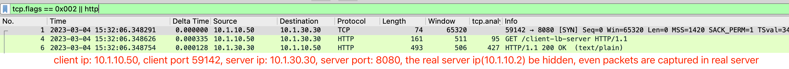

= Cloud Load Balancer
:toc: manual

== Prerequisites

=== Related Objects

link:LBObjects.adoc[Cloud Load Balancer Related Objects] 

=== health checks

[source, bash]
.*tcp health checks*
----
gcloud compute health-checks create tcp tcp-health-check --port=8080 --proxy-header=NONE --check-interval=5 --timeout=5 --unhealthy-threshold=3 --healthy-threshold=1
----

[source, bash]
.*http basic health checks*
----
gcloud compute health-checks create http http-basic-check --port 8080 --request-path=/ --proxy-header=NONE --check-interval=5 --timeout=5 --healthy-threshold=1 --unhealthy-threshold=3
----

[source, bash]
.*http advanced health checks*
----
gcloud compute health-checks create http http-advanced-check --port 8080 --request-path=/health-check --response=health --host=probe.example.com --proxy-header=NONE --check-interval=5 --timeout=5 --healthy-threshold=1 --unhealthy-threshold=3
----

=== instance template

[source, bash]
.*instance template(internet)*
----
gcloud compute instance-templates create lb-backend-template \
   --region=us-central1 \
   --network=default \
   --subnet=default \
   --tags=allow-health-check \
   --machine-type=e2-micro \
   --image-family=debian-11 \
   --image-project=debian-cloud \
   --metadata=startup-script='#!/bin/bash
      apt-get update
      apt-get install -y nginx
      curl -k -s https://raw.githubusercontent.com/cloudadc/cloud-quickstarts/main/gcp/network/lb/app.conf -o /etc/nginx/conf.d/app.conf
      update-rc.d nginx enable
      service nginx restart'
----

=== instance group(managed, zonal, internet)

[source, bash]
.*instance group*
----
gcloud compute instance-groups managed create mig-app-us \
   --base-instance-name=mig-app-us \
   --size=1 \
   --template=lb-backend-template  \
   --zone=us-central1-a  \
   --list-managed-instances-results=PAGELESS \
   --health-check=tcp-health-check  \
   --initial-delay=60

gcloud compute instance-groups managed set-autoscaling mig-app-us \
   --zone=us-central1-a  \ 
   --cool-down-period=60  \
   --max-num-replicas=3  \ 
   --min-num-replicas=1  \ 
   --mode=on  \
   --target-cpu-utilization=0.5

gcloud compute instance-groups set-named-ports mig-app-us --named-ports=webapp:8080 --zone=us-central1-a
----

=== Prepare Application VM Image

Prepare Application VM Image can used to create instance template or VM instance in internat.

[source, bash]
.*1. Create VM Instance*
----
gcloud compute instances create webserver \
   --zone=us-central1-a \
   --machine-type=e2-micro \
   --tags=allow-health-checks \
   --create-disk=auto-delete=no,boot=yes,device-name=webserver,image=projects/debian-cloud/global/images/debian-11-bullseye-v20230206,mode=rw,size=10,type=pd-balanced \
   --metadata=startup-script='#!/bin/bash
      apt-get update
      apt-get install -y nginx
      curl -k -s https://raw.githubusercontent.com/cloudadc/cloud-quickstarts/main/gcp/network/lb/app.conf -o /etc/nginx/conf.d/app.conf
      update-rc.d nginx enable
      service nginx restart'
----

* `--tags` - the `allow-health-checks` hints the firewall rules will filter traffic via tag `allow-health-checks`
* `--create-disk` - the `webserver` is the name of Disk, the `auto-delete=no` means Disk will keep even the Instance be deleted

[source, bash]
.*2. Delete the VM Instance*
----
gcloud compute instances delete webserver --zone=us-central1-a
----

[source, bash]
.*3. Verify the Disk Still Exist*
----
$ gcloud compute disks list
NAME: webserver
LOCATION: us-central1-a
LOCATION_SCOPE: zone
SIZE_GB: 10
TYPE: pd-balanced
STATUS: READY
----

[source, bash]
.*4. Create VM Image*
----
gcloud compute images create testwebserver --source-disk=webserver --source-disk-zone=us-central1-a --storage-location=us --family=webserver
----

[source, json]
.*5. Overview of VM Image*
----
{
  "architecture": "X86_64",
  "archiveSizeBytes": "603495488",
  "creationTimestamp": "2023-03-03T18:18:44.944-08:00",
  "diskSizeGb": "10",
  "family": "webserver",
  "guestOsFeatures": [
    {
      "type": "UEFI_COMPATIBLE"
    },
    {
      "type": "VIRTIO_SCSI_MULTIQUEUE"
    },
    {
      "type": "GVNIC"
    }
  ],
  "id": "9119815172979889259",
  "kind": "compute#image",
  "labelFingerprint": "42WmSpB8rSM=",
  "licenseCodes": [
    "3853522013536123851"
  ],
  "licenses": [
    "https://www.googleapis.com/compute/v1/projects/debian-cloud/global/licenses/debian-11-bullseye"
  ],
  "name": "testwebserver",
  "selfLink": "https://www.googleapis.com/compute/v1/projects/playground-s-11-9d5aa8e6/global/images/testwebserver",
  "sourceDisk": "https://www.googleapis.com/compute/v1/projects/playground-s-11-9d5aa8e6/zones/us-central1-a/disks/webserver",
  "sourceDiskId": "868007293016283134",
  "sourceType": "RAW",
  "status": "READY",
  "storageLocations": [
    "us"
  ]
}
----

== Global external HTTP Load Balancer(multi-region)

The Global external HTTP load Balancer topology looks as below:

There are 2 instances groups in different regions, the Global external HTTP load Balancer diftributed the HTTP traffic to these instances groups, there are 2 forwarding rules and reference 2 addresses, IPv4 and IPv6 accordingly. For client request from US, the HTTP Load Balancer dispatch the request to instance group in `us-central1`, for the client request from europe, the HTTP Load Balancer dispatch the request to instance group in `europe-west1`.

=== Prepare the Network

[source, bash]
.*1. delete default network*
----
for i in $(gcloud compute firewall-rules list | grep NAME | awk '{print $2}') ; do gcloud compute firewall-rules delete $i ; done
gcloud compute networks delete default
----

[source, bash]
.*2. create test network*
----
gcloud compute networks create test --subnet-mode=custom
gcloud compute networks subnets create test-us-central1 --network=test --region=us-central1 --range=10.1.10.0/28
gcloud compute networks subnets create test-europe-west1 --network=test --region=europe-west1 --range=10.1.10.16/28
----

[source, bash]
.*3. create firewall-rules to allow all internal and external ssh, icmp*
----
gcloud compute firewall-rules create test-allow-internal --network=test --allow=tcp,udp,icmp --source-ranges=10.1.10.0/27
gcloud compute firewall-rules create test-allow-ssh --network=test --allow=tcp:22,icmp
----

[source, bash]
.*4. create firewall-rule to allow health check*
----
gcloud compute firewall-rules create test-allow-health-checks --network=test --allow tcp:8080 --source-ranges=130.211.0.0/22,35.191.0.0/16 --target-tags=allow-health-checks
----

NOTE: Health checks determine which instances of a load balancer can receive new connections. For HTTP load balancing, the health check probes to your load-balanced instances come from addresses in the ranges `130.211.0.0/22` and `35.191.0.0/16`.

=== Prepare backend application VM image

Refer to link:#prepare-application-vm-image[Prepare Application VM Image] create applcation vm image. The `--network-interface=network-tier=PREMIUM,subnet=test-us-central1` should be added while creating the VM instance with external ip address.

=== Create instance template

[source, bash]
.*1. configure the instance template*
----
gcloud compute instance-templates create us-webserver-template --machine-type=f1-micro --network-interface=subnet=test-us-central1,no-address --tags=allow-health-checks --create-disk=auto-delete=yes,boot=yes,device-name=testwebserver-template,image=testwebserver,mode=rw,size=10,type=pd-balanced --region=us-central1

gcloud compute instance-templates create eu-webserver-template --machine-type=f1-micro --network-interface=subnet=test-europe-west1,no-address --tags=allow-health-checks --create-disk=auto-delete=yes,boot=yes,device-name=testwebserver-template,image=testwebserver,mode=rw,size=10,type=pd-balanced --region=europe-west1
----

NOTE: The `testwebserver` is created in link:#prepare-application-vm-image[Prepare Application VM Image].

[source, bash]
.*2. verify the instance template*
----
$ gcloud compute instance-templates list
NAME: eu-webserver-template
MACHINE_TYPE: f1-micro
PREEMPTIBLE:
CREATION_TIMESTAMP: 2023-03-03T03:39:16.194-08:00

NAME: us-webserver-template
MACHINE_TYPE: f1-micro
PREEMPTIBLE:
CREATION_TIMESTAMP: 2023-03-03T03:38:12.977-08:00
----

* link:lb-compute-instance-templates.json[lb-compute-instance-templates.json]

=== Create health check

[source, bash]
.*1. create health check for managed instance groups*
----
gcloud compute health-checks create tcp http-health-check --port=8080 --proxy-header=NONE --check-interval=5 --timeout=5 --unhealthy-threshold=2 --healthy-threshold=2
----

[source, bash]
.*2. verify the health check*
----
$ gcloud compute health-checks list --format=json
NAME: http-health-check
REGION:
PROTOCOL: TCP
----

* link:lb-compute-health-checks.json[lb-compute-health-checks.json]

=== Create instance groups

[source, bash]
.*1. create instance group us-central1-mig*
----
gcloud compute instance-groups managed create us-central1-mig --base-instance-name=us-central1-mig --size=1 --template=us-webserver-template --zones=us-central1-c,us-central1-f,us-central1-b --target-distribution-shape=EVEN --instance-redistribution-type=PROACTIVE --list-managed-instances-results=PAGELESS --health-check=http-health-check --initial-delay=60

gcloud compute instance-groups managed set-autoscaling us-central1-mig --region=us-central1 --cool-down-period=60 --max-num-replicas=2 --min-num-replicas=1 --mode=on --target-load-balancing-utilization=0.8

gcloud compute instance-groups set-named-ports us-central1-mig --named-ports=webapp:8080 --region=us-central1
----

* `--instance-redistribution-type`

[source, bash]
.*2. create instance group europe-west1-mig*
----
gcloud compute instance-groups managed create europe-west1-mig --base-instance-name=europe-west1-mig --size=1 --template=eu-webserver-template --zones=europe-west1-b,europe-west1-d,europe-west1-c --target-distribution-shape=EVEN --instance-redistribution-type=PROACTIVE --list-managed-instances-results=PAGELESS --health-check=http-health-check --initial-delay=60

gcloud compute instance-groups managed set-autoscaling europe-west1-mig --region=europe-west1 --cool-down-period=60 --max-num-replicas=2 --min-num-replicas=1 --mode=on --target-load-balancing-utilization=0.8

gcloud compute instance-groups set-named-ports europe-west1-mig --named-ports=webapp:8080 --region=europe-west1
----

[source, bash]
.*3. verify the instance groups*
----
$ gcloud compute instance-groups list
NAME: us-central1-mig
LOCATION: us-central1
SCOPE: region
NETWORK: test
MANAGED: Yes
INSTANCES: 1

NAME: europe-west1-mig
LOCATION: europe-west1
SCOPE: region
NETWORK: test
MANAGED: Yes
INSTANCES: 1
----

* link:lb-compute-instance-groups.json[lb-compute-instance-groups.json]

=== Reserve an external IP address

[source, bash]
.*1. set up a global static external IPv4 address*
----
gcloud compute addresses create lb-ipv4-1 --ip-version=IPV4 --global
----

[source, bash]
.*2. set up a global static external IPv6 address*
----
gcloud compute addresses create lb-ipv6-1 --ip-version=IPV6 --global
----

[source, bash]
.*3. Overview the ip address*
----
$ for i in 4 6 ; do gcloud compute addresses describe lb-ipv$i-1 --format="get(address)" --global ; done
34.149.94.6
2600:1901:0:e738::
----

=== Set up the load balancer

*1. Create a HTTP health check*

Refer to link:#health-checks[health checks] to create a `http-basic-check` health check.

[source, bash]
.*2. Create a backend service*
----
gcloud compute backend-services create http-backend --load-balancing-scheme=EXTERNAL_MANAGED --protocol=HTTP --port-name=webapp --health-checks=http-basic-check --global
----

[source, bash]
.*3. Add instance group to the backend service*
----
gcloud compute backend-services add-backend http-backend --instance-group=us-central1-mig --instance-group-region=us-central1 --balancing-mode=UTILIZATION --max-utilization=0.8 --capacity-scaler=1.0 --global
gcloud compute backend-services add-backend http-backend --instance-group=europe-west1-mig --instance-group-region=europe-west1 --balancing-mode=RATE --max-rate-per-instance=0.8 --capacity-scaler=1.0 --global
----

[source, bash]
.*4. Create a URL map to route the incoming requests to the default backend service*
----
gcloud compute url-maps create http-lb --default-service http-backend
----

=== Setting up an HTTP frontend

[source, bash]
.*1. Create a target HTTP proxy to route requests to your URL map*
----
gcloud compute target-http-proxies create http-lb-proxy --url-map=http-lb
----

[source, bash]
.*2. Create a global forwarding rule to route incoming requests to the proxy*
----
gcloud compute forwarding-rules create fr-web-ipv4 --load-balancing-scheme=EXTERNAL_MANAGED --target-http-proxy=http-lb-proxy --address=lb-ipv4-1 --ports=80 --global
gcloud compute forwarding-rules create fr-web-ipv6 --load-balancing-scheme=EXTERNAL_MANAGED --target-http-proxy=http-lb-proxy --address=lb-ipv6-1 --ports=80 --global
----

=== Diagram from GCP UI Console

*1. click `Network Services` > `Load balancingStart`, click `Create Load Balancer`*

image:lb-start-config.png[]

NOTE: There mainly 3 categories of Load Balancers.

*2. Select `From Internet to my VMs or serverless services` and `Global HTTP(S) Load Balancer`*

image:lb-create-options.png[]

*3. Configure Frontend with both IPv4 and IPv6 address on port 80*

image:lb-fronted.png[]

*4. Configure Backend reference with 2 instance groups*

image:lb-bakcend.png[]

NOTE: the health check passed, both instance groups has one active vm instance.

*5. Observability*

image:lb-observe.png[]

=== Test access the application

The commands `for i in 4 6 ; do gcloud compute addresses describe lb-ipv$i-1 --format="get(address)" --global ; done` can be used to retrive the both IPv4 and IPv6 address.

[source, bash]
.*1. Access the application many time from us client, all request be route to us-central1-mig*
----
us-client:~$ for i in 1 2 3 ; do curl -s http://34.149.94.6 | head -n 7 ; done

            request: GET / HTTP/1.1
               host: 34.149.94.6
           hostname: us-central1-mig-5dn3

        client addr: 35.191.19.247:39436
        server addr: 10.1.10.3:8080

            request: GET / HTTP/1.1
               host: 34.149.94.6
           hostname: us-central1-mig-5dn3

        client addr: 35.191.24.231:39560
        server addr: 10.1.10.3:8080

            request: GET / HTTP/1.1
               host: 34.149.94.6
           hostname: us-central1-mig-5dn3

        client addr: 35.191.23.136:60574
        server addr: 10.1.10.3:8080
----

[source, bash]
.*2. Access the application many time from europe client, all request be route to europe-west1-mig*
----
eu-client:~$ for i in 1 2 3 ; do curl -s http://34.149.94.6 | head -n 7 ; done

            request: GET / HTTP/1.1
               host: 34.149.94.6
           hostname: europe-west1-mig-sb2h

        client addr: 35.191.23.217:48854
        server addr: 10.1.10.18:8080

            request: GET / HTTP/1.1
               host: 34.149.94.6
           hostname: europe-west1-mig-sb2h

        client addr: 35.191.24.154:48254
        server addr: 10.1.10.18:8080

            request: GET / HTTP/1.1
               host: 34.149.94.6
           hostname: europe-west1-mig-sb2h

        client addr: 35.191.13.77:44342
        server addr: 10.1.10.18:8080
----

[source, bash]
.*3. Access application via IPv6 address*
----
$ curl http://[2600:1901:0:e738::]/

            request: GET / HTTP/1.1
               host: [2600:1901:0:8a64::]
           hostname: us-central1-mig-hj4h

        client addr: 35.191.10.41:60452
        server addr: 10.1.10.3:8080

             cookie: 
                xff: 
         user agent: curl/7.64.1
----

[source, bash]
.*4. Access 10 times. record client address*
----
$ for i in {1..10} ; do curl -s http://34.149.94.6/ | grep client ; done
        client addr: 35.191.19.137:59148
        client addr: 35.191.23.243:36940
        client addr: 35.191.17.70:53276
        client addr: 35.191.13.251:37462
        client addr: 35.191.19.172:37568
        client addr: 35.191.17.147:35084
        client addr: 35.191.10.45:41058
        client addr: 35.191.19.138:48834
        client addr: 35.191.17.144:34852
        client addr: 35.191.23.80:55730
----

NOTE: the cloud load balancer use `35.191.0.0/16` as snat pool.

*5. Review LB's health check packets*

image:lb-tcp-health-check.png[]

NOTE: The Load Balancer source also come from `35.191.0.0/16`, use one of member of snat pool.

== Global external HTTP load balancer

External HTTP(S) Load Balancing is a proxy-based Layer 7 load balancer that enables you to run and scale your services behind a single external IP address. External HTTP(S) Load Balancing distributes HTTP and HTTPS traffic to backends hosted on a variety of Google Cloud platforms (such as Compute Engine, Google Kubernetes Engine (GKE), Cloud Storage, and so on), as well as external backends connected over the internet or via hybrid connectivity.

The Topology as below figure:

image:gcp-network-lb-http-classic.png[]

=== Prepare NGINX Application

Refer to link:#instance-template[instance template] and link:#instance-groupmanaged-zonal-internet[instance group(managed, zonal, internet)] to create a Managed Instance Group.

=== Create firewall rule to allow health check

[source, bash]
.*Create firewall rule to allow health check and LB snat ingress request*
----
gcloud compute firewall-rules create fw-allow-health-check --network=default --action=allow --direction=ingress --source-ranges=130.211.0.0/22,35.191.0.0/16 --target-tags=allow-health-check --rules=tcp:8080
----

=== Reserve an external IP address

[source, bash]
.*1. set up a global static external IP address*
----
gcloud compute addresses create lb-ipv4-1 --ip-version=IPV4 --global
----

[source, bash]
.*2. overview the reserved external IP address*
----
gcloud compute addresses describe lb-ipv4-1 --format="get(address)" --global
----

=== Set up the load balancer

*1. Create a HTTP health check*

Refer to link:#health-checks[health checks] to create a `http-basic-check` health check.

[source, bash]
.*2. Create a backend service*
----
gcloud compute backend-services create web-backend-service --load-balancing-scheme=EXTERNAL_MANAGED --protocol=HTTP --port-name=webapp --health-checks=http-basic-check --global
----

[source, bash]
.*3. Add instance group to the backend service*
----
gcloud compute backend-services add-backend web-backend-service --instance-group=mig-app-us --instance-group-zone=us-central1-a --global
----

[source, bash]
.*4. Create a URL map to route the incoming requests to the default backend service*
----
gcloud compute url-maps create web-map-http --default-service web-backend-service
----

=== Setting up an HTTP frontend

[source, bash]
.*1. Create a target HTTP proxy to route requests to your URL map*
----
gcloud compute target-http-proxies create http-lb-proxy --url-map web-map-http
----

[source, bash]
.*2. Create a global forwarding rule to route incoming requests to the proxy*
----
gcloud compute forwarding-rules create http-content-rule --load-balancing-scheme=EXTERNAL_MANAGED --address=lb-ipv4-1 --target-http-proxy=http-lb-proxy --ports=80 --global
----

=== Test to access application

[source, bash]
----
$ IPAddress=$(gcloud compute forwarding-rules describe http-content-rule --global | grep IPAddress | awk '{print $2}') ; for i in 1 2 3  ; do curl -s $IPAddress | head -n 7; done

            request: GET / HTTP/1.1
               host: 34.111.28.110
           hostname: mig-app-us-g1mj

        client addr: 35.191.19.137:37950
        server addr: 10.128.0.2:8080

            request: GET / HTTP/1.1
               host: 34.111.28.110
           hostname: mig-app-us-g1mj

        client addr: 35.191.19.212:35892
        server addr: 10.128.0.2:8080

            request: GET / HTTP/1.1
               host: 34.111.28.110
           hostname: mig-app-us-g1mj

        client addr: 35.191.19.255:52306
        server addr: 10.128.0.2:8080
----

== Global external HTTP load balancer (classic)

External HTTP(S) Load Balancing is a proxy-based Layer 7 load balancer that enables you to run and scale your services behind a single external IP address. External HTTP(S) Load Balancing distributes HTTP and HTTPS traffic to backends hosted on a variety of Google Cloud platforms (such as Compute Engine, Google Kubernetes Engine (GKE), Cloud Storage, and so on), as well as external backends connected over the internet or via hybrid connectivity.

The Topology as below figure:

image:gcp-network-lb-http-classic.png[]

=== Prepare NGINX Application

Refer to link:#instance-template[instance template] and link:#instance-groupmanaged-zonal-internet[instance group(managed, zonal, internet)] to create a Managed Instance Group.

=== Create firewall rule to allow health check

[source, bash]
.*Create firewall rule to allow health check and LB snat ingress request*
----
gcloud compute firewall-rules create fw-allow-health-check --network=default --action=allow --direction=ingress --source-ranges=130.211.0.0/22,35.191.0.0/16 --target-tags=allow-health-check --rules=tcp:8080
----

=== Reserve an external IP address

[source, bash]
.*1. set up a global static external IP address*
----
gcloud compute addresses create lb-ipv4-1 --ip-version=IPV4 --global
----

[source, bash]
.*2. overview the reserved external IP address*
----
gcloud compute addresses describe lb-ipv4-1 --format="get(address)" --global
----

=== Set up the load balancer

*1. Create a HTTP health check*

Refer to link:#health-checks[health checks] to create a `http-basic-check` health check.

[source, bash]
.*2. Create a backend service*
----
gcloud compute backend-services create web-backend-service --load-balancing-scheme=EXTERNAL --protocol=HTTP --port-name=webapp --health-checks=http-basic-check --global
----

[source, bash]
.*3. Add instance group to the backend service*
----
gcloud compute backend-services add-backend web-backend-service --instance-group=mig-app-us --instance-group-zone=us-central1-a --global
----

[source, bash]
.*4. Create a URL map to route the incoming requests to the default backend service*
----
gcloud compute url-maps create web-map-http --default-service web-backend-service
----

=== Setting up an HTTP frontend

[source, bash]
.*1. Create a target HTTP proxy to route requests to your URL map*
----
gcloud compute target-http-proxies create http-lb-proxy --url-map web-map-http
----

[source, bash]
.*2. Create a global forwarding rule to route incoming requests to the proxy*
----
gcloud compute forwarding-rules create http-content-rule --address=lb-ipv4-1 --global --target-http-proxy=http-lb-proxy --ports=80
----

=== Test to access application

[source, bash]
----
$ IPAddress=$(gcloud compute forwarding-rules describe http-content-rule --global | grep IPAddress | awk '{print $2}') ; for i in 1 2 3  ; do curl -s $IPAddress | head -n 7; done

            request: GET / HTTP/1.1
               host: 34.111.28.110
           hostname: mig-app-us-g1mj

        client addr: 35.191.3.144:52559
        server addr: 10.128.0.2:8080

            request: GET / HTTP/1.1
               host: 34.111.28.110
           hostname: mig-app-us-g1mj

        client addr: 130.211.0.85:50134
        server addr: 10.128.0.2:8080

            request: GET / HTTP/1.1
               host: 34.111.28.110
           hostname: mig-app-us-g1mj

        client addr: 35.191.15.168:59259
        server addr: 10.128.0.2:8080
----

== External TCP/UDP Network load balancer(target-pools)

Google Cloud external TCP/UDP Network Load Balancing is a regional, pass-through load balancer. A network load balancer distributes external traffic among virtual machine (VM) instances in the same region.

The Topology as below figure:

image:gcp-nlb-arch.png[]

=== Create web server VM instances

[source, bash]
.*1. create vm www1*
----
gcloud compute instances create www1 \
    --zone=us-central1-a \
    --tags=network-lb-tag \
    --machine-type=e2-small \
    --image-family=debian-11 \
    --image-project=debian-cloud \
    --metadata=startup-script='#!/bin/bash
      apt-get update
      apt-get install -y nginx
      curl -k -s https://raw.githubusercontent.com/cloudadc/cloud-quickstarts/main/gcp/network/lb/app.conf -o /etc/nginx/conf.d/app.conf
      update-rc.d nginx enable
      service nginx restart'
----

[source, bash]
.*2. create vm www2*
----
gcloud compute instances create www2 \
    --zone=us-central1-a \
    --tags=network-lb-tag \
    --machine-type=e2-small \
    --image-family=debian-11 \
    --image-project=debian-cloud \
    --metadata=startup-script='#!/bin/bash
      apt-get update
      apt-get install -y nginx
      curl -k -s https://raw.githubusercontent.com/cloudadc/cloud-quickstarts/main/gcp/network/lb/app.conf -o /etc/nginx/conf.d/app.conf
      update-rc.d nginx enable
      service nginx restart'
----

[source, bash]
.*3. create vm www3*
----
gcloud compute instances create www3 \
    --zone=us-central1-a \
    --tags=network-lb-tag \
    --machine-type=e2-small \
    --image-family=debian-11 \
    --image-project=debian-cloud \
    --metadata=startup-script='#!/bin/bash
      apt-get update
      apt-get install -y nginx
      curl -k -s https://raw.githubusercontent.com/cloudadc/cloud-quickstarts/main/gcp/network/lb/app.conf -o /etc/nginx/conf.d/app.conf
      update-rc.d nginx enable
      service nginx restart'
----

[source, bash] 
.*4. create firewall to allow http request*
----
gcloud compute firewall-rules create www-firewall-network-lb --target-tags network-lb-tag --allow tcp:8080
---- 

[source, bash]
.*5. test access www app*
----
$ for ip in $(gcloud compute instances list | grep EXTERNAL_IP | awk '{print $2}') ; do curl $ip:8080 ; done

            request: GET / HTTP/1.1
               host: 34.66.174.19
           hostname: www1

        client addr: 34.87.162.177:37952
        server addr: 10.128.0.5:8080

             cookie:
                xff:
         user agent: curl/7.74.0

            request: GET / HTTP/1.1
               host: 34.30.185.127
           hostname: www2

        client addr: 34.87.162.177:34504
        server addr: 10.128.0.6:8080

             cookie:
                xff:
         user agent: curl/7.74.0

            request: GET / HTTP/1.1
               host: 34.30.158.80
           hostname: www3

        client addr: 34.87.162.177:41204
        server addr: 10.128.0.7:8080

             cookie:
                xff:
         user agent: curl/7.74.0
----

=== Network load balancer

[source, bash]
.*1. Create a static external IP address*
----
gcloud compute addresses create network-lb-ip-1 --region=us-central1
----

[source, bash]
.*2. Create a HTTP health check*
----
gcloud compute http-health-checks create basic-check
----

[source, bash]
.*3. Create a target pool*
----
gcloud compute target-pools create www-pool --region=us-central1 --http-health-check=basic-check
----

[source, bash]
.*4. Add the instances to the pool*
----
gcloud compute target-pools add-instances www-pool --instances=www1,www2,www3 --instances-zone=us-central1-a --region=us-central1
----

[source, bash]
.*5. Add a forwarding rule*
----
gcloud compute forwarding-rules create www-rule --region=us-central1 --ports=8080 --address=network-lb-ip-1 --target-pool=www-pool
----

=== Test to access application

[source, bash]
----           
$ IPADDRESS=$(gcloud compute forwarding-rules describe www-rule --region=us-central1 | grep IPAddress | awk '{print $2}') ; for i in 1 2 3 ; do curl $IPADDRESS:8080 ; done
               
            request: GET / HTTP/1.1
               host: 34.134.75.195
           hostname: www2
        
        client addr: 34.87.162.177:40456
        server addr: 34.134.75.195:8080
                
             cookie: 
                xff:
         user agent: curl/7.74.0
            
               
            request: GET / HTTP/1.1
               host: 34.134.75.195
           hostname: www3
        
        client addr: 34.87.162.177:34026
        server addr: 34.134.75.195:8080
                
             cookie: 
                xff:
         user agent: curl/7.74.0
            
               
            request: GET / HTTP/1.1
               host: 34.134.75.195
           hostname: www2
        
        client addr: 34.87.162.177:34038
        server addr: 34.134.75.195:8080
                
             cookie: 
                xff:
         user agent: curl/7.74.0
----

== Internal TCP/UDP Network load balancer

Google Cloud offers Internal Load Balancing for your TCP/UDP-based traffic. Internal Load Balancing enables you to run and scale your services behind a private load balancing IP address that is accessible only to your internal virtual machine instances.

* https://cloud.google.com/load-balancing/docs/internal/setting-up-internal

*The Topology:*

=== Prepare the Network

[source, bash]
.*1. create internal network and subnets*
----
gcloud compute networks create internal --subnet-mode=custom
gcloud compute networks subnets create internal-a --network=internal --range=10.1.10.0/24 --region=us-central1
gcloud compute networks subnets create internal-b --network=internal --range=10.1.20.0/24 --region=us-central1
gcloud compute networks subnets create internal-lb --network=internal --range=10.1.30.0/24 --region=us-central1
----

[source, bash]
.*2. create firewall rule allow icmp, ssh from any source*
----
gcloud compute firewall-rules create app-allow-icmp-ssh --direction=INGRESS --priority=1000 --network=internal --action=ALLOW --rules=tcp:22,icmp --source-ranges=0.0.0.0/0 --target-tags=backend-service
----

[source, bash]
.*3. create firewall rule allow IAP to utility VM*
----
gcloud compute firewall-rules create allow-iap-to-utility-vm --direction=INGRESS --priority=1000 --network=internal --action=ALLOW --rules=tcp:22,icmp --source-ranges=35.235.240.0/20 --target-tags=utility-vm
----

[source, bash]
.*4. create firewall rule allow application internal access*
----
gcloud compute firewall-rules create allow-app-access-from-internal --direction=INGRESS --priority=1000 --network=internal --action=ALLOW --rules=tcp:8080 --source-ranges=10.1.10.0/24,10.1.20.0/24,10.1.30.0/24 --target-tags=backend-service
----

[source, bash]
.*5. create firewall rule allow health check*
----
gcloud compute firewall-rules create allow-health-checks --direction=INGRESS --priority=1000 --network=internal --action=ALLOW --rules=tcp:8080 --source-ranges=130.211.0.0/22,35.191.0.0/16 --target-tags=backend-service
----

=== Create instance group

[source, bash]
.*1. create instance template*
----
gcloud compute instance-templates create webserver-a --machine-type=e2-micro --network-interface=subnet=internal-a,no-address --region=us-central1 --tags=backend-service --create-disk=auto-delete=yes,boot=yes,device-name=webserver-a,image=testwebserver,mode=rw,size=10,type=pd-balanced

gcloud compute instance-templates create webserver-b --machine-type=e2-micro --network-interface=subnet=internal-b,no-address --region=us-central1 --tags=backend-service --create-disk=auto-delete=yes,boot=yes,device-name=webserver-b,image=testwebserver,mode=rw,size=10,type=pd-balanced
----

*2. create http health check*

Refer to link:#health-checks[health checks] section to create a `http-basic-check` health check.

[source, bash]
.*3. create instance groups*
----
gcloud compute instance-groups managed create ig1 --base-instance-name=ig1 --size=1 --template=webserver-a --zone=us-central1-a --list-managed-instances-results=pageless --health-check=http-basic-check --initial-delay=60

gcloud compute instance-groups managed set-autoscaling ig1 --max-num-replicas=2 --min-num-replicas=1 --target-load-balancing-utilization=0.8 --mode=on --cool-down-period=60 --zone=us-central1-a

gcloud compute instance-groups managed set-named-ports ig1 --named-ports=webapp:8080 --zone=us-central1-a

gcloud compute instance-groups managed create ig2 --size=1 --base-instance-name=ig2 --template=webserver-b --zone=us-central1-b --list-managed-instances-results=pageless --health-check=http-basic-check --initial-delay=60

gcloud compute instance-groups managed set-autoscaling ig2 --max-num-replicas=2 --min-num-replicas=1 --target-load-balancing-utilization=0.8 --mode=on --cool-down-period=60 --zone=us-central1-b

gcloud compute instance-groups managed set-named-ports ig2 --named-ports=webapp:8080 --zone=us-central1-b
----

=== Crate utility vm test backend services

[source, bash]
.*1. create utility vm*
----
gcloud compute instances create utility-vm \
    --zone=us-central1-c \
    --tags=utility-vm \
    --machine-type=e2-micro \
    --image-family=debian-11 \
    --image-project=debian-cloud \
    --network-interface=private-network-ip=10.1.10.50,subnet=internal-a,no-address
----

[source, bash]
.*2. ssh to utility vm*
----
gcloud compute ssh utility-vm --zone=us-central1-c --tunnel-through-iap
----

[source, bash]
.*3. access application in ig1*
----
utility-vm:~$ curl 10.1.10.2:8080

            request: GET / HTTP/1.1
               host: 10.1.10.2
           hostname: ig1-dd93

        client addr: 10.1.10.50:45812
        server addr: 10.1.10.2:8080

             cookie:
                xff:
         user agent: curl/7.74.0
----

[source, bash]
.*4. access application in ig2*
----
utility-vm:~$ curl 10.1.20.2:8080

            request: GET / HTTP/1.1
               host: 10.1.20.2
           hostname: ig2-gjr1

        client addr: 10.1.10.50:33274
        server addr: 10.1.20.2:8080

             cookie:
                xff:
         user agent: curl/7.74.0
----

=== Create backend services

[source, bash]
.*1. create regional health check*
----
gcloud compute health-checks create http hc-http-8080 --region=us-central1 --port=8080
----

[source, bash]
.*2. create internal backend service*
----
gcloud compute backend-services create itlb-backend --load-balancing-scheme=INTERNAL --protocol=tcp --region=us-central1 --health-checks=hc-http-8080 --health-checks-region=us-central1
----

[source, bash]
.*3. add instance groups to backend service*
----
gcloud compute backend-services add-backend itlb-backend --region=us-central1 --instance-group=ig1 --instance-group-zone=us-central1-a
gcloud compute backend-services add-backend itlb-backend --region=us-central1 --instance-group=ig2 --instance-group-zone=us-central1-b
----

=== Create forwarding rule

[source, bash]
.*creat forwarding rule*
----
gcloud compute forwarding-rules create fr-itlb --region=us-central1 --load-balancing-scheme=INTERNAL --network=internal --subnet=internal-lb --address=10.1.30.30 --ip-protocol=TCP --ports=8080 --backend-service=itlb-backend --backend-service-region=us-central1
----

=== Test access the application via LB endpoint

[source, bash]
.*In utility vm curl the application several times*
----
utility-vm:~$ for i in {1..3} ; do curl -s 10.1.30.30:8080 | head -n 7 ; done

            request: GET / HTTP/1.1
               host: 10.1.30.30
           hostname: ig2-gjr1

        client addr: 10.1.10.50:45614
        server addr: 10.1.30.30:8080

            request: GET / HTTP/1.1
               host: 10.1.30.30
           hostname: ig1-dd93

        client addr: 10.1.10.50:45624
        server addr: 10.1.30.30:8080

            request: GET / HTTP/1.1
               host: 10.1.30.30
           hostname: ig2-gjr1

        client addr: 10.1.10.50:45638
        server addr: 10.1.30.30:8080
----

=== Packet Flow Deep Dive

This section will install tcpdump on both ig1 and ig2's vm, capture the packet flow, due to the vm are internal, to install tcpdump need set up nat firstly.

[source, bash]
.*1. create cloud router*
----
gcloud compute routers create nat-router-us-central1 --region=us-central1 --network=internal --advertisement-mode=CUSTOM --set-advertisement-ranges=10.1.10.0/24,10.1.20.0/24
----

[source, bash]
.*2. create cloud nat*
----
gcloud compute routers nats create nat-us-central1 --router=nat-router-us-central1 --router-region=us-central1 --auto-allocate-nat-external-ips --nat-custom-subnet-ip-ranges=internal-a,internal-b
----

[source, bash]
.*3. install tcpdump either on ig1 vm, or ig2 vm*
----
sudo apt-get install tcpdump -y
----

[source, bash]
.*4. Capture health check packet*
----
sudo tcpdump -nni ens4 port 8080 -w itlb-health-check.pcap
sudo tcpdump -nni ens4 port 8080 -w itlb-client-server.pcap
sudo tcpdump -nni ens4 port 8080 -w itlb-client-lb-server.pcap
----

* link:pcap/itlb-health-check.pcap[itlb-health-check.pcap] - health check packet flow
* link:pcap/itlb-client-server.pcap[itlb-client-server.pcap] - client access server directly packet flow
* link:pcap/itlb-client-lb-server.pcap[itlb-client-lb-server.pcap] - client access server via lb packet flow

*5. Health Check*

* There are two health check, one from LB, another from MIG
* Both Health Check extract SNAT address from `35.191.0.0/16`
* Health Check from LB Hidden the real server IP

*6. Client Server directly Access*

* Client access server directly the real server IP address `10.1.10.2` not hidden

*7. Client access server via LB*

* Client access server via LB, the real ip address be hiden.

== Internal HTTP load balancer

image:img/e.png[]

=== Prepare the Network

[source, bash]
.*1. create internal network and subnets*
----
gcloud compute networks create internal --subnet-mode=custom
gcloud compute networks subnets create internal-a --network=internal --range=10.1.10.0/24 --region=us-central1
gcloud compute networks subnets create internal-b --network=internal --range=10.1.20.0/24 --region=us-central1
gcloud compute networks subnets create internal-lb --network=internal --range=10.1.30.0/24 --region=us-central1
gcloud compute networks subnets create internal-proxy --purpose=REGIONAL_MANAGED_PROXY --role=ACTIVE --network=internal --range=10.1.40.0/24 --region=us-central1
----

[source, bash]
.*2. create firewall rule allow icmp, ssh from any source*
----
gcloud compute firewall-rules create app-allow-icmp-ssh --direction=INGRESS --priority=1000 --network=internal --action=ALLOW --rules=tcp:22,icmp --source-ranges=0.0.0.0/0 --target-tags=backend-service
----

[source, bash]
.*3. create firewall rule allow IAP to utility VM*
----
gcloud compute firewall-rules create allow-iap-to-utility-vm --direction=INGRESS --priority=1000 --network=internal --action=ALLOW --rules=tcp:22,icmp --source-ranges=35.235.240.0/20 --target-tags=utility-vm
----

[source, bash]
.*4. create firewall rule allow application internal access*
----
gcloud compute firewall-rules create allow-app-access-from-internal --direction=INGRESS --priority=1000 --network=internal --action=ALLOW --rules=tcp:8080 --source-ranges=10.1.10.0/24,10.1.20.0/24,10.1.30.0/24,10.1.40.0/24 --target-tags=backend-service
----

[source, bash]
.*5. create firewall rule allow health check*
----
gcloud compute firewall-rules create allow-health-checks --direction=INGRESS --priority=1000 --network=internal --action=ALLOW --rules=tcp:8080 --source-ranges=130.211.0.0/22,35.191.0.0/16 --target-tags=backend-service
----

=== Prepare backend application VM image

Refer to link:#prepare-application-vm-image[Prepare Application VM Image] create applcation vm image. The --network-interface=network-tier=PREMIUM,subnet=internal-a should be added while creating the VM instance with external ip address.

=== Create instance group blue

[source, bash]
.*1. create instance template*
----
gcloud compute instance-templates create blue --machine-type=e2-micro --network-interface=subnet=internal-a,no-address --region=us-central1 --tags=backend-service --create-disk=auto-delete=yes,boot=yes,device-name=blue,image=testwebserver,mode=rw,size=10,type=pd-balanced
----

[source, bash]
.*2. create instance groups*
----
gcloud compute instance-groups managed create ig-blue --base-instance-name=blue --size=2 --template=blue --region=us-central1 --list-managed-instances-results=pageless
----

[source, bash]
.*3. set named ports*
----
gcloud compute instance-groups managed set-named-ports ig-blue --named-ports=webapp:8080 --region=us-central1
----

=== Create instance group green

[source, bash]
.*1. create instance template*
----
gcloud compute instance-templates create green --machine-type=e2-micro --network-interface=subnet=internal-b,no-address --region=us-central1 --tags=backend-service --create-disk=auto-delete=yes,boot=yes,device-name=green,image=testwebserver,mode=rw,size=10,type=pd-balanced
----

[source, bash]
.*2. create instance groups*
----
gcloud compute instance-groups managed create ig-green --base-instance-name=green --size=2 --template=green --region=us-central1 --list-managed-instances-results=pageless
----

[source, bash]
.*3. set named ports*
----
gcloud compute instance-groups managed set-named-ports ig-green --named-ports=webapp:8080 --region=us-central1
----

[source, bash]
.*1. create utility vm*
----
gcloud compute instances create utility-vm \
    --zone=us-central1-c \
    --tags=utility-vm \
    --machine-type=e2-micro \
    --image-family=debian-11 \
    --image-project=debian-cloud \
    --network-interface=private-network-ip=10.1.10.50,subnet=internal-a,no-address
----

[source, bash]
.*2. ssh to utility vm*
----
gcloud compute ssh utility-vm --zone=us-central1-c --tunnel-through-iap
----

[source, bash]
.*3. access application in blue instance group*
----
$ curl 10.1.10.3:8080/blue

            request: GET /blue HTTP/1.1
               host: 10.1.10.3
           hostname: blue-cw0k

        client addr: 10.1.10.50:58236
        server addr: 10.1.10.3:8080

$ curl 10.1.10.4:8080/blue

            request: GET /blue HTTP/1.1
               host: 10.1.10.4
           hostname: blue-9prw

        client addr: 10.1.10.50:46862
        server addr: 10.1.10.4:8080
----

[source, bash]
.*4. access application in green instance group*
----
$ curl 10.1.20.2:8080/blue

            request: GET /blue HTTP/1.1
               host: 10.1.20.2
           hostname: green-qjvg

        client addr: 10.1.10.50:38730
        server addr: 10.1.20.2:8080

$ curl 10.1.20.3:8080/blue

            request: GET /blue HTTP/1.1
               host: 10.1.20.3
           hostname: green-6xz5

        client addr: 10.1.10.50:60046
        server addr: 10.1.20.3:8080
----

=== Create blue-service backend

[source, bash]
.*1. create regional health check*
----
gcloud compute health-checks create http blue-heatlh-check --region=us-central1 --port=8080 --check-interval=10 --timeout=5 --healthy-threshold=2 --unhealthy-threshold=3
----

[source, bash]
.*2. create internal backend service*
----
gcloud compute backend-services create blue-service --load-balancing-scheme=INTERNAL_MANAGED --protocol=HTTP --port-name=webapp --health-checks=blue-heatlh-check --health-checks-region=us-central1 --region=us-central1
----

[source, bash]
.*3. add instance groups to backend service*
----
gcloud compute backend-services add-backend blue-service --region=us-central1 --instance-group=ig-blue --instance-group-region=us-central1 --balancing-mode=UTILIZATION --max-utilization=0.8 --capacity-scaler=1.0 
----

=== Create green-service backend

[source, bash]
.*1. create regional health check*
----
gcloud compute health-checks create http green-heatlh-check --region=us-central1 --port=8080 --check-interval=10 --timeout=5 --healthy-threshold=2 --unhealthy-threshold=3
----

[source, bash]
.*2. create internal backend service*
----
gcloud compute backend-services create green-service --load-balancing-scheme=INTERNAL_MANAGED --protocol=HTTP --port-name=webapp --health-checks=green-heatlh-check --health-checks-region=us-central1 --region=us-central1
----

[source, bash]
.*3. add instance groups to backend service*
----
gcloud compute backend-services add-backend green-service --region=us-central1 --instance-group=ig-green --instance-group-region=us-central1 --balancing-mode=UTILIZATION --max-utilization=0.8 --capacity-scaler=1.0 
----

=== Set up traffic management(blue/green)

[source, bash]
.*1. create ihlb-bule-green.yaml content as the following*
----
name: ihlb-bule-green
defaultService: regions/us-central1/backendServices/green-service
hostRules:
- hosts:
  - '*'
  pathMatcher: matcher1
pathMatchers:
- defaultService: regions/us-central1/backendServices/green-service
  name: matcher1
  routeRules:
  - priority: 2
    matchRules:
      - prefixMatch: /
    routeAction:
      weightedBackendServices:
        - backendService: regions/us-central1/backendServices/green-service
          weight: 95
        - backendService: regions/us-central1/backendServices/blue-service
          weight: 5
----

[source, bash]
.*2. Create the URL map*
----
gcloud compute url-maps import ihlb-bule-green --region=us-central1 --source=ihlb-bule-green.yaml
----

=== Setting up an HTTP frontend

[source, bash]
.*1. Create a target HTTP proxy to route requests to blue/green URL map*
----
gcloud compute target-http-proxies create ihlb-thp-bule-green --url-map=ihlb-bule-green --url-map-region=us-central1 --region=us-central1
----

[source, bash]
.*2. Create forwarding rules reference with blue/green http proxy*
----
gcloud compute forwarding-rules create ihlb-fr-blue-green --load-balancing-scheme=INTERNAL_MANAGED --target-http-proxy=ihlb-thp-bule-green --target-http-proxy-region=us-central1 --network=internal --subnet=internal-lb --address=10.1.30.5 --ports=80 --region=us-central1
----

=== Test access the application via LB endpoint

[source, bash]
.**
----

----

[source, bash]
.**
----

----

[source, bash]
.**
----

----

[source, bash]
.**
----

----

[source, bash]
.**
----

----

