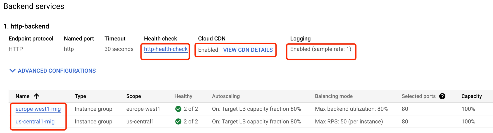

= Cloud Load Balancer
:toc: manual

== Cloud Load Balancer

TODO

== Global HTTP Load Balancer + Autoscaling Instance Groups 

Google Cloud HTTP(S) load balancing is implemented at the edge of Google's network in Google's points of presence (POP) around the world. User traffic directed to an HTTP(S) load balancer enters the POP closest to the user and is then load-balanced over Google's global network to the closest backend that has sufficient available capacity.

=== Prepare the Network

[source, bash]
.*1. delete default network*
----
for i in $(gcloud compute firewall-rules list | grep NAME | awk '{print $2}') ; do gcloud compute firewall-rules delete $i ; done
gcloud compute networks delete default
----

[source, bash]
.*2. create test network*
----
gcloud compute networks create test --subnet-mode=custom
gcloud compute networks subnets create test-us-central1 --network=test --region=us-central1 --range=10.1.10.0/28
gcloud compute networks subnets create test-europe-west1 --network=test --region=europe-west1 --range=10.1.10.16/28
----

[source, bash]
.*3. create firewall-rules to allow all internal and external ssh, icmp*
----
gcloud compute firewall-rules create test-allow-internal --network=test --allow=tcp,udp,icmp --source-ranges=10.1.10.0/27
gcloud compute firewall-rules create test-allow-ssh --network=test --allow=tcp:22,icmp
----

[source, bash]
.*4. create firewall-rule to allow health check*
----
gcloud compute firewall-rules create test-allow-health-checks --network=test --allow tcp:80 --source-ranges=130.211.0.0/22,35.191.0.0/16 --target-tags=allow-health-checks
----

NOTE: Health checks determine which instances of a load balancer can receive new connections. For HTTP load balancing, the health check probes to your load-balanced instances come from addresses in the ranges `130.211.0.0/22` and `35.191.0.0/16`.

=== Create a NAT to allow VM outbound traffic and load balancer inbound traffic

[source, bash]
.*1. create cloud router*
----
gcloud compute routers create nat-router-us-central1 --region=us-central1  --network=test
----

[source, bash]
.*2. create cloud nat*
----
gcloud compute routers nats create nat-config --router=nat-router-us-central1 --router-region=us-central1 --auto-allocate-nat-external-ips --nat-all-subnet-ip-ranges
----

NOTE: If VM instances without an external IP address, Cloud NAT service to allow those VM instances to send outbound traffic only through the Cloud NAT, and receive inbound traffic through the load balancer.

=== Prepare Application as VM Image

[source, bash]
.*1. Create VM Instance*
----
gcloud compute instances create webserver \
    --zone=us-central1-a \
    --machine-type=e2-micro \
    --network-interface=subnet=test-us-central1,no-address \
    --maintenance-policy=MIGRATE \
    --provisioning-model=STANDARD \
    --tags=allow-health-checks \
    --create-disk=boot=yes,device-name=webserver,image=projects/debian-cloud/global/images/debian-11-bullseye-v20230206,mode=rw,size=10,type=pd-balanced \
    --no-shielded-secure-boot \
    --shielded-vtpm \
    --shielded-integrity-monitoring \
    --reservation-affinity=any
----

* `--network-interface` - the `no-address` hints no public IP address will be assigned
* `--tags` - the `allow-health-checks` hints the firewall rules will filter traffic via tag `allow-health-checks`
* `--create-disk` - the `webserver` is the name of Disk, no `auto-delete=yes` means Disk will keep even the Instance be deleted

[source, bash]
.*2. SSH to VM Instance setup Application*
----
sudo apt-get update
sudo apt-get install -y apache2
sudo update-rc.d apache2 enable
sudo service apache2 start
sudo service apache2 status

$ curl localhost -I
HTTP/1.1 200 OK
Date: Sat, 18 Feb 2023 07:15:51 GMT
Server: Apache/2.4.54 (Debian)
Last-Modified: Sat, 18 Feb 2023 07:14:35 GMT
ETag: "29cd-5f4f42ea69383"
Accept-Ranges: bytes
Content-Length: 10701
Vary: Accept-Encoding
Content-Type: text/html
----

[source, bash]
.*3. Delete the VM Instance*
----
gcloud compute instances delete webserver --zone=us-central1-a
----

[source, bash]
.*4. Verify the Disk Still Exist*
----
$ gcloud compute disks list
NAME: webserver
LOCATION: us-central1-a
LOCATION_SCOPE: zone
SIZE_GB: 10
TYPE: pd-balanced
STATUS: READY
----

[source, bash]
.*5. Create VM Image*
----
gcloud compute images create testwebserver --source-disk=webserver --source-disk-zone=us-central1-a --storage-location=us --family=webserver
----

=== Create instance template

[source, bash]
.*1. configure the instance template*
----
gcloud compute instance-templates create testwebserver-template --machine-type=f1-micro --network-interface=subnet=test-us-central1,no-address --maintenance-policy=MIGRATE --provisioning-model=STANDARD --tags=allow-health-checks --create-disk=auto-delete=yes,boot=yes,device-name=testwebserver-template,image=testwebserver,mode=rw,size=10,type=pd-balanced --no-shielded-secure-boot --shielded-vtpm --shielded-integrity-monitoring --reservation-affinity=any

gcloud compute instance-templates create euwebserver-template --machine-type=f1-micro --network-interface=subnet=test-europe-west1,no-address --maintenance-policy=MIGRATE --provisioning-model=STANDARD --tags=allow-health-checks --create-disk=auto-delete=yes,boot=yes,device-name=testwebserver-template,image=testwebserver,mode=rw,size=10,type=pd-balanced --no-shielded-secure-boot --shielded-vtpm --shielded-integrity-monitoring --reservation-affinity=any
----

[source, bash]
.*2. verify the instance template*
----
$ gcloud compute instance-templates list
NAME: testwebserver-template
MACHINE_TYPE: f1-micro
PREEMPTIBLE:
CREATION_TIMESTAMP: 2023-02-17T23:46:48.601-08:00
----

=== Create health check

[source, bash]
.*1. create health check for managed instance groups*
----
gcloud beta compute health-checks create tcp http-health-check --port=80 --proxy-header=NONE --no-enable-logging --check-interval=5 --timeout=5 --unhealthy-threshold=2 --healthy-threshold=2
----

[source, bash]
.*2. verify the health check*
----
$ gcloud compute health-checks list --format=json
[
  {
    "checkIntervalSec": 5,
    "creationTimestamp": "2023-02-17T23:50:57.264-08:00",
    "healthyThreshold": 2,
    "id": "8695075995878505870",
    "kind": "compute#healthCheck",
    "logConfig": {
      "enable": false
    },
    "name": "http-health-check",
    "selfLink": "https://www.googleapis.com/compute/v1/projects/playground-s-11-aa9fa969/global/healthChecks/http-health-check",
    "tcpHealthCheck": {
      "port": 80,
      "portSpecification": "USE_FIXED_PORT",
      "proxyHeader": "NONE"
    },
    "timeoutSec": 5,
    "type": "TCP",
    "unhealthyThreshold": 2
  }
]
----

=== Configure the HTTP load balancer

*Start create*

image:lb-start-config.png[]

*Select From Internet to my VMs or serverless services and Global HTTP(S) Load Balancer*

image:lb-create-options.png[]

*Frontend*

image:lb-fronted.png[]

*Backend*

*Observability*

image:lb-observe.png[]

== Internal Load Balancer

Google Cloud offers Internal Load Balancing for your TCP/UDP-based traffic. Internal Load Balancing enables you to run and scale your services behind a private load balancing IP address that is accessible only to your internal virtual machine instances.

=== Configure internal traffic and health check firewall rules

[source, bash]
----
gcloud compute firewall-rules create fw-allow-health-checks --network my-internal-app --allow tcp:80 --source-ranges 130.211.0.0/22,35.191.0.0/16 --target-tags backend-service
gcloud compute firewall-rules create fw-allow-lb-access --network my-internal-app --allow all --source-ranges 10.10.0.0/16 --target-tags backend-service
----

NOTE: Configure firewall rules to allow internal traffic connectivity from sources in the 10.10.0.0/16 range. This rule allows incoming traffic from any client located in the subnet. Health checks determine which instances of a load balancer can receive new connections. For HTTP load balancing, the health check probes to your load-balanced instances come from addresses in the ranges 130.211.0.0/22 and 35.191.0.0/16. Your firewall rules must allow these connections.

=== Create a NAT configuration using Cloud Router

[source, bash]
.*1. create cloud router*
----
gcloud compute routers create nat-router-us-central1 --region us-central1 --network my-internal-app
----

[source, bash]
.*2. create cloud nat*
----
gcloud compute routers nats create nat-config --router=nat-router-us-central1 --router-region=us-central1 --auto-allocate-nat-external-ips --nat-all-subnet-ip-ranges
----

NOTE: If VM instances without an external IP address, Cloud NAT service to allow these VM instances to send outbound traffic only through the Cloud NAT, and receive inbound traffic through the load balancer.

