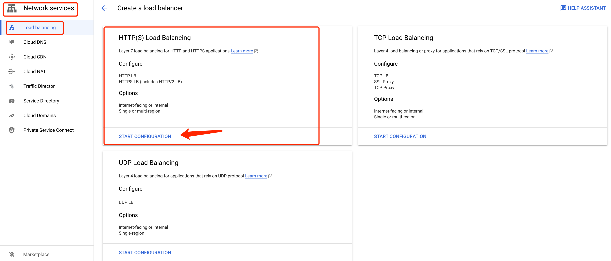

= Cloud Load Balancer
:toc: manual

== Prerequisites

=== Related Objects

link:LBObjects.adoc[Cloud Load Balancer Related Objects] 

=== health checks

[source, bash]
.*tcp health checks*
----
gcloud compute health-checks create tcp tcp-health-check --port=8080 --proxy-header=NONE --check-interval=5 --timeout=5 --unhealthy-threshold=3 --healthy-threshold=1
----

[source, bash]
.*http basic health checks*
----
gcloud compute health-checks create http http-basic-check --port 8080 --request-path=/ --proxy-header=NONE --check-interval=5 --timeout=5 --healthy-threshold=1 --unhealthy-threshold=3
----

[source, bash]
.*http advanced health checks*
----
gcloud compute health-checks create http http-advanced-check --port 8080 --request-path=/health-check --response=health --host=probe.example.com --proxy-header=NONE --check-interval=5 --timeout=5 --healthy-threshold=1 --unhealthy-threshold=3
----

=== instance template

[source, bash]
.*instance template(internet)*
----
gcloud compute instance-templates create lb-backend-template \
   --region=us-central1 \
   --network=default \
   --subnet=default \
   --tags=allow-health-check \
   --machine-type=e2-micro \
   --image-family=debian-11 \
   --image-project=debian-cloud \
   --metadata=startup-script='#!/bin/bash
      apt-get update
      apt-get install -y nginx
      curl -k -s https://raw.githubusercontent.com/cloudadc/cloud-quickstarts/main/gcp/network/lb/app.conf -o /etc/nginx/conf.d/app.conf
      update-rc.d nginx enable
      service nginx restart'
----

=== instance group(managed, zonal, internet)

[source, bash]
.*instance group*
----
gcloud compute instance-groups managed create mig-app-us \
   --base-instance-name=mig-app-us \
   --size=1 \
   --template=lb-backend-template  \
   --zone=us-central1-a  \
   --list-managed-instances-results=PAGELESS \
   --health-check=tcp-health-check  \
   --initial-delay=60

gcloud compute instance-groups managed set-autoscaling mig-app-us \
   --zone=us-central1-a  \ 
   --cool-down-period=60  \
   --max-num-replicas=3  \ 
   --min-num-replicas=1  \ 
   --mode=on  \
   --target-cpu-utilization=0.5

gcloud compute instance-groups set-named-ports mig-app-us --named-ports=webapp:8080 --zone=us-central1-a
----

[source, bash]
.**
----

----

[source, bash]
.**
----

----

[source, bash]
.**
----

----

[source, bash]
.**
----

----

== Global external HTTP Load Balancer

Google Cloud HTTP(S) load balancing is implemented at the edge of Google's network in Google's points of presence (POP) around the world. User traffic directed to an HTTP(S) load balancer enters the POP closest to the user and is then load-balanced over Google's global network to the closest backend that has sufficient available capacity.

=== Prepare the Network

[source, bash]
.*1. delete default network*
----
for i in $(gcloud compute firewall-rules list | grep NAME | awk '{print $2}') ; do gcloud compute firewall-rules delete $i ; done
gcloud compute networks delete default
----

[source, bash]
.*2. create test network*
----
gcloud compute networks create test --subnet-mode=custom
gcloud compute networks subnets create test-us-central1 --network=test --region=us-central1 --range=10.1.10.0/28
gcloud compute networks subnets create test-europe-west1 --network=test --region=europe-west1 --range=10.1.10.16/28
----

[source, bash]
.*3. create firewall-rules to allow all internal and external ssh, icmp*
----
gcloud compute firewall-rules create test-allow-internal --network=test --allow=tcp,udp,icmp --source-ranges=10.1.10.0/27
gcloud compute firewall-rules create test-allow-ssh --network=test --allow=tcp:22,icmp
----

[source, bash]
.*4. create firewall-rule to allow health check*
----
gcloud compute firewall-rules create test-allow-health-checks --network=test --allow tcp:8080 --source-ranges=130.211.0.0/22,35.191.0.0/16 --target-tags=allow-health-checks
----

NOTE: Health checks determine which instances of a load balancer can receive new connections. For HTTP load balancing, the health check probes to your load-balanced instances come from addresses in the ranges `130.211.0.0/22` and `35.191.0.0/16`.

=== Create a NAT to allow VM outbound traffic and load balancer inbound traffic

[source, bash]
.*1. create cloud router*
----
gcloud compute routers create nat-router-us-central1 --region=us-central1  --network=test
----

[source, bash]
.*2. create cloud nat*
----
gcloud compute routers nats create nat-config --router=nat-router-us-central1 --router-region=us-central1 --auto-allocate-nat-external-ips --nat-all-subnet-ip-ranges
----

NOTE: If VM instances without an external IP address, Cloud NAT service to allow those VM instances to send outbound traffic only through the Cloud NAT, and receive inbound traffic through the load balancer.

=== Prepare Application as VM Image

[source, bash]
.*1. Create VM Instance*
----
gcloud compute instances create webserver \
    --zone=us-central1-a \
    --machine-type=e2-micro \
    --network-interface=subnet=test-us-central1,no-address \
    --maintenance-policy=MIGRATE \
    --provisioning-model=STANDARD \
    --tags=allow-health-checks \
    --create-disk=auto-delete=no,boot=yes,device-name=webserver,image=projects/debian-cloud/global/images/debian-11-bullseye-v20230206,mode=rw,size=10,type=pd-balanced \
    --no-shielded-secure-boot \
    --shielded-vtpm \
    --shielded-integrity-monitoring \
    --reservation-affinity=any
----

* `--network-interface` - the `no-address` hints no public IP address will be assigned
* `--tags` - the `allow-health-checks` hints the firewall rules will filter traffic via tag `allow-health-checks`
* `--create-disk` - the `webserver` is the name of Disk, the `auto-delete=no` means Disk will keep even the Instance be deleted

[source, bash]
.*2. SSH to VM Instance setup Application*
----
sudo apt-get update
sudo apt-get install -y nginx
sudo service nginx start
sudo service nginx status
sudo update-rc.d nginx enable

sudo service nginx restart

$ curl localhost:8080

            request: GET / HTTP/1.1
               host: localhost
           hostname: webserver

        client addr: 127.0.0.1:36790
        server addr: 127.0.0.1:8080

             cookie: 
                xff: 
         user agent: curl/7.74.0
----

[source, bash]
.*3. Delete the VM Instance*
----
gcloud compute instances delete webserver --zone=us-central1-a
----

[source, bash]
.*4. Verify the Disk Still Exist*
----
$ gcloud compute disks list
NAME: webserver
LOCATION: us-central1-a
LOCATION_SCOPE: zone
SIZE_GB: 10
TYPE: pd-balanced
STATUS: READY
----

[source, bash]
.*5. Create VM Image*
----
gcloud compute images create testwebserver --source-disk=webserver --source-disk-zone=us-central1-a --storage-location=us --family=webserver
----

=== Create instance template

[source, bash]
.*1. configure the instance template*
----
gcloud compute instance-templates create us-webserver-template --machine-type=f1-micro --network-interface=subnet=test-us-central1,no-address --maintenance-policy=MIGRATE --provisioning-model=STANDARD --tags=allow-health-checks --create-disk=auto-delete=yes,boot=yes,device-name=testwebserver-template,image=testwebserver,mode=rw,size=10,type=pd-balanced --no-shielded-secure-boot --shielded-vtpm --shielded-integrity-monitoring --reservation-affinity=any

gcloud compute instance-templates create eu-webserver-template --machine-type=f1-micro --network-interface=subnet=test-europe-west1,no-address --maintenance-policy=MIGRATE --provisioning-model=STANDARD --tags=allow-health-checks --create-disk=auto-delete=yes,boot=yes,device-name=testwebserver-template,image=testwebserver,mode=rw,size=10,type=pd-balanced --no-shielded-secure-boot --shielded-vtpm --shielded-integrity-monitoring --reservation-affinity=any
----

[source, bash]
.*2. verify the instance template*
----
$ gcloud compute instance-templates list
NAME: eu-webserver-template
MACHINE_TYPE: f1-micro
PREEMPTIBLE:
CREATION_TIMESTAMP: 2023-02-18T07:33:52.548-08:00

NAME: us-webserver-template
MACHINE_TYPE: f1-micro
PREEMPTIBLE:
CREATION_TIMESTAMP: 2023-02-18T07:33:22.746-08:00
----

* link:lb-compute-instance-templates.json[lb-compute-instance-templates.json]

=== Create health check

[source, bash]
.*1. create health check for managed instance groups*
----
gcloud compute health-checks create tcp http-health-check --port=8080 --proxy-header=NONE --check-interval=5 --timeout=5 --unhealthy-threshold=2 --healthy-threshold=2
----

[source, bash]
.*2. verify the health check*
----
$ gcloud compute health-checks list --format=json
NAME: http-health-check
REGION:
PROTOCOL: TCP
----

* link:lb-compute-health-checks.json[lb-compute-health-checks.json]

=== Create instance groups

[source, bash]
.*1. create instance group us-central1-mig*
----
gcloud compute instance-groups managed create us-central1-mig --base-instance-name=us-central1-mig --size=1 --template=us-webserver-template --zones=us-central1-c,us-central1-f,us-central1-b --target-distribution-shape=EVEN --instance-redistribution-type=PROACTIVE --list-managed-instances-results=PAGELESS --health-check=http-health-check --initial-delay=60
gcloud compute instance-groups managed set-autoscaling us-central1-mig --region=us-central1 --cool-down-period=60 --max-num-replicas=2 --min-num-replicas=1 --mode=on --target-load-balancing-utilization=0.8
----

[source, bash]
.*2. create instance group europe-west1-mig*
----
gcloud compute instance-groups managed create europe-west1-mig --base-instance-name=europe-west1-mig --size=1 --template=eu-webserver-template --zones=europe-west1-b,europe-west1-d,europe-west1-c --target-distribution-shape=EVEN --instance-redistribution-type=PROACTIVE --list-managed-instances-results=PAGELESS --health-check=http-health-check --initial-delay=60
gcloud compute instance-groups managed set-autoscaling europe-west1-mig --region=europe-west1 --cool-down-period=60 --max-num-replicas=2 --min-num-replicas=1 --mode=on --target-load-balancing-utilization=0.8
----

[source, bash]
.*3. verify the instance groups*
----
$ gcloud compute instance-groups list
NAME: us-central1-mig
LOCATION: us-central1
SCOPE: region
NETWORK: test
MANAGED: Yes
INSTANCES: 1

NAME: europe-west1-mig
LOCATION: europe-west1
SCOPE: region
NETWORK: test
MANAGED: Yes
INSTANCES: 1
----

* link:lb-compute-instance-groups.json[lb-compute-instance-groups.json]

=== Configure the HTTP load balancer

*1. click `Network Services` > `Load balancingStart`, click `Create Load Balancer`*

NOTE: There mainly 3 categories of Load Balancers.

*2. Select `From Internet to my VMs or serverless services` and `Global HTTP(S) Load Balancer`*

image:lb-create-options.png[]

*3. Configure Frontend with both IPv4 and IPv6 address on port 80*

image:lb-fronted.png[]

*4. Configure Backend reference with 2 instance groups*

NOTE: the health check passed, both instance groups has one active vm instance.

*5. Observability*

image:lb-observe.png[]

=== Test access the application via LB endpoint

[source, bash]
.*1. IPv4 access*
----
$ curl http://34.110.133.211/

            request: GET / HTTP/1.1
               host: 34.110.133.211
           hostname: us-central1-mig-hj4h

        client addr: 35.191.13.248:36374
        server addr: 10.1.10.3:8080

             cookie: 
                xff: 
         user agent: curl/7.64.1
----

[source, bash]
.*2. IPv6 access*
----
$ curl http://[2600:1901:0:8a64::]/

            request: GET / HTTP/1.1
               host: [2600:1901:0:8a64::]
           hostname: us-central1-mig-hj4h

        client addr: 35.191.10.41:60452
        server addr: 10.1.10.3:8080

             cookie: 
                xff: 
         user agent: curl/7.64.1
----

[source, bash]
.*3. Access 10 times. record client address*
----
$ for i in {1..10} ; do curl -s http://[2600:1901:0:8a64::]/ | grep client ; done
        client addr: 35.191.19.137:59148
        client addr: 35.191.23.243:36940
        client addr: 35.191.17.70:53276
        client addr: 35.191.13.251:37462
        client addr: 35.191.19.172:37568
        client addr: 35.191.17.147:35084
        client addr: 35.191.10.45:41058
        client addr: 35.191.19.138:48834
        client addr: 35.191.17.144:34852
        client addr: 35.191.23.80:55730
----

NOTE: the cloud load balancer use `35.191.0.0/16` as snat pool.

*4. Review LB's health check packets*

Note that the Load Balancer source also come from `35.191.0.0/16`, use one of member of snat pool.

== Global external HTTP load balancer (classic)

External HTTP(S) Load Balancing is a proxy-based Layer 7 load balancer that enables you to run and scale your services behind a single external IP address. External HTTP(S) Load Balancing distributes HTTP and HTTPS traffic to backends hosted on a variety of Google Cloud platforms (such as Compute Engine, Google Kubernetes Engine (GKE), Cloud Storage, and so on), as well as external backends connected over the internet or via hybrid connectivity.

The Topology as below figure:

image:gcp-network-lb-http-classic.png[]

=== Prepare NGINX Application

Refer to link:#instance-template[instance template] and link:#instance-groupmanaged-zonal-internet[instance group(managed, zonal, internet)] to create a Managed Instance Group.

Create firewall rule to allow health check and LB snat ingress request:

[source, bash]
.*3. Create firewall rule to allow health check and LB snat ingress request*
----
gcloud compute firewall-rules create fw-allow-health-check --network=default --action=allow --direction=ingress --source-ranges=130.211.0.0/22,35.191.0.0/16 --target-tags=allow-health-check --rules=tcp:8080
----

=== HTTP Load Balancer

[source, bash]
.*1. set up a global static external IP address*
----
gcloud compute addresses create lb-ipv4-1 --ip-version=IPV4 --global
----

*2. Create a HTTP health check*

Refer to link:#health-checks[health checks] to create a `http-basic-check` health check.

[source, bash]
.*3. Create a backend service*
----
gcloud compute backend-services create web-backend-service --protocol=HTTP --port-name=webapp --health-checks=http-basic-check --global
----

[source, bash]
.*4. Add instance group to the backend service*
----
gcloud compute backend-services add-backend web-backend-service --instance-group=mig-app-us --instance-group-zone=us-central1-a --global
----

[source, bash]
.*5. Create a URL map to route the incoming requests to the default backend service*
----
gcloud compute url-maps create web-map-http --default-service web-backend-service
----

[source, bash]
.*6. Create a target HTTP proxy to route requests to your URL map*
----
gcloud compute target-http-proxies create http-lb-proxy --url-map web-map-http
----

[source, bash]
.*7. Create a global forwarding rule to route incoming requests to the proxy*
----
gcloud compute forwarding-rules create http-content-rule --address=lb-ipv4-1 --global --target-http-proxy=http-lb-proxy --ports=80
----

=== Test to access application

[source, bash]
----
$ IPAddress=$(gcloud compute forwarding-rules describe http-content-rule --global | grep IPAddress | awk '{print $2}') ; for i in 1 2 3  ; do curl $IPAddress ; done

            request: GET / HTTP/1.1
               host: 34.111.231.147
           hostname: lb-backend-group-s699

        client addr: 35.191.8.83:57775
        server addr: 10.128.0.2:8080

             cookie:
                xff:
         user agent: curl/7.74.0

            request: GET / HTTP/1.1
               host: 34.111.231.147
           hostname: lb-backend-group-s699

        client addr: 35.191.1.236:49776
        server addr: 10.128.0.2:8080

             cookie:
                xff:
         user agent: curl/7.74.0

            request: GET / HTTP/1.1
               host: 34.111.231.147
           hostname: lb-backend-group-g7b1

        client addr: 130.211.0.93:57606
        server addr: 10.128.0.3:8080

             cookie:
                xff:
         user agent: curl/7.74.0
----

== Network load balancer

Google Cloud external TCP/UDP Network Load Balancing is a regional, pass-through load balancer. A network load balancer distributes external traffic among virtual machine (VM) instances in the same region.

The Topology as below figure:

=== Create web server VM instances

[source, bash]
.*1. create vm www1*
----
gcloud compute instances create www1 \
    --zone=us-central1-a \
    --tags=network-lb-tag \
    --machine-type=e2-small \
    --image-family=debian-11 \
    --image-project=debian-cloud \
    --metadata=startup-script='#!/bin/bash
      apt-get update
      apt-get install -y nginx
      curl -k -s https://raw.githubusercontent.com/cloudadc/cloud-quickstarts/main/gcp/network/lb/app.conf -o /etc/nginx/conf.d/app.conf
      update-rc.d nginx enable
      service nginx restart'
----

[source, bash]
.*2. create vm www2*
----
gcloud compute instances create www2 \
    --zone=us-central1-a \
    --tags=network-lb-tag \
    --machine-type=e2-small \
    --image-family=debian-11 \
    --image-project=debian-cloud \
    --metadata=startup-script='#!/bin/bash
      apt-get update
      apt-get install -y nginx
      curl -k -s https://raw.githubusercontent.com/cloudadc/cloud-quickstarts/main/gcp/network/lb/app.conf -o /etc/nginx/conf.d/app.conf
      update-rc.d nginx enable
      service nginx restart'
----

[source, bash]
.*3. create vm www3*
----
gcloud compute instances create www3 \
    --zone=us-central1-a \
    --tags=network-lb-tag \
    --machine-type=e2-small \
    --image-family=debian-11 \
    --image-project=debian-cloud \
    --metadata=startup-script='#!/bin/bash
      apt-get update
      apt-get install -y nginx
      curl -k -s https://raw.githubusercontent.com/cloudadc/cloud-quickstarts/main/gcp/network/lb/app.conf -o /etc/nginx/conf.d/app.conf
      update-rc.d nginx enable
      service nginx restart'
----

[source, bash] 
.*4. create firewall to allow http request*
----
gcloud compute firewall-rules create www-firewall-network-lb --target-tags network-lb-tag --allow tcp:8080
---- 

[source, bash]
.*5. test access www app*
----
$ for ip in $(gcloud compute instances list | grep EXTERNAL_IP | awk '{print $2}') ; do curl $ip:8080 ; done

            request: GET / HTTP/1.1
               host: 34.66.174.19
           hostname: www1

        client addr: 34.87.162.177:37952
        server addr: 10.128.0.5:8080

             cookie:
                xff:
         user agent: curl/7.74.0

            request: GET / HTTP/1.1
               host: 34.30.185.127
           hostname: www2

        client addr: 34.87.162.177:34504
        server addr: 10.128.0.6:8080

             cookie:
                xff:
         user agent: curl/7.74.0

            request: GET / HTTP/1.1
               host: 34.30.158.80
           hostname: www3

        client addr: 34.87.162.177:41204
        server addr: 10.128.0.7:8080

             cookie:
                xff:
         user agent: curl/7.74.0
----

=== Network load balancer

[source, bash]
.*1. Create a static external IP address*
----
gcloud compute addresses create network-lb-ip-1 --region=us-central1
----

[source, bash]
.*2. Create a HTTP health check*
----
gcloud compute http-health-checks create basic-check
----

[source, bash]
.*3. Create a target pool*
----
gcloud compute target-pools create www-pool --region=us-central1 --http-health-check=basic-check
----

[source, bash]
.*4. Add the instances to the pool*
----
gcloud compute target-pools add-instances www-pool --instances=www1,www2,www3 --instances-zone=us-central1-a --region=us-central1
----

[source, bash]
.*5. Add a forwarding rule*
----
gcloud compute forwarding-rules create www-rule --region=us-central1 --ports=8080 --address=network-lb-ip-1 --target-pool=www-pool
----

=== Test to access application

[source, bash]
----           
$ IPADDRESS=$(gcloud compute forwarding-rules describe www-rule --region=us-central1 | grep IPAddress | awk '{print $2}') ; for i in 1 2 3 ; do curl $IPADDRESS:8080 ; done
               
            request: GET / HTTP/1.1
               host: 34.134.75.195
           hostname: www2
        
        client addr: 34.87.162.177:40456
        server addr: 34.134.75.195:8080
                
             cookie: 
                xff:
         user agent: curl/7.74.0
            
               
            request: GET / HTTP/1.1
               host: 34.134.75.195
           hostname: www3
        
        client addr: 34.87.162.177:34026
        server addr: 34.134.75.195:8080
                
             cookie: 
                xff:
         user agent: curl/7.74.0
            
               
            request: GET / HTTP/1.1
               host: 34.134.75.195
           hostname: www2
        
        client addr: 34.87.162.177:34038
        server addr: 34.134.75.195:8080
                
             cookie: 
                xff:
         user agent: curl/7.74.0
----

== Internal Load Balancer

Google Cloud offers Internal Load Balancing for your TCP/UDP-based traffic. Internal Load Balancing enables you to run and scale your services behind a private load balancing IP address that is accessible only to your internal virtual machine instances.

=== Configure internal traffic and health check firewall rules

[source, bash]
----
gcloud compute firewall-rules create fw-allow-health-checks --network my-internal-app --allow tcp:80 --source-ranges 130.211.0.0/22,35.191.0.0/16 --target-tags backend-service
gcloud compute firewall-rules create fw-allow-lb-access --network my-internal-app --allow all --source-ranges 10.10.0.0/16 --target-tags backend-service
----

NOTE: Configure firewall rules to allow internal traffic connectivity from sources in the 10.10.0.0/16 range. This rule allows incoming traffic from any client located in the subnet. Health checks determine which instances of a load balancer can receive new connections. For HTTP load balancing, the health check probes to your load-balanced instances come from addresses in the ranges 130.211.0.0/22 and 35.191.0.0/16. Your firewall rules must allow these connections.

=== Create a NAT configuration using Cloud Router

[source, bash]
.*1. create cloud router*
----
gcloud compute routers create nat-router-us-central1 --region us-central1 --network my-internal-app
----

[source, bash]
.*2. create cloud nat*
----
gcloud compute routers nats create nat-config --router=nat-router-us-central1 --router-region=us-central1 --auto-allocate-nat-external-ips --nat-all-subnet-ip-ranges
----

NOTE: If VM instances without an external IP address, Cloud NAT service to allow these VM instances to send outbound traffic only through the Cloud NAT, and receive inbound traffic through the load balancer.

