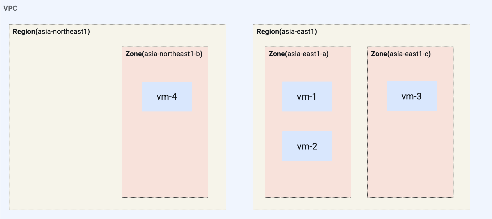
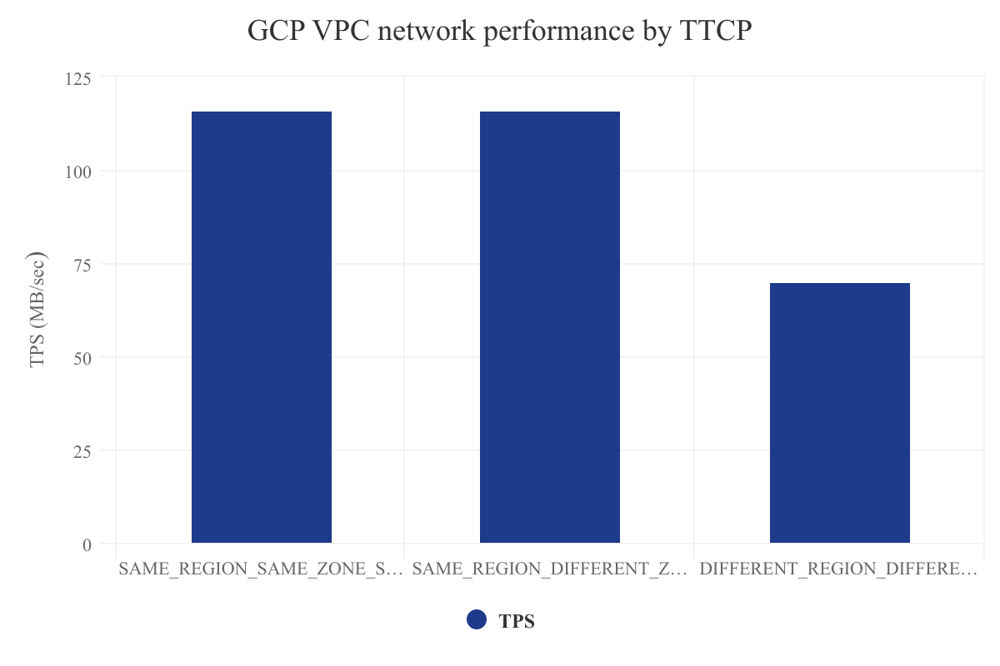

= VPC
:toc: manual

== default network

=== network

[source, bash]
----
gcloud compute networks list
----

link:default.json[default.json]

[source, json]
----
{
    "autoCreateSubnetworks": true,
    "kind": "compute#network",
    "name": "default",
    "networkFirewallPolicyEnforcementOrder": "AFTER_CLASSIC_FIREWALL",
    "x_gcloud_bgp_routing_mode": "REGIONAL",
    "x_gcloud_subnet_mode": "AUTO"
}
----

=== subnets

[source, bash]
----
gcloud compute networks subnets list
----

link:default-subnets.json[default-subnets.json]

|===
|gatewayAddress |ipCidrRange |name |privateIpGoogleAccess |purpose |stackType |network |region

| 10.128.0.1
| 10.128.0.0/20
| default
| false
| PRIVATE
| IPV4_ONLY
| default
| us-central1

| 10.132.0.1
| 10.132.0.0/20
| default
| false
| PRIVATE
| IPV4_ONLY
| default
| europe-west1

| 10.138.0.1
| 10.138.0.0/20
| default
| false
| PRIVATE
| IPV4_ONLY
| default
| us-west1

| 10.140.0.1
| 10.140.0.0/20
| default
| false
| PRIVATE
| IPV4_ONLY
| default
| asia-east1

| 10.142.0.1
| 10.142.0.0/20
| default
| false
| PRIVATE
| IPV4_ONLY
| default
| us-east1

| 10.146.0.1
| 10.146.0.0/20
| default
| false
| PRIVATE
| IPV4_ONLY
| default
| asia-northeast1

| 10.148.0.1
| 10.148.0.0/20
| default
| false
| PRIVATE
| IPV4_ONLY
| default
| asia-southeast1

| 10.150.0.1
| 10.150.0.0/20
| default
| false
| PRIVATE
| IPV4_ONLY
| default
| us-east4

| 10.152.0.1
| 10.152.0.0/20
| default
| false
| PRIVATE
| IPV4_ONLY
| default
| australia-southeast1

| 10.154.0.1
| 10.154.0.0/20
| default
| false
| PRIVATE
| IPV4_ONLY
| default
| europe-west2

| 10.156.0.1
| 10.156.0.0/20
| default
| false
| PRIVATE
| IPV4_ONLY
| default
| europe-west3

| 10.160.0.1
| 10.160.0.0/20
| default
| false
| PRIVATE
| IPV4_ONLY
| default
| asia-south1

| 10.164.0.1
| 10.164.0.0/20
| default
| false
| PRIVATE
| IPV4_ONLY
| default
| europe-west4

| 10.166.0.1
| 10.166.0.0/20
| default
| false
| PRIVATE
| IPV4_ONLY
| default
| europe-north1

| 10.168.0.1
| 10.168.0.0/20
| default
| false
| PRIVATE
| IPV4_ONLY
| default
| us-west2

| 10.180.0.1
| 10.180.0.0/20
| default
| false
| PRIVATE
| IPV4_ONLY
| default
| us-west3

| 10.182.0.1
| 10.182.0.0/20
| default
| false
| PRIVATE
| IPV4_ONLY
| default
| us-west4

| 10.186.0.1
| 10.186.0.0/20
| default
| false
| PRIVATE
| IPV4_ONLY
| default
| europe-central2

| 10.194.0.1
| 10.194.0.0/20
| default
| false
| PRIVATE
| IPV4_ONLY
| default
| southamerica-west1

| 10.196.0.1
| 10.196.0.0/20
| default
| false
| PRIVATE
| IPV4_ONLY
| default
| us-east7

|10.202.0.1
|10.202.0.0/20
|default
|false
|PRIVATE
|IPV4_ONLY
|default
|us-east5

|10.206.0.1
|10.206.0.0/20
|default
|false
|PRIVATE
|IPV4_ONLY
|default
|us-south1

|10.208.0.1
|10.208.0.0/20
|default
|false
|PRIVATE
|IPV4_ONLY
|default
|me-west1
|===

=== routes

[source, bash]
----
gcloud compute routes list
----

link:default-routes.json[default-routes.json]

|===
|destRange |name |priority |network |nextHopNetwork

|0.0.0.0/0
|default-route-a9424e017df6cc72
|1000
|default
|

|10.154.0.0/20
|default-route-120b0e8e1a1e6600
|0
|default
|default

|10.160.0.0/20
|default-route-185361fb8189dc54
|0
|default
|default

|10.132.0.0/20
|default-route-1920fc2005167826
|0
|default
|default

|10.194.0.0/20
|default-route-263f56c558e23588
|0
|default
|default

|10.202.0.0/20
|default-route-2ac9262d4c41487b
|0
|default
|default

|10.140.0.0/20
|default-route-3589d5e6cf6657b9
|0
|default
|default

|10.138.0.0/20
|default-route-3999302cbd084b50
|0
|default
|default

|10.164.0.0/20
|default-route-468313b5bf1066c2
|0
|default
|default

|10.150.0.0/20
|default-route-561bda1e08a32613
|0
|default
|default

|10.128.0.0/20
|default-route-632dca7cafdb3528
|0
|default
|default

|10.186.0.0/20
|default-route-7897f5199529c84b
|0
|default
|default

|10.182.0.0/20
|default-route-817fc4d84c6484bc
|0
|default
|default

|10.146.0.0/20
|default-route-85e8c45f9ba3ad71
|0
|default
|default

|10.180.0.0/20
|default-route-8a1b6b72c04e1c19
|0
|default
|default

|10.142.0.0/20
|default-route-b9ecc55c1f8a18e0
|0
|default
|default

|10.148.0.0/20
|default-route-c0920f75992bc86b
|0
|default
|default

|10.152.0.0/20
|default-route-c316d6acc7332b4b
|0
|default
|default

|10.166.0.0/20
|default-route-d431f58d6523f27a
|0
|default
|default

|10.206.0.0/20
|default-route-d62ba1b5651c11e7
|0
|default
|default

|10.208.0.0/20
|default-route-d66d5f3c08efee80
|0
|default
|default

|10.168.0.0/20
|default-route-e7174b8619696a58
|0
|default
|default

|10.156.0.0/20
|default-route-eccb105ce62524b8
|0
|default
|default

|10.196.0.0/20
|default-route-eebfbfdb149fa172
|0
|default
|default
|===

=== firewall rules

[source, bash] 
----
gcloud compute firewall-rules list
----

link:default-firewall-rules.json[default-firewall-rules.json]

|===
|name |direction |network |priority |sourceRanges |allowedProtocolPort |logConfigEnable
|default-allow-icmp
|INGRESS
|default
|65534
|0.0.0.0/0
|icmp
|false

|default-allow-internal
|INGRESS
|default
|65534
|10.128.0.0/9
|tcp/(0-65535)
|false

|default-allow-rdp
|INGRESS
|default
|65534
|0.0.0.0/0
|tcp/3389
|false

|default-allow-ssh
|INGRESS
|default
|65534
|0.0.0.0/0
|tcp/22
|false
|===

== delete default network

=== delete vpc network firewall rules

[source, bash]
----
for i in $(gcloud compute firewall-rules list | grep NAME | awk '{print $2}') ; do gcloud compute firewall-rules delete $i ; done
----

=== delete default vpc network

[source, bash]
----
gcloud compute networks delete default
----

== One VPC, Three Netowrks, Two Regions, Five VMs

|===
|NAME |Region| ZONE |Network| Internal IP

|mynetwork-us-vm
|us-central1
|us-central1-b
|mynetwork
|10.128.0.2

|mynetwork-eu-vm
|europe-west1
|europe-west1-c
|mynetwork
|10.132.0.2

|managementnet-us-vm
|us-central1
|us-central1-b
|managementnet
|10.240.0.2

|privatenet-us-vm
|us-central1
|us-central1-b
|privatenet
|172.16.0.2

|privatenet-eu-vm
|europe-west1
|europe-west1-c
|privatenet
|172.20.0.2

|===

* link:instances.json[instances.json]

=== Create Networks

[source, bash]
.*delete default network*
----
for i in $(gcloud compute firewall-rules list | grep NAME | awk '{print $2}') ; do gcloud compute firewall-rules delete $i ; done
gcloud compute networks delete default
----

[source, bash]
.*Create networks*
----
gcloud compute networks create mynetwork --subnet-mode=auto
gcloud compute networks create managementnet --subnet-mode=custom
gcloud compute networks create privatenet --subnet-mode=custom
----

[source, bash]
.*Create subnets*
----
gcloud compute networks subnets create managementsubnet-us --network=managementnet --region=us-central1 --range=10.240.0.0/20
gcloud compute networks subnets create privatesubnet-us --network=privatenet --region=us-central1 --range=172.16.0.0/24
gcloud compute networks subnets create privatesubnet-eu --network=privatenet --region=europe-west1 --range=172.20.0.0/20
----

=== Create Firewall Rules

[source, bash]
.*mynetwork*
----
gcloud compute firewall-rules create mynetwork-allow-custom --network=mynetwork --direction=INGRESS --priority=65534 --source-ranges=10.128.0.0/9 --action=ALLOW --rules=all
gcloud compute firewall-rules create mynetwork-allow-icmp --network=mynetwork --direction=INGRESS --priority=65534 --source-ranges=0.0.0.0/0 --action=ALLOW --rules=icmp
gcloud compute firewall-rules create mynetwork-allow-rdp --network=mynetwork --direction=INGRESS --priority=65534 --source-ranges=0.0.0.0/0 --action=ALLOW --rules=tcp:3389
gcloud compute firewall-rules create mynetwork-allow-ssh --network=mynetwork --direction=INGRESS --priority=65534 --source-ranges=0.0.0.0/0 --action=ALLOW --rules=tcp:22
----

[source, bash]
.*managementnet*
----
gcloud compute firewall-rules create managementnet-allow-icmp-ssh-rdp --direction=INGRESS --priority=1000 --network=managementnet --action=ALLOW --rules=icmp,tcp:22,tcp:3389 --source-ranges=0.0.0.0/0
----

[source, bash]
.*privatenet*
----
gcloud compute firewall-rules create privatenet-allow-icmp-ssh-rdp --direction=INGRESS --priority=1000 --network=privatenet --action=ALLOW --rules=icmp,tcp:22,tcp:3389 --source-ranges=0.0.0.0/0
----

=== Create VMs

[source, bash]
.*mynetwork*
----
gcloud compute instances create mynetwork-us-vm --zone=us-central1-b --machine-type=e2-micro --subnet=mynetwork --image-family=debian-11 --image-project=debian-cloud --boot-disk-size=10GB --boot-disk-type=pd-standard --boot-disk-device-name=mynetwork-us-vm
gcloud compute instances create mynetwork-eu-vm --zone=europe-west1-c --machine-type=e2-micro --subnet=mynetwork --image-family=debian-11 --image-project=debian-cloud --boot-disk-size=10GB --boot-disk-type=pd-standard --boot-disk-device-name=mynetwork-eu-vm
----

[source, bash]
.*managementnet*
----
gcloud compute instances create managementnet-us-vm --zone=us-central1-b --machine-type=e2-micro --subnet=managementsubnet-us --image-family=debian-11 --image-project=debian-cloud --boot-disk-size=10GB --boot-disk-type=pd-standard --boot-disk-device-name=managementnet-us-vm
----

[source, bash]
.*privatesubnet*
----
gcloud compute instances create privatenet-us-vm --zone=us-central1-b --machine-type=e2-micro --subnet=privatesubnet-us --image-family=debian-11 --image-project=debian-cloud --boot-disk-size=10GB --boot-disk-type=pd-standard --boot-disk-device-name=privatenet-us-vm
gcloud compute instances create privatenet-eu-vm --zone=europe-west1-c --machine-type=e2-micro --subnet=privatesubnet-eu --image-family=debian-11 --image-project=debian-cloud --boot-disk-size=10GB --boot-disk-type=pd-standard --boot-disk-device-name=privatenet-us-vm
----

=== Test Connectivity

[source, bash]
.*Extract Internal and External IPs*
----
INTERNAL_IPS=$(gcloud compute instances list | grep INTERNAL_IP | awk '{print $2}')
EXTERNAL_IPS=$(gcloud compute instances list | grep EXTERNAL_IP | awk '{print $2}')
echo $INTERNAL_IPS
echo $EXTERNAL_IPS
----

[source, bash]
.*SSH to mynetwork-us-vm, and ping all external ips*
----
mynetwork-us-vm:~$ for i in $EXTERNAL_IPS ; do ping $i -c3 ; done
PING 34.28.96.75 (34.28.96.75) 56(84) bytes of data.
64 bytes from 34.28.96.75: icmp_seq=1 ttl=61 time=2.26 ms
64 bytes from 34.28.96.75: icmp_seq=2 ttl=61 time=0.701 ms
64 bytes from 34.28.96.75: icmp_seq=3 ttl=61 time=0.810 ms

--- 34.28.96.75 ping statistics ---
3 packets transmitted, 3 received, 0% packet loss, time 2011ms
rtt min/avg/max/mdev = 0.701/1.257/2.260/0.710 ms
PING 34.122.119.170 (34.122.119.170) 56(84) bytes of data.
64 bytes from 34.122.119.170: icmp_seq=1 ttl=61 time=1.67 ms
64 bytes from 34.122.119.170: icmp_seq=2 ttl=61 time=0.557 ms
64 bytes from 34.122.119.170: icmp_seq=3 ttl=61 time=0.499 ms

--- 34.122.119.170 ping statistics ---
3 packets transmitted, 3 received, 0% packet loss, time 2012ms
rtt min/avg/max/mdev = 0.499/0.908/1.668/0.537 ms
PING 34.67.22.140 (34.67.22.140) 56(84) bytes of data.
64 bytes from 34.67.22.140: icmp_seq=1 ttl=61 time=2.75 ms
64 bytes from 34.67.22.140: icmp_seq=2 ttl=61 time=0.657 ms
64 bytes from 34.67.22.140: icmp_seq=3 ttl=61 time=0.653 ms

--- 34.67.22.140 ping statistics ---
3 packets transmitted, 3 received, 0% packet loss, time 2012ms
rtt min/avg/max/mdev = 0.653/1.352/2.746/0.985 ms
PING 34.77.219.183 (34.77.219.183) 56(84) bytes of data.
64 bytes from 34.77.219.183: icmp_seq=1 ttl=53 time=104 ms
64 bytes from 34.77.219.183: icmp_seq=2 ttl=53 time=103 ms
64 bytes from 34.77.219.183: icmp_seq=3 ttl=53 time=103 ms

--- 34.77.219.183 ping statistics ---
3 packets transmitted, 3 received, 0% packet loss, time 2003ms
rtt min/avg/max/mdev = 103.082/103.552/104.420/0.614 ms
PING 35.233.109.131 (35.233.109.131) 56(84) bytes of data.
64 bytes from 35.233.109.131: icmp_seq=1 ttl=53 time=105 ms
64 bytes from 35.233.109.131: icmp_seq=2 ttl=53 time=103 ms
64 bytes from 35.233.109.131: icmp_seq=3 ttl=53 time=103 ms

--- 35.233.109.131 ping statistics ---
3 packets transmitted, 3 received, 0% packet loss, time 2003ms
rtt min/avg/max/mdev = 103.280/103.802/104.813/0.714 ms
----

[source, bash]
.*SSH to mynetwork-us-vm, and ping all external ips*
----
$ for i in $INTERNAL_IPS ; do ping $i -c3 ; done
PING 10.240.0.2 (10.240.0.2) 56(84) bytes of data.

--- 10.240.0.2 ping statistics ---
3 packets transmitted, 0 received, 100% packet loss, time 2049ms

PING 10.128.0.2 (10.128.0.2) 56(84) bytes of data.
64 bytes from 10.128.0.2: icmp_seq=1 ttl=64 time=0.027 ms
64 bytes from 10.128.0.2: icmp_seq=2 ttl=64 time=0.051 ms
64 bytes from 10.128.0.2: icmp_seq=3 ttl=64 time=0.050 ms

--- 10.128.0.2 ping statistics ---
3 packets transmitted, 3 received, 0% packet loss, time 2029ms
rtt min/avg/max/mdev = 0.027/0.042/0.051/0.011 ms
PING 172.16.0.2 (172.16.0.2) 56(84) bytes of data.

--- 172.16.0.2 ping statistics ---
3 packets transmitted, 0 received, 100% packet loss, time 2044ms

PING 10.132.0.2 (10.132.0.2) 56(84) bytes of data.
64 bytes from 10.132.0.2: icmp_seq=1 ttl=64 time=104 ms
64 bytes from 10.132.0.2: icmp_seq=2 ttl=64 time=109 ms
64 bytes from 10.132.0.2: icmp_seq=3 ttl=64 time=109 ms

--- 10.132.0.2 ping statistics ---
3 packets transmitted, 3 received, 0% packet loss, time 2003ms
rtt min/avg/max/mdev = 104.079/107.486/109.197/2.409 ms
PING 172.20.0.2 (172.20.0.2) 56(84) bytes of data.

--- 172.20.0.2 ping statistics ---
3 packets transmitted, 0 received, 100% packet loss, time 2024ms
----

NOTE: only VM in mynetwork can be ping successfully.

=== Delete VMs, Firewall rules, Networks

[source, bash]
.*Delete VM, Firewall rules, networks*
----
for i in $(gcloud compute instances list | grep NAME | awk '{print $2}'); do gcloud compute instances delete $i --zone=$(gcloud compute instances list $i | grep ZONE | awk '{print $2}'); done

for i in $(gcloud compute firewall-rules list | grep NAME | awk '{print $2}') ; do gcloud compute firewall-rules delete $i ; done

for i in $(gcloud compute networks list | grep NAME | awk '{print $2}'); do gcloud compute networks delete $i ; done
----

== One VPC, One Netowrks, Two Regions, Four VMs 

As below figure, 4 VM instances will created, `vm-1`, `vm-2` and `vm-3` are all on same region, `vm-4` on a different region, `vm-1` and `vm-2` also on same zone, `vm-3` on a different zone, `vm-1`, `vm-2` and `vm-3`.

=== Create custom Network

Use the following steps to create a custom vpc network:

[source, bash]
.*1. delete default network*
----
for i in $(gcloud compute firewall-rules list | grep NAME | awk '{print $2}') ; do gcloud compute firewall-rules delete $i ; done
gcloud compute networks delete default
----

[source, bash]
.*2. create custom network*
----
gcloud compute networks create mynetwork --subnet-mode=custom --mtu=1460 --bgp-routing-mode=regional
----

[source, bash]
.*3. create subnets*
----
gcloud compute networks subnets create subnet-1 --range=10.140.0.0/20 --stack-type=IPV4_ONLY --network=mynetwork --region=asia-east1
gcloud compute networks subnets create subnet-2 --range=10.146.0.0/20 --stack-type=IPV4_ONLY --network=mynetwork --region=asia-northeast1
----

[source, bash]
.*4. create firewall rules*
----
gcloud compute firewall-rules create mynetwork-allow-custom --network=mynetwork --direction=INGRESS --priority=65534 --source-ranges=10.140.0.0/20,10.146.0.0/20 --action=ALLOW --rules=all
gcloud compute firewall-rules create mynetwork-allow-icmp --network=mynetwork --direction=INGRESS --priority=65534 --source-ranges=0.0.0.0/0 --action=ALLOW --rules=icmp
gcloud compute firewall-rules create mynetwork-allow-rdp --network=mynetwork --direction=INGRESS --priority=65534 --source-ranges=0.0.0.0/0 --action=ALLOW --rules=tcp:3389
gcloud compute firewall-rules create mynetwork-allow-ssh --network=mynetwork --direction=INGRESS --priority=65534 --source-ranges=0.0.0.0/0 --action=ALLOW --rules=tcp:22
----

=== Create VMs

[source, bash]
.*Create 4 vm instances on Cloud Shell*
----
gcloud compute instances create vm-1  --zone=asia-east1-a --machine-type=e2-micro --network-interface=network-tier=PREMIUM,subnet=subnet-1 --metadata=enable-oslogin=true --maintenance-policy=MIGRATE --provisioning-model=STANDARD --create-disk=auto-delete=yes,boot=yes,device-name=vm-1,image=centos-7-v20221206,mode=rw,size=20,type=pd-balanced --no-shielded-secure-boot --shielded-vtpm --shielded-integrity-monitoring --reservation-affinity=any

gcloud compute instances create vm-2  --zone=asia-east1-a --machine-type=e2-micro --network-interface=network-tier=PREMIUM,subnet=subnet-1 --metadata=enable-oslogin=true --maintenance-policy=MIGRATE --provisioning-model=STANDARD --create-disk=auto-delete=yes,boot=yes,device-name=vm-1,image=centos-7-v20221206,mode=rw,size=20,type=pd-balanced --no-shielded-secure-boot --shielded-vtpm --shielded-integrity-monitoring --reservation-affinity=any

gcloud compute instances create vm-3  --zone=asia-east1-c --machine-type=e2-micro --network-interface=network-tier=PREMIUM,subnet=subnet-1 --metadata=enable-oslogin=true --maintenance-policy=MIGRATE --provisioning-model=STANDARD --create-disk=auto-delete=yes,boot=yes,device-name=vm-1,image=centos-7-v20221206,mode=rw,size=20,type=pd-balanced --no-shielded-secure-boot --shielded-vtpm --shielded-integrity-monitoring --reservation-affinity=any

gcloud compute instances create vm-4  --zone=asia-northeast1-b --machine-type=e2-micro --network-interface=network-tier=PREMIUM,subnet=subnet-2 --metadata=enable-oslogin=true --maintenance-policy=MIGRATE --provisioning-model=STANDARD --create-disk=auto-delete=yes,boot=yes,device-name=vm-1,image=centos-7-v20221206,mode=rw,size=20,type=pd-balanced --no-shielded-secure-boot --shielded-vtpm --shielded-integrity-monitoring --reservation-affinity=any
----

=== test icmp connectivity

[source, bash]
.*1. extract the internal ips and external ips*
----
INTERNAL_IPS=$(gcloud compute instances list | grep INTERNAL_IP | awk '{print $2}')
EXTERNAL_IPS=$(gcloud compute instances list | grep EXTERNAL_IP | awk '{print $2}')
echo $INTERNAL_IPS
echo $EXTERNAL_IPS
----

NOTE: Copy the both output, which will used in next step.

[source, bash]
.*2. set INTERNAL_IPS and EXTERNAL_IPS with value of above outputs, execute the following commands in all vms*
----
for i in $INTERNAL_IPS ; do ping $i -c3 ; done
for i in $EXTERNAL_IPS ; do ping $i -c3 ; done
----

NOTE: All ping on each vms are success, both internal and external ip can be ping succcess on all vms, no matter vm are on same zone, same region, different region, same subnet, different subnet.

=== vpc network performance

In this section, we will test the customized vpc network which created in above step via `ping` and `ttcp` tools. `ttcp` need install on all vms, more about ttcp refer to https://github.com/kylinsoong/ttcp/releases.

Run ttcp recv on `vm-1`, then run ttcp trans on vm-2`, `vm-3` and `vm-4` accordingly, record the results. Raw results from recv side refer to link:results.ttcp[results.ttcp], which each trans are run 3 times.

* vm in same subnet has similar performance, even they are on same zone, or different zone
* vm on different subnet(vm are across region) has significant performance downgrade
* TPS on same subnet are around 116 MB/sec
* TPS on different subnet are around 70 MB/sec

=== remove allow icmp firewall rule, test icmp/tcp connectivity

[source, bash]
.*1. remove allow icmp firewall rule*
----
gcloud compute firewall-rules delete mynetwork-allow-icmp
----

[source, bash]
.*2. test icmp connectivity*
----
for i in $INTERNAL_IPS ; do ping $i -c3 ; done
for i in $EXTERNAL_IPS ; do ping $i -c3 ; done
----

NOTE: The ping against internal ips are all success, even vm are across different region and different subnets; all ping against external ips all failed, which remove allow icmp firewall rule take effect.

[source, bash]
.*3. test tcp connectivity*
----
@vm-4 ~]$ ttcp -t 10.140.0.2
@vm-3 ~]$ ttcp -t 10.140.0.2
@vm-2 ~]$ ttcp -t 10.140.0.2
----

NOTE: All ttcp trans from `vm-2`, `vm-3`, `vm-4` are transmit data to `vm-1` are success.

=== remove allow internal rule, test icmp/tcp connectivity

[source, bash]
.*1. remove allow internal firewall rule*
----
gcloud compute firewall-rules delete mynetwork-allow-custom
----

[source, bash]
.*2. test icmp connectivity*
----
for i in $INTERNAL_IPS ; do ping $i -c3 ; done
----

NOTE: Ping internal ips all failed, tcmp were forbidden.

[source, bash]
.*3. test tcp connectivity*
----
@vm-4 ~]$ ttcp -t 10.140.0.2
@vm-3 ~]$ ttcp -t 10.140.0.2
@vm-2 ~]$ ttcp -t 10.140.0.2
----

NOTE: All ttcp trans execute failed, tcp were forbidden.

== VM Connectivity

=== Create Custom Network

[source, bash]
----
gcloud compute networks create privatenet --subnet-mode=custom

gcloud compute networks subnets create privatenet-us --network=privatenet --region=us-central1 --range=10.130.0.0/20

gcloud compute firewall-rules create privatenet-allow-ssh --network=privatenet --direction=INGRESS --priority=65534 --source-ranges=0.0.0.0/0 --action=ALLOW --rules=tcp:22
----

=== Create VM instance with no public IP address

[source, bash]
.*Create VM instance*
----
gcloud compute instances create vm-internal --zone=us-central1-c --machine-type=n1-standard-1 --network-interface=subnet=privatenet-us,no-address --image-family=debian-11 --image-project=debian-cloud --boot-disk-size=10GB --boot-disk-type=pd-standard --boot-disk-device-name=vm-internal
----

.*Client the SSH to connecto with SSH on GCP Console VM instances list*

The SSH to vm-internal is success, which hints the VM instance with no public IP address can be accessed via SSH in GCP Console VM instances list

[source, bash]
.*Show assigned internal IP address of vm-internal*
----
$ ip addr show ens4:
2: ens4: <BROADCAST,MULTICAST,UP,LOWER_UP> mtu 1460 qdisc pfifo_fast state UP group default qlen 1000
    link/ether 42:01:0a:82:00:02 brd ff:ff:ff:ff:ff:ff
    altname enp0s4
    inet 10.130.0.2/32 brd 10.130.0.2 scope global dynamic ens4
       valid_lft 3179sec preferred_lft 3179sec
    inet6 fe80::4001:aff:fe82:2/64 scope link 
       valid_lft forever preferred_lft forever
----

* Detailed about vm-internal: link:vm-internal-no-public-ip.json[vm-internal-no-public-ip.json]

=== `gcloud compute ssh` to connect to vm-internal using an Identity-Aware Proxy (IAP) tunnel

[source, bash]
----
gcloud compute ssh vm-internal --zone us-central1-c --tunnel-through-iap
----

NOTE: `gcloud compute ssh` will generate certificates to enable no password input ssh.

=== Download Cloud Storage figure in vm-internal

[source, bash]
.*Create a bucket, copy a figure to bucket*
----
gsutil mb gs://kylintest
gsutil cp gs://cloud-training/gcpnet/private/access.svg gs://kylintest
----

[source, bash]
.*SSH to vm-internal, try to download figure to local*
----
$ gcloud compute ssh vm-internal --zone us-central1-c --tunnel-through-iap
...
@vm-internal:~$ gsutil cp gs://kylintest/*.svg .
INFO 0102 15:37:15.013244 retry_util.py] Retrying request, attempt #1...
----

NOTE: The vm-internal can not download the figure from bucket to local without public IP address assigned.

=== Enable Private Google Access on subnet

[source, bash]
.*Enable Private Google Access*
----
gcloud compute networks subnets update privatenet-us --region=us-central1 --enable-private-ip-google-access
----

[source, bash]
.*SSH to vm-internal, try to download figure to local*
----
vm-internal:~$ gsutil cp gs://kylintest/*.svg .
Copying gs://kylintest/access.svg...
/ [1 files][ 24.8 KiB/ 24.8 KiB]
Operation completed over 1 objects/24.8 KiB.

vm-internal:~$ ls -l *.svg
-rw-r--r-- 1 student-01-0b2ebb62bede google-sudoers 25350 Jan  2 15:47 access.svg
----

NOTE: The `gsutil cp` execute successful, can download the figure from Google Cloud Storage.

=== Configure a Cloud NAT gateway

[source, bash]
.*SSH to vm-internal, install dnsutils package*
----
vm-internal:~$ sudo apt install dnsutils
...
0% [Connecting to deb.debian.org (146.75.78.132)] [Connecting to security.debian.org (151.101.66.132)]   
----

NOTE: The package install stuck in connecting to internet repository, and finally failed, because vm-internal only has access to Google APIs and services.

*Create Cloud NAT gateway from Network services > Cloud NAT*

NOTE: The Cloud NAT should reference a Cloud Router and a VPC Network.

[source, bash]
.*SSH to vm-internal, install dnsutils package*
----
vm-internal:~$ sudo apt install dnsutils
...
Progress: [ 98%] [########################################################################################################################################################################################.....]
----

NOTE: The package installed successfully due to the Cloud NAT gateway be set up.

=== VM instace DNS Mapping

SSH to vm-internal to implement DNS Lookup

[source, bash]
.*A*
----
$ nslookup -type=A vm-internal
Server:         169.254.169.254
Address:        169.254.169.254#53

Non-authoritative answer:
Name:   vm-internal.us-central1-c.c.qwiklabs-gcp-00-107214e97e2f.internal
Address: 10.130.0.2
----

[source, bash]
.*A*
----
$ nslookup -type=A  vm-internal.us-central1-c.c.qwiklabs-gcp-00-107214e97e2f.internal
Server:         169.254.169.254
Address:        169.254.169.254#53

Non-authoritative answer:
Name:   vm-internal.us-central1-c.c.qwiklabs-gcp-00-107214e97e2f.internal
Address: 10.130.0.2
----

[source, bash]
.*PTR*
----
$ nslookup -type=PTR 10.130.0.2
Server:         169.254.169.254
Address:        169.254.169.254#53

Non-authoritative answer:
2.0.130.10.in-addr.arpa name = vm-internal.us-central1-c.c.qwiklabs-gcp-00-107214e97e2f.internal.
----

[source, bash]
.*SOA*
----
$ nslookup -type=SOA vm-internal.us-central1-c.c.qwiklabs-gcp-00-107214e97e2f.internal
Server:         169.254.169.254
Address:        169.254.169.254#53

Non-authoritative answer:
*** Can't find vm-internal.us-central1-c.c.qwiklabs-gcp-00-107214e97e2f.internal: No answer

Authoritative answers can be found from:
internal
        origin = ns.us-central1.gcedns-prod.internal
        mail addr = cloud-dns-hostmaster.google.com
        serial = 2015030600
        refresh = 7200
        retry = 3600
        expire = 24796800
        minimum = 5
----

