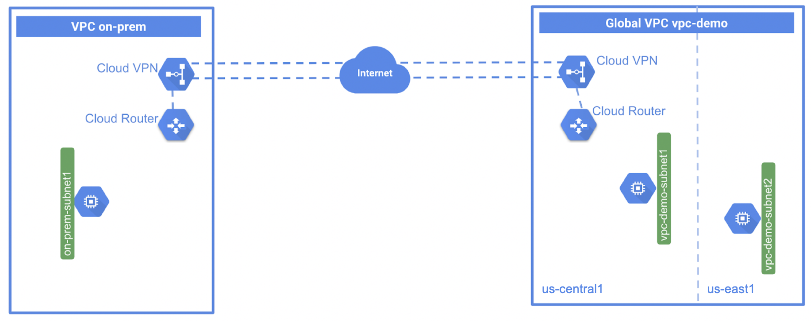

= Cloud Router
:toc: manual

== About Cloud Router

Cloud Router enables you to dynamically exchange routes between your Virtual Private Cloud (VPC) and peer network by using Border Gateway Protocol (BGP).

* https://en.wikipedia.org/wiki/Border_Gateway_Protocol

== Netowrks and Resources Preparation

The Network Toploy as below figure:

* A global VPC called vpc-demo, with two custom subnets in us-east1 and us-central1, each region has a VM accordingly.
* A second VPC called on-prem to simulate a customer's on-premises data center, with one custom subnet, and has one VM instance.

=== vpc-demo

[source, bash]
.*1. create vpc-demo*
----
gcloud compute networks create vpc-demo --subnet-mode custom
----

[source, bash]
.*2. create subnets*
----
gcloud compute networks subnets create vpc-demo-subnet1 --network vpc-demo --range 10.1.1.0/24 --region us-central1
gcloud compute networks subnets create vpc-demo-subnet2 --network vpc-demo --range 10.2.1.0/24 --region us-east1
----

[source, bash]
.*3. create firewall to allow all custom traffic within the network, to allow SSH, ICMP traffic from anywhere*
----
gcloud compute firewall-rules create vpc-demo-allow-custom --network vpc-demo --allow tcp:0-65535,udp:0-65535,icmp --source-ranges 10.0.0.0/8
gcloud compute firewall-rules create vpc-demo-allow-ssh-icmp --network vpc-demo --allow tcp:22,icmp
----

[source, bash]
.*4. create vm instances*
----
gcloud compute instances create vpc-demo-instance1 --machine-type=e2-micro --zone=us-central1-b --network-interface=subnet=vpc-demo-subnet1,no-address
gcloud compute instances create vpc-demo-instance2 --machine-type=e2-micro --zone=us-east1-b --network-interface=subnet=vpc-demo-subnet2,no-address
----

=== on-prem

[source, bash]
.*1. create on-prem*
----
gcloud compute networks create on-prem --subnet-mode custom
----

[source, bash]
.*2. create subnets*
----
gcloud compute networks subnets create on-prem-subnet1 --network on-prem --range 192.168.1.0/24 --region us-central1
----

[source, bash]
.*3. create firewall to allow all custom traffic within the network, to allow SSH, ICMP traffic from anywhere*
----
gcloud compute firewall-rules create on-prem-allow-custom --network on-prem --allow tcp:0-65535,udp:0-65535,icmp --source-ranges 192.168.0.0/16
gcloud compute firewall-rules create on-prem-allow-ssh-icmp --network on-prem --allow tcp:22,icmp
----

[source, bash]
.*4. create vm instances*
----
gcloud compute instances create on-prem-instance1 --machine-type=e2-micro --zone=us-central1-a --network-interface=subnet=on-prem-subnet1,no-address
----

== Create Cloud Router

=== vpc-demo

[source, bash]
.*1. Create Router*
----
gcloud compute routers create vpc-demo-router --region=us-central1 --network=vpc-demo --asn=65001
----

[source, json]
.*2. View Router*
----
{
  "bgp": {
    "advertiseMode": "DEFAULT",
    "asn": 65001,
    "keepaliveInterval": 20
  },
  "creationTimestamp": "2023-04-27T08:52:00.635-07:00",
  "encryptedInterconnectRouter": false,
  "id": "8560170561968743631",
  "kind": "compute#router",
  "name": "vpc-demo-router",
  "network": "https://www.googleapis.com/compute/v1/projects/playground-s-11-0df280c1/global/networks/vpc-demo",
  "region": "https://www.googleapis.com/compute/v1/projects/playground-s-11-0df280c1/regions/us-central1",
  "selfLink": "https://www.googleapis.com/compute/v1/projects/playground-s-11-0df280c1/regions/us-central1/routers/vpc-demo-router"
}
----

=== on-prem

[source, bash]
.*1. Create Router*
----
gcloud compute routers create on-prem-router --region=us-central1 --network=on-prem --asn=65002
----

[source, json]
.*2. View Router*
----
{
  "bgp": {
    "advertiseMode": "DEFAULT",
    "asn": 65002,
    "keepaliveInterval": 20
  },
  "creationTimestamp": "2023-04-27T08:53:21.022-07:00",
  "encryptedInterconnectRouter": false,
  "id": "6132761853516260510",
  "kind": "compute#router",
  "name": "on-prem-router",
  "network": "https://www.googleapis.com/compute/v1/projects/playground-s-11-0df280c1/global/networks/on-prem",
  "region": "https://www.googleapis.com/compute/v1/projects/playground-s-11-0df280c1/regions/us-central1",
  "selfLink": "https://www.googleapis.com/compute/v1/projects/playground-s-11-0df280c1/regions/us-central1/routers/on-prem-router"
}
----

[source, bash]
.**
----

----

[source, json]
.**
----

----
