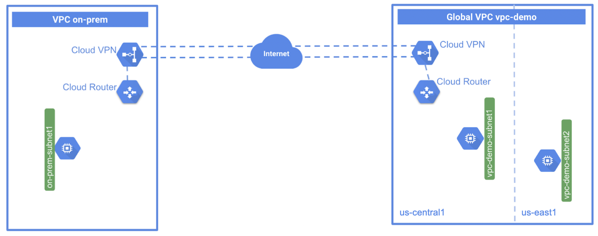

= Hybrid Connectivity
:toc: manual

== Netowrks and Resources Preparation

The Network Toploy as below figure:

* A global VPC called vpc-demo, with two custom subnets in us-east1 and us-central1, each region has a VM accordingly.
* A second VPC called on-prem to simulate a customer's on-premises data center, with one custom subnet, and has one VM instance.

=== vpc-demo

[source, bash]
.*1. create vpc-demo*
----
gcloud compute networks create vpc-demo --subnet-mode custom
----

[source, bash]
.*2. create subnets*
----
gcloud compute networks subnets create vpc-demo-subnet1 --network vpc-demo --range 10.1.1.0/24 --region us-central1
gcloud compute networks subnets create vpc-demo-subnet2 --network vpc-demo --range 10.2.1.0/24 --region us-east1
----

[source, bash]
.*3. create firewall to allow all custom traffic within the network, to allow SSH, ICMP traffic from anywhere*
----
gcloud compute firewall-rules create vpc-demo-allow-custom --network vpc-demo --allow tcp:0-65535,udp:0-65535,icmp --source-ranges 10.0.0.0/8
gcloud compute firewall-rules create vpc-demo-allow-ssh-icmp --network vpc-demo --allow tcp:22,icmp
----

[source, bash]
.*4. create vm instances*
----
gcloud compute instances create vpc-demo-instance1 --machine-type=e2-micro --zone=us-central1-b --network-interface=subnet=vpc-demo-subnet1,no-address
gcloud compute instances create vpc-demo-instance2 --machine-type=e2-micro --zone=us-east1-b --network-interface=subnet=vpc-demo-subnet2,no-address
----

=== on-prem

[source, bash]
.*1. create on-prem*
----
gcloud compute networks create on-prem --subnet-mode custom
----

[source, bash]
.*2. create subnets*
----
gcloud compute networks subnets create on-prem-subnet1 --network on-prem --range 192.168.1.0/24 --region us-central1
----

[source, bash]
.*3. create firewall to allow all custom traffic within the network, to allow SSH, ICMP traffic from anywhere*
----
gcloud compute firewall-rules create on-prem-allow-custom --network on-prem --allow tcp:0-65535,udp:0-65535,icmp --source-ranges 192.168.0.0/16
gcloud compute firewall-rules create on-prem-allow-ssh-icmp --network on-prem --allow tcp:22,icmp
----

[source, bash]
.*4. create vm instances*
----
gcloud compute instances create on-prem-instance1 --machine-type=e2-micro --zone=us-central1-a --network-interface=subnet=on-prem-subnet1,no-address
----

=== Script All in One

[source, bash]
----
gcloud compute networks create vpc-demo --subnet-mode custom
gcloud compute networks create on-prem --subnet-mode custom
gcloud compute networks subnets create vpc-demo-subnet1 --network vpc-demo --range 10.1.1.0/24 --region us-central1
gcloud compute networks subnets create vpc-demo-subnet2 --network vpc-demo --range 10.2.1.0/24 --region us-east1
gcloud compute networks subnets create on-prem-subnet1 --network on-prem --range 192.168.1.0/24 --region us-central1
gcloud compute firewall-rules create vpc-demo-allow-custom --network vpc-demo --allow tcp:0-65535,udp:0-65535,icmp --source-ranges 10.0.0.0/8
gcloud compute firewall-rules create vpc-demo-allow-ssh-icmp --network vpc-demo --allow tcp:22,icmp
gcloud compute firewall-rules create on-prem-allow-custom --network on-prem --allow tcp:0-65535,udp:0-65535,icmp --source-ranges 192.168.0.0/16
gcloud compute firewall-rules create on-prem-allow-ssh-icmp --network on-prem --allow tcp:22,icmp
gcloud compute instances create vpc-demo-instance1 --machine-type=e2-micro --zone=us-central1-b --network-interface=subnet=vpc-demo-subnet1,no-address
gcloud compute instances create vpc-demo-instance2 --machine-type=e2-micro --zone=us-east1-b --network-interface=subnet=vpc-demo-subnet2,no-address
gcloud compute instances create on-prem-instance1 --machine-type=e2-micro --zone=us-central1-a --network-interface=subnet=on-prem-subnet1,no-address
----

== Route Based Classic VPN

link:CLASSIC_VPN_ROUTE.adoc[Route Based Classic VPN]

== Policy Based Classic VPN

link:CLASSIC_VPN_POLICY.adoc[Policy Based Classic VPN]

== Cloud Router

link:CLOUD_ROUTER.adoc[Cloud Router]

== Classic VPN with BGP

TODO

== Cloud HA VPN

link:CLOUD_VPN.adoc[Cloud HA VPN]
