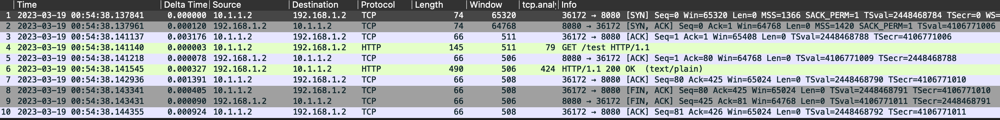

= Cloud HA VPN
:toc: manual

== About Cloud HA VPN

HA VPN is a high-availability (HA) Cloud VPN solution that lets you securely connect your on-premises network to your VPC network through an IPsec VPN connection in a single region. HA VPN provides an SLA of 99.99% service availability.

HA VPN is a regional per VPC, VPN solution. HA VPN gateways have two interfaces, each with its own public IP address. When you create an HA VPN gateway, two public IP addresses are automatically chosen from different address pools. When HA VPN is configured with two tunnels, Cloud VPN offers a 99.99% service availability uptime.

== Netowrks and Resources Preparation

=== vpc-demo

[source, bash]
.*1. create vpc-demo*
----
gcloud compute networks create vpc-demo --subnet-mode custom
----

[source, bash]
.*2. create subnets*
----
gcloud compute networks subnets create vpc-demo-subnet1 --network vpc-demo --range 10.1.1.0/24 --region us-central1
gcloud compute networks subnets create vpc-demo-subnet2 --network vpc-demo --range 10.2.1.0/24 --region us-east1
----

[source, bash]
.*3. create firewall to allow all custom traffic within the network, to allow SSH, ICMP traffic from anywhere*
----
gcloud compute firewall-rules create vpc-demo-allow-custom --network vpc-demo --allow tcp:0-65535,udp:0-65535,icmp --source-ranges 10.0.0.0/8
gcloud compute firewall-rules create vpc-demo-allow-ssh-icmp --network vpc-demo --allow tcp:22,icmp
----

[source, bash]
.*4. create vm instances*
----
gcloud compute instances create vpc-demo-instance1 --zone us-central1-b --subnet vpc-demo-subnet1
gcloud compute instances create vpc-demo-instance2 --zone us-east1-b --subnet vpc-demo-subnet2
----

=== on-prem

[source, bash]
.*1. create on-prem*
----
gcloud compute networks create on-prem --subnet-mode custom
----

[source, bash]
.*2. create subnets*
----
gcloud compute networks subnets create on-prem-subnet1 --network on-prem --range 192.168.1.0/24 --region us-central1
----

[source, bash]
.*3. create firewall to allow all custom traffic within the network, to allow SSH, ICMP traffic from anywhere*
----
gcloud compute firewall-rules create on-prem-allow-custom --network on-prem --allow tcp:0-65535,udp:0-65535,icmp --source-ranges 192.168.0.0/16
gcloud compute firewall-rules create on-prem-allow-ssh-icmp --network on-prem --allow tcp:22,icmp
----

[source, bash]
.*4. create vm instances*
----
gcloud compute instances create on-prem-instance1 --zone us-central1-a --subnet on-prem-subnet1
----

== HA VPN Setting up on vpc network

=== Create HA VPN gateway 

[source, bash]
.*1. create vpn gateway*
----
gcloud compute vpn-gateways create vpc-demo-vpn-gw1 --network vpc-demo --region us-central1
----

[source, json]
.*2. view the details of vpn gateway*
----
{
  "creationTimestamp": "2023-01-24T01:02:43.130-08:00",
  "id": "7388101625046507612",
  "kind": "compute#vpnGateway",
  "labelFingerprint": "42WmSpB8rSM=",
  "name": "vpc-demo-vpn-gw1",
  "network": "https://www.googleapis.com/compute/v1/projects/qwiklabs-gcp-01-0e4b3b1f8f92/global/networks/vpc-demo",
  "region": "https://www.googleapis.com/compute/v1/projects/qwiklabs-gcp-01-0e4b3b1f8f92/regions/us-central1",
  "selfLink": "https://www.googleapis.com/compute/v1/projects/qwiklabs-gcp-01-0e4b3b1f8f92/regions/us-central1/vpnGateways/vpc-demo-vpn-gw1",
  "stackType": "IPV4_ONLY",
  "vpnInterfaces": [
    {
      "id": 0,
      "ipAddress": "34.157.109.112"
    },
    {
      "id": 1,
      "ipAddress": "35.220.92.201"
    }
  ]
}
----

=== Create cloud router

[source, bash]
.*1. create cloud router*
----
gcloud compute routers create vpc-demo-router1 --network=vpc-demo --asn=65001 --region=us-central1
----

[source, json]
.*2. view the details of cloud router*
----
{
  "bgp": {
    "advertiseMode": "DEFAULT",
    "asn": 65001,
    "keepaliveInterval": 20
  },
  "creationTimestamp": "2023-03-18T08:05:50.210-07:00",
  "encryptedInterconnectRouter": false,
  "id": "8540647100926946721",
  "kind": "compute#router",
  "name": "vpc-demo-router1",
  "network": "https://www.googleapis.com/compute/v1/projects/playground-s-11-226f57f4/global/networks/vpc-demo",
  "region": "https://www.googleapis.com/compute/v1/projects/playground-s-11-226f57f4/regions/us-central1",
  "selfLink": "https://www.googleapis.com/compute/v1/projects/playground-s-11-226f57f4/regions/us-central1/routers/vpc-demo-router1"
}
----

== HA VPN Setting up on on-prem 

=== Create HA VPN gateway

[source, bash]
.*1. create vpn gateway*
----
gcloud compute vpn-gateways create on-prem-vpn-gw1 --network=on-prem --region=us-central1 
----

[source, json]
.*2. view the details of vpn gateway*
----
{
  "creationTimestamp": "2023-03-18T08:12:11.802-07:00",
  "id": "7181549694185138724",
  "kind": "compute#vpnGateway",
  "labelFingerprint": "42WmSpB8rSM=",
  "name": "on-prem-vpn-gw1",
  "network": "https://www.googleapis.com/compute/v1/projects/playground-s-11-226f57f4/global/networks/on-prem",
  "region": "https://www.googleapis.com/compute/v1/projects/playground-s-11-226f57f4/regions/us-central1",
  "selfLink": "https://www.googleapis.com/compute/v1/projects/playground-s-11-226f57f4/regions/us-central1/vpnGateways/on-prem-vpn-gw1",
  "stackType": "IPV4_ONLY",
  "vpnInterfaces": [
    {
      "id": 0,
      "ipAddress": "35.242.115.23"
    },
    {
      "id": 1,
      "ipAddress": "34.157.224.167"
    }
  ]
}
----

=== Create cloud router 

[source, bash]
.*1. create cloud router*
----
gcloud compute routers create on-prem-router1 --network=on-prem --asn=65002 --region=us-central1
----

[source, json]
.*2. view the details of cloud router*
----
{
  "bgp": {
    "advertiseMode": "DEFAULT",
    "asn": 65002,
    "keepaliveInterval": 20
  },
  "creationTimestamp": "2023-03-18T08:15:56.131-07:00",
  "encryptedInterconnectRouter": false,
  "id": "6213271535167761219",
  "kind": "compute#router",
  "name": "on-prem-router1",
  "network": "https://www.googleapis.com/compute/v1/projects/playground-s-11-226f57f4/global/networks/on-prem",
  "region": "https://www.googleapis.com/compute/v1/projects/playground-s-11-226f57f4/regions/us-central1",
  "selfLink": "https://www.googleapis.com/compute/v1/projects/playground-s-11-226f57f4/regions/us-central1/routers/on-prem-router1"
}
----

== Create VPN Tunnels

=== Create VPN tunnels on `vpc-demo network`

[source, bash]
.*1. create 1st tunnel*
----
gcloud compute vpn-tunnels create vpc-demo-tunnel0 --peer-gcp-gateway=on-prem-vpn-gw1 --ike-version=2  --shared-secret=shared_secret --router=vpc-demo-router1 --vpn-gateway=vpc-demo-vpn-gw1 --interface=0 --region=us-central1
----

[source, bash]
.*2. create 2nd tunnel*
----
gcloud compute vpn-tunnels create vpc-demo-tunnel1 --peer-gcp-gateway=on-prem-vpn-gw1 --ike-version=2  --shared-secret=shared_secret --router=vpc-demo-router1 --vpn-gateway=vpc-demo-vpn-gw1 --interface=1 --region=us-central1
----

[source, json]
.*3. overview of tunnel vpc-demo-tunnel0*
----
{
  "creationTimestamp": "2023-03-18T08:32:05.982-07:00",
  "description": "",
  "detailedStatus": "No incoming packets from peer",
  "id": "2660682271060158362",
  "ikeVersion": 2,
  "kind": "compute#vpnTunnel",
  "localTrafficSelector": [
    "0.0.0.0/0"
  ],
  "name": "vpc-demo-tunnel0",
  "peerGcpGateway": "https://www.googleapis.com/compute/v1/projects/playground-s-11-226f57f4/regions/us-central1/vpnGateways/on-prem-vpn-gw1",
  "peerIp": "35.242.115.23",
  "region": "https://www.googleapis.com/compute/v1/projects/playground-s-11-226f57f4/regions/us-central1",
  "remoteTrafficSelector": [
    "0.0.0.0/0"
  ],
  "router": "https://www.googleapis.com/compute/v1/projects/playground-s-11-226f57f4/regions/us-central1/routers/vpc-demo-router1",
  "selfLink": "https://www.googleapis.com/compute/v1/projects/playground-s-11-226f57f4/regions/us-central1/vpnTunnels/vpc-demo-tunnel0",
  "sharedSecret": "*************",
  "sharedSecretHash": "ijpaUsV2tTyjw0a-mof9fFJG5UNv",
  "status": "NO_INCOMING_PACKETS",
  "vpnGateway": "https://www.googleapis.com/compute/v1/projects/playground-s-11-226f57f4/regions/us-central1/vpnGateways/vpc-demo-vpn-gw1",
  "vpnGatewayInterface": 0
}
----

[source, json]
.*4. overview of tunnel vpc-demo-tunnel1*
----
{
  "creationTimestamp": "2023-03-18T08:34:29.798-07:00",
  "description": "",
  "detailedStatus": "No incoming packets from peer",
  "id": "2733471186359444714",
  "ikeVersion": 2,
  "kind": "compute#vpnTunnel",
  "localTrafficSelector": [
    "0.0.0.0/0"
  ],
  "name": "vpc-demo-tunnel1",
  "peerGcpGateway": "https://www.googleapis.com/compute/v1/projects/playground-s-11-226f57f4/regions/us-central1/vpnGateways/on-prem-vpn-gw1",
  "peerIp": "34.157.224.167",
  "region": "https://www.googleapis.com/compute/v1/projects/playground-s-11-226f57f4/regions/us-central1",
  "remoteTrafficSelector": [
    "0.0.0.0/0"
  ],
  "router": "https://www.googleapis.com/compute/v1/projects/playground-s-11-226f57f4/regions/us-central1/routers/vpc-demo-router1",
  "selfLink": "https://www.googleapis.com/compute/v1/projects/playground-s-11-226f57f4/regions/us-central1/vpnTunnels/vpc-demo-tunnel1",
  "sharedSecret": "*************",
  "sharedSecretHash": "wXZs2kCivy8XkUD_xLcUVzw_UrDb",
  "status": "NO_INCOMING_PACKETS",
  "vpnGateway": "https://www.googleapis.com/compute/v1/projects/playground-s-11-226f57f4/regions/us-central1/vpnGateways/vpc-demo-vpn-gw1",
  "vpnGatewayInterface": 1
}
----

=== Create VPN tunnels on `on-prem network`

[source, bash]
.*1. create 1st tunnel*
----
gcloud compute vpn-tunnels create on-prem-tunnel0 --peer-gcp-gateway=vpc-demo-vpn-gw1 --ike-version=2 --shared-secret=shared_secret --router=on-prem-router1 --vpn-gateway=on-prem-vpn-gw1 --interface=0 --region=us-central1
----

[source, bash]
.*2. create 2nd tunnel*
----
gcloud compute vpn-tunnels create on-prem-tunnel1 --peer-gcp-gateway=vpc-demo-vpn-gw1 --ike-version=2 --shared-secret=shared_secret --router=on-prem-router1 --vpn-gateway=on-prem-vpn-gw1 --interface=1 --region=us-central1
----

[source, json]
.*3. overview of tunnel on-prem-tunnel0*
----
{
  "creationTimestamp": "2023-03-18T08:42:37.462-07:00",
  "description": "",
  "detailedStatus": "Tunnel is up and running.",
  "id": "6824639715773801730",
  "ikeVersion": 2,
  "kind": "compute#vpnTunnel",
  "localTrafficSelector": [
    "0.0.0.0/0"
  ],
  "name": "on-prem-tunnel0",
  "peerGcpGateway": "https://www.googleapis.com/compute/v1/projects/playground-s-11-226f57f4/regions/us-central1/vpnGateways/vpc-demo-vpn-gw1",
  "peerIp": "34.157.104.109",
  "region": "https://www.googleapis.com/compute/v1/projects/playground-s-11-226f57f4/regions/us-central1",
  "remoteTrafficSelector": [
    "0.0.0.0/0"
  ],
  "router": "https://www.googleapis.com/compute/v1/projects/playground-s-11-226f57f4/regions/us-central1/routers/on-prem-router1",
  "selfLink": "https://www.googleapis.com/compute/v1/projects/playground-s-11-226f57f4/regions/us-central1/vpnTunnels/on-prem-tunnel0",
  "sharedSecret": "*************",
  "sharedSecretHash": "RGtD_bSFR-qLzmhrJEdJ2Fi-XVL0",
  "status": "ESTABLISHED",
  "vpnGateway": "https://www.googleapis.com/compute/v1/projects/playground-s-11-226f57f4/regions/us-central1/vpnGateways/on-prem-vpn-gw1",
  "vpnGatewayInterface": 0
}
----

[source, json]
.*4. overview of tunnel on-prem-tunnel1*
----
{
  "creationTimestamp": "2023-03-18T08:43:49.034-07:00",
  "description": "",
  "detailedStatus": "Tunnel is up and running.",
  "id": "5123307482251813594",
  "ikeVersion": 2,
  "kind": "compute#vpnTunnel",
  "localTrafficSelector": [
    "0.0.0.0/0"
  ],
  "name": "on-prem-tunnel1",
  "peerGcpGateway": "https://www.googleapis.com/compute/v1/projects/playground-s-11-226f57f4/regions/us-central1/vpnGateways/vpc-demo-vpn-gw1",
  "peerIp": "35.220.77.49",
  "region": "https://www.googleapis.com/compute/v1/projects/playground-s-11-226f57f4/regions/us-central1",
  "remoteTrafficSelector": [
    "0.0.0.0/0"
  ],
  "router": "https://www.googleapis.com/compute/v1/projects/playground-s-11-226f57f4/regions/us-central1/routers/on-prem-router1",
  "selfLink": "https://www.googleapis.com/compute/v1/projects/playground-s-11-226f57f4/regions/us-central1/vpnTunnels/on-prem-tunnel1",
  "sharedSecret": "*************",
  "sharedSecretHash": "-2jx_uPNpdINyv0oFJw15Ovh49SJ",
  "status": "ESTABLISHED",
  "vpnGateway": "https://www.googleapis.com/compute/v1/projects/playground-s-11-226f57f4/regions/us-central1/vpnGateways/on-prem-vpn-gw1",
  "vpnGatewayInterface": 1
}
----

=== Check all VPC Tunnel Status are established

[source, bash]
----
$ gcloud compute vpn-tunnels list --format=json | grep status
    "status": "ESTABLISHED",
    "status": "ESTABLISHED",
    "status": "ESTABLISHED",
    "status": "ESTABLISHED",
----

== Create BGP peering 

=== BGP peering on vpc-demo-tunnel0

[source, bash]
.*1. Create the router interface for tunnel0 in network vpc-demo*
----
gcloud compute routers add-interface vpc-demo-router1 --interface-name=if-tunnel0-to-on-prem --ip-address=169.254.0.1 --mask-length=30 --vpn-tunnel=vpc-demo-tunnel0 --region=us-central1
----

[source, bash]
.*2. Create the BGP peer for tunnel0 in network vpc-demo*
----
gcloud compute routers add-bgp-peer vpc-demo-router1 --peer-name=bgp-on-prem-tunnel0 --interface=if-tunnel0-to-on-prem --peer-ip-address=169.254.0.2 --peer-asn=65002 --region=us-central1
----

[source, json]
.*3. View the router information(sessionInitializationMode is diabled, BGP neighboring not done)*
----
{
  "bgp": {
    "advertiseMode": "DEFAULT",
    "asn": 65001,
    "keepaliveInterval": 20
  },
  "bgpPeers": [
    {
      "bfd": {
        "minReceiveInterval": 1000,
        "minTransmitInterval": 1000,
        "multiplier": 5,
        "sessionInitializationMode": "DISABLED"
      },
      "enable": "TRUE",
      "enableIpv6": false,
      "interfaceName": "if-tunnel0-to-on-prem",
      "ipAddress": "169.254.0.1",
      "name": "bgp-on-prem-tunnel0",
      "peerAsn": 65002,
      "peerIpAddress": "169.254.0.2"
    }
  ],
  "creationTimestamp": "2023-03-18T08:05:50.210-07:00",
  "encryptedInterconnectRouter": false,
  "id": "8540647100926946721",
  "interfaces": [
    {
      "ipRange": "169.254.0.1/30",
      "linkedVpnTunnel": "https://www.googleapis.com/compute/v1/projects/playground-s-11-226f57f4/regions/us-central1/vpnTunnels/vpc-demo-tunnel0",
      "name": "if-tunnel0-to-on-prem"
    }
  ],
  "kind": "compute#router",
  "name": "vpc-demo-router1",
  "network": "https://www.googleapis.com/compute/v1/projects/playground-s-11-226f57f4/global/networks/vpc-demo",
  "region": "https://www.googleapis.com/compute/v1/projects/playground-s-11-226f57f4/regions/us-central1",
  "selfLink": "https://www.googleapis.com/compute/v1/projects/playground-s-11-226f57f4/regions/us-central1/routers/vpc-demo-router1"
}
----

[source, json]
.*4. view the tunnel*
----
{
  "creationTimestamp": "2023-03-18T08:32:05.982-07:00",
  "description": "",
  "detailedStatus": "Tunnel is up and running.",
  "id": "2660682271060158362",
  "ikeVersion": 2,
  "kind": "compute#vpnTunnel",
  "localTrafficSelector": [
    "0.0.0.0/0"
  ],
  "name": "vpc-demo-tunnel0",
  "peerGcpGateway": "https://www.googleapis.com/compute/v1/projects/playground-s-11-226f57f4/regions/us-central1/vpnGateways/on-prem-vpn-gw1",
  "peerIp": "35.242.115.23",
  "region": "https://www.googleapis.com/compute/v1/projects/playground-s-11-226f57f4/regions/us-central1",
  "remoteTrafficSelector": [
    "0.0.0.0/0"
  ],
  "router": "https://www.googleapis.com/compute/v1/projects/playground-s-11-226f57f4/regions/us-central1/routers/vpc-demo-router1",
  "selfLink": "https://www.googleapis.com/compute/v1/projects/playground-s-11-226f57f4/regions/us-central1/vpnTunnels/vpc-demo-tunnel0",
  "sharedSecret": "*************",
  "sharedSecretHash": "ijpaUsV2tTyjw0a-mof9fFJG5UNv",
  "status": "ESTABLISHED",
  "vpnGateway": "https://www.googleapis.com/compute/v1/projects/playground-s-11-226f57f4/regions/us-central1/vpnGateways/vpc-demo-vpn-gw1",
  "vpnGatewayInterface": 0
}
----

=== BGP peering on vpc-demo-tunnel1

[source, bash]
.*1. Create a router interface for tunnel1 in network vpc-demo*
----
gcloud compute routers add-interface vpc-demo-router1 --interface-name=if-tunnel1-to-on-prem  --ip-address=169.254.1.1 --mask-length=30 --vpn-tunnel=vpc-demo-tunnel1 --region=us-central1
----

[source, bash]
.*2. Create the BGP peer for tunnel1 in network vpc-demo*
----
gcloud compute routers add-bgp-peer vpc-demo-router1 --peer-name=bgp-on-prem-tunnel1 --interface=if-tunnel1-to-on-prem --peer-ip-address=169.254.1.2 --peer-asn=65002 --region=us-central1
----

[source, json]
.*3. View the router information(BGP neighboring not done)*
----
{
  "bgp": {
    "advertiseMode": "DEFAULT",
    "asn": 65001,
    "keepaliveInterval": 20
  },
  "bgpPeers": [
    {
      "bfd": {
        "minReceiveInterval": 1000,
        "minTransmitInterval": 1000,
        "multiplier": 5,
        "sessionInitializationMode": "DISABLED"
      },
      "enable": "TRUE",
      "enableIpv6": false,
      "interfaceName": "if-tunnel0-to-on-prem",
      "ipAddress": "169.254.0.1",
      "name": "bgp-on-prem-tunnel0",
      "peerAsn": 65002,
      "peerIpAddress": "169.254.0.2"
    },
    {
      "bfd": {
        "minReceiveInterval": 1000,
        "minTransmitInterval": 1000,
        "multiplier": 5,
        "sessionInitializationMode": "DISABLED"
      },
      "enable": "TRUE",
      "enableIpv6": false,
      "interfaceName": "if-tunnel1-to-on-prem",
      "ipAddress": "169.254.1.1",
      "name": "bgp-on-prem-tunnel1",
      "peerAsn": 65002,
      "peerIpAddress": "169.254.1.2"
    }
  ],
  "creationTimestamp": "2023-03-18T08:05:50.210-07:00",
  "encryptedInterconnectRouter": false,
  "id": "8540647100926946721",
  "interfaces": [
    {
      "ipRange": "169.254.0.1/30",
      "linkedVpnTunnel": "https://www.googleapis.com/compute/v1/projects/playground-s-11-226f57f4/regions/us-central1/vpnTunnels/vpc-demo-tunnel0",
      "name": "if-tunnel0-to-on-prem"
    },
    {
      "ipRange": "169.254.1.1/30",
      "linkedVpnTunnel": "https://www.googleapis.com/compute/v1/projects/playground-s-11-226f57f4/regions/us-central1/vpnTunnels/vpc-demo-tunnel1",
      "name": "if-tunnel1-to-on-prem"
    }
  ],
  "kind": "compute#router",
  "name": "vpc-demo-router1",
  "network": "https://www.googleapis.com/compute/v1/projects/playground-s-11-226f57f4/global/networks/vpc-demo",
  "region": "https://www.googleapis.com/compute/v1/projects/playground-s-11-226f57f4/regions/us-central1",
  "selfLink": "https://www.googleapis.com/compute/v1/projects/playground-s-11-226f57f4/regions/us-central1/routers/vpc-demo-router1"
}
----

[source, json]
.*4. view the tunnel*
----
{
  "creationTimestamp": "2023-03-18T08:34:29.798-07:00",
  "description": "",
  "detailedStatus": "Tunnel is up and running.",
  "id": "2733471186359444714",
  "ikeVersion": 2,
  "kind": "compute#vpnTunnel",
  "localTrafficSelector": [
    "0.0.0.0/0"
  ],
  "name": "vpc-demo-tunnel1",
  "peerGcpGateway": "https://www.googleapis.com/compute/v1/projects/playground-s-11-226f57f4/regions/us-central1/vpnGateways/on-prem-vpn-gw1",
  "peerIp": "34.157.224.167",
  "region": "https://www.googleapis.com/compute/v1/projects/playground-s-11-226f57f4/regions/us-central1",
  "remoteTrafficSelector": [
    "0.0.0.0/0"
  ],
  "router": "https://www.googleapis.com/compute/v1/projects/playground-s-11-226f57f4/regions/us-central1/routers/vpc-demo-router1",
  "selfLink": "https://www.googleapis.com/compute/v1/projects/playground-s-11-226f57f4/regions/us-central1/vpnTunnels/vpc-demo-tunnel1",
  "sharedSecret": "*************",
  "sharedSecretHash": "wXZs2kCivy8XkUD_xLcUVzw_UrDb",
  "status": "ESTABLISHED",
  "vpnGateway": "https://www.googleapis.com/compute/v1/projects/playground-s-11-226f57f4/regions/us-central1/vpnGateways/vpc-demo-vpn-gw1",
  "vpnGatewayInterface": 1
}
----

=== BGP peering on on-prem-tunnel0

[source, bash]
.*1. Create a router interface for tunnel0 in network on-prem*
----
gcloud compute routers add-interface on-prem-router1 --interface-name=if-tunnel0-to-vpc-demo --ip-address=169.254.0.2 --mask-length=30 --vpn-tunnel=on-prem-tunnel0 --region=us-central1
----

[source, bash]
.*2. Create the BGP peer for tunnel0 in network on-prem*
----
gcloud compute routers add-bgp-peer on-prem-router1 --peer-name=bgp-vpc-demo-tunnel0 --interface=if-tunnel0-to-vpc-demo --peer-ip-address=169.254.0.1  --peer-asn=65001 --region=us-central1
----

[source, json]
.*3. View the router information*
----
{
  "bgp": {
    "advertiseMode": "DEFAULT",
    "asn": 65002,
    "keepaliveInterval": 20
  },
  "bgpPeers": [
    {
      "bfd": {
        "minReceiveInterval": 1000,
        "minTransmitInterval": 1000,
        "multiplier": 5,
        "sessionInitializationMode": "DISABLED"
      },
      "enable": "TRUE",
      "enableIpv6": false,
      "interfaceName": "if-tunnel0-to-vpc-demo",
      "ipAddress": "169.254.0.2",
      "name": "bgp-vpc-demo-tunnel0",
      "peerAsn": 65001,
      "peerIpAddress": "169.254.0.1"
    }
  ],
  "creationTimestamp": "2023-03-18T08:15:56.131-07:00",
  "encryptedInterconnectRouter": false,
  "id": "6213271535167761219",
  "interfaces": [
    {
      "ipRange": "169.254.0.2/30",
      "linkedVpnTunnel": "https://www.googleapis.com/compute/v1/projects/playground-s-11-226f57f4/regions/us-central1/vpnTunnels/on-prem-tunnel0",
      "name": "if-tunnel0-to-vpc-demo"
    }
  ],
  "kind": "compute#router",
  "name": "on-prem-router1",
  "network": "https://www.googleapis.com/compute/v1/projects/playground-s-11-226f57f4/global/networks/on-prem",
  "region": "https://www.googleapis.com/compute/v1/projects/playground-s-11-226f57f4/regions/us-central1",
  "selfLink": "https://www.googleapis.com/compute/v1/projects/playground-s-11-226f57f4/regions/us-central1/routers/on-prem-router1"
}
----

[source, json]
.*4. view the tunnel*
----
{
  "creationTimestamp": "2023-03-18T08:42:37.462-07:00",
  "description": "",
  "detailedStatus": "Tunnel is up and running.",
  "id": "6824639715773801730",
  "ikeVersion": 2,
  "kind": "compute#vpnTunnel",
  "localTrafficSelector": [
    "0.0.0.0/0"
  ],
  "name": "on-prem-tunnel0",
  "peerGcpGateway": "https://www.googleapis.com/compute/v1/projects/playground-s-11-226f57f4/regions/us-central1/vpnGateways/vpc-demo-vpn-gw1",
  "peerIp": "34.157.104.109",
  "region": "https://www.googleapis.com/compute/v1/projects/playground-s-11-226f57f4/regions/us-central1",
  "remoteTrafficSelector": [
    "0.0.0.0/0"
  ],
  "router": "https://www.googleapis.com/compute/v1/projects/playground-s-11-226f57f4/regions/us-central1/routers/on-prem-router1",
  "selfLink": "https://www.googleapis.com/compute/v1/projects/playground-s-11-226f57f4/regions/us-central1/vpnTunnels/on-prem-tunnel0",
  "sharedSecret": "*************",
  "sharedSecretHash": "RGtD_bSFR-qLzmhrJEdJ2Fi-XVL0",
  "status": "ESTABLISHED",
  "vpnGateway": "https://www.googleapis.com/compute/v1/projects/playground-s-11-226f57f4/regions/us-central1/vpnGateways/on-prem-vpn-gw1",
  "vpnGatewayInterface": 0
}
----

=== BGP peering on on-prem-tunnel1

[source, bash]
.*1. Create a router interface for tunnel1 in network on-prem*
----
gcloud compute routers add-interface on-prem-router1 --interface-name=if-tunnel1-to-vpc-demo --ip-address=169.254.1.2 --mask-length=30 --vpn-tunnel=on-prem-tunnel1 --region=us-central1
----

[source, bash]
.*2. Create the BGP peer for tunnel1 in network on-prem*
----
gcloud compute routers add-bgp-peer on-prem-router1 --peer-name=bgp-vpc-demo-tunnel1 --interface=if-tunnel1-to-vpc-demo --peer-ip-address=169.254.1.1  --peer-asn=65001 --region=us-central1
----

[source, json]
.*3. View the router information*
----
{
  "bgp": {
    "advertiseMode": "DEFAULT",
    "asn": 65002,
    "keepaliveInterval": 20
  },
  "bgpPeers": [
    {
      "bfd": {
        "minReceiveInterval": 1000,
        "minTransmitInterval": 1000,
        "multiplier": 5,
        "sessionInitializationMode": "DISABLED"
      },
      "enable": "TRUE",
      "enableIpv6": false,
      "interfaceName": "if-tunnel0-to-vpc-demo",
      "ipAddress": "169.254.0.2",
      "name": "bgp-vpc-demo-tunnel0",
      "peerAsn": 65001,
      "peerIpAddress": "169.254.0.1"
    },
    {
      "bfd": {
        "minReceiveInterval": 1000,
        "minTransmitInterval": 1000,
        "multiplier": 5,
        "sessionInitializationMode": "DISABLED"
      },
      "enable": "TRUE",
      "enableIpv6": false,
      "interfaceName": "if-tunnel1-to-vpc-demo",
      "ipAddress": "169.254.1.2",
      "name": "bgp-vpc-demo-tunnel1",
      "peerAsn": 65001,
      "peerIpAddress": "169.254.1.1"
    }
  ],
  "creationTimestamp": "2023-03-18T08:15:56.131-07:00",
  "encryptedInterconnectRouter": false,
  "id": "6213271535167761219",
  "interfaces": [
    {
      "ipRange": "169.254.0.2/30",
      "linkedVpnTunnel": "https://www.googleapis.com/compute/v1/projects/playground-s-11-226f57f4/regions/us-central1/vpnTunnels/on-prem-tunnel0",
      "name": "if-tunnel0-to-vpc-demo"
    },
    {
      "ipRange": "169.254.1.2/30",
      "linkedVpnTunnel": "https://www.googleapis.com/compute/v1/projects/playground-s-11-226f57f4/regions/us-central1/vpnTunnels/on-prem-tunnel1",
      "name": "if-tunnel1-to-vpc-demo"
    }
  ],
  "kind": "compute#router",
  "name": "on-prem-router1",
  "network": "https://www.googleapis.com/compute/v1/projects/playground-s-11-226f57f4/global/networks/on-prem",
  "region": "https://www.googleapis.com/compute/v1/projects/playground-s-11-226f57f4/regions/us-central1",
  "selfLink": "https://www.googleapis.com/compute/v1/projects/playground-s-11-226f57f4/regions/us-central1/routers/on-prem-router1"
}
----

[source, json]
.*4. view the tunnel*
----
{
  "creationTimestamp": "2023-03-18T08:43:49.034-07:00",
  "description": "",
  "detailedStatus": "Tunnel is up and running.",
  "id": "5123307482251813594",
  "ikeVersion": 2,
  "kind": "compute#vpnTunnel",
  "localTrafficSelector": [
    "0.0.0.0/0"
  ],
  "name": "on-prem-tunnel1",
  "peerGcpGateway": "https://www.googleapis.com/compute/v1/projects/playground-s-11-226f57f4/regions/us-central1/vpnGateways/vpc-demo-vpn-gw1",
  "peerIp": "35.220.77.49",
  "region": "https://www.googleapis.com/compute/v1/projects/playground-s-11-226f57f4/regions/us-central1",
  "remoteTrafficSelector": [
    "0.0.0.0/0"
  ],
  "router": "https://www.googleapis.com/compute/v1/projects/playground-s-11-226f57f4/regions/us-central1/routers/on-prem-router1",
  "selfLink": "https://www.googleapis.com/compute/v1/projects/playground-s-11-226f57f4/regions/us-central1/vpnTunnels/on-prem-tunnel1",
  "sharedSecret": "*************",
  "sharedSecretHash": "-2jx_uPNpdINyv0oFJw15Ovh49SJ",
  "status": "ESTABLISHED",
  "vpnGateway": "https://www.googleapis.com/compute/v1/projects/playground-s-11-226f57f4/regions/us-central1/vpnGateways/on-prem-vpn-gw1",
  "vpnGatewayInterface": 1
}
----

== Verify and Testing

=== Create firewall allow traffic betwen remote network

[source, bash]
----
gcloud compute firewall-rules create vpc-demo-allow-subnets-from-on-prem --network vpc-demo --allow tcp,udp,icmp --source-ranges 192.168.1.0/24
gcloud compute firewall-rules create on-prem-allow-subnets-from-vpc-demo --network on-prem --allow tcp,udp,icmp --source-ranges 10.1.1.0/24,10.2.1.0/24
----

=== on-prem ping vpc instance

[source, bash]
.*1. on on-prem instace ping vpc instance*
----
@on-prem-instance1:~$ ping 10.1.1.2
PING 10.1.1.2 (10.1.1.2) 56(84) bytes of data.
64 bytes from 10.1.1.2: icmp_seq=1 ttl=62 time=4.88 ms
64 bytes from 10.1.1.2: icmp_seq=2 ttl=62 time=1.50 ms
64 bytes from 10.1.1.2: icmp_seq=3 ttl=62 time=1.22 ms
----

The icmp packet flow:

[source, bash]
.*2. on on-prem instace ping instace on us-east1*
----
@on-prem-instance1:~$ ping 10.2.1.2
PING 10.2.1.2 (10.2.1.2) 56(84) bytes of data.
----

NOTE: ping faied.

=== on vpc to access http service on on-prem

[source, bash]
.*1. on vpc instance to access on-prem http service on port 8080*
----
$ curl http://192.168.1.2:8080/test -H "Host: testvpn.gcp"

            request: GET /test HTTP/1.1
               host: testvpn.gcp
           hostname: on-prem-instance1

        client addr: 10.1.1.2:36172
        server addr: 192.168.1.2:8080

             cookie: 
                xff: 
         user agent: curl/7.74.0
----

*2. the http packet flow*

