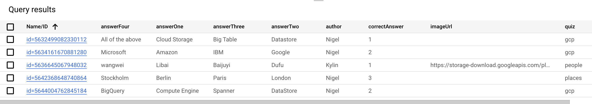

= Quiz
:toc: manual

Quiz is a cloud native application build an run cloud.

== Prerequisites

=== Build on Cloud Shell

[source, bash]
----
git clone https://github.com/cloudadc/cloud-quickstarts.git
ln -s cloud-quickstarts/quiz quiz
cd quiz
mvn clean install
----

=== Enabling required services

[source, bash]
----
gcloud services enable datastore.googleapis.com
----

=== Set Environment Viarables

[source, bash]
----
export GCLOUD_PROJECT=$DEVSHELL_PROJECT_ID
export GCLOUD_BUCKET=$DEVSHELL_PROJECT_ID-media
----

=== Create Cloud Storage Bucket

[source, bash]
----
gsutil mb gs://$GCLOUD_BUCKET
----

=== Create App Engine

[source, bash]
----
gcloud app create --region "us-central"
----

=== Load Questions Data to Datastore

[source, bash]
----
java -jar questions-loader/target/quiz-questions-loader-0.0.1.jar 
----

NOTE: The above will create 5 questions and upload link:etc/img/libai.png[etc/img/libai.png] to Cloud Storage.

Query the datastore via `SELECT * FROM Question`:

Access the Cloud Storage Bucket Image via *imageUrl* in above query results.
