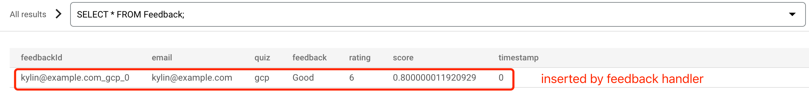
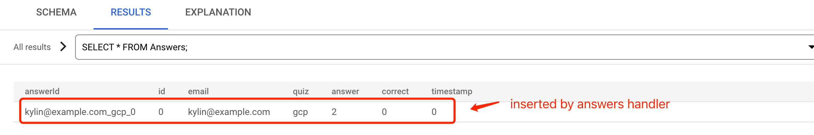

= Quiz
:toc: manual

Quiz is a cloud native application build an run cloud.

== Cloud Development

This sections contains steps to develop and debug quiz appliction on Cloud Shell and Cloud App Engine.

=== Build on Cloud Shell

[source, bash]
----
git clone https://github.com/cloudadc/cloud-quickstarts.git
ln -s cloud-quickstarts/quiz quiz
cd quiz
mvn clean install
----

=== Enabling required services

[source, bash]
----
gcloud services enable datastore.googleapis.com
gcloud services enable spanner.googleapis.com
gcloud services enable language.googleapis.com
----

=== Set Environment Viarables

[source, bash]
----
export GCLOUD_PROJECT=$DEVSHELL_PROJECT_ID
export GCLOUD_BUCKET=$DEVSHELL_PROJECT_ID-media
----

=== Create Cloud Storage Bucket

[source, bash]
----
gsutil mb gs://$GCLOUD_BUCKET
----

=== Create App Engine

[source, bash]
----
gcloud app create --region "us-central"
----

=== Load Questions Data to Datastore

[source, bash]
----
java -jar questions-loader/target/quiz-questions-loader-0.0.1.jar 
----

NOTE: The above will create 5 questions and upload link:etc/img/libai.png[etc/img/libai.png] to Cloud Storage.

Query the Cloud Datastore via `SELECT * FROM Question`:

image:etc/img/datastore-query.png[]

Access the Cloud Storage Bucket Image via *imageUrl* in above query results.

=== Create Cloud Pub/Sub topics

[source, bash]
----
gcloud pubsub topics create feedback
gcloud pubsub topics create answers
----

=== Create Cloud Spanner Instance/Database/Tables

[source, bash]
----
gcloud spanner instances create quiz-instance --config=regional-us-central1 --description="Quiz instance" --nodes=1
gcloud spanner databases create quiz-database --instance quiz-instance --ddl "CREATE TABLE Feedback ( feedbackId STRING(100) NOT NULL, email STRING(100), quiz STRING(20), feedback STRING(MAX), rating INT64, score FLOAT64, timestamp INT64 ) PRIMARY KEY (feedbackId); CREATE TABLE Answers (answerId STRING(100) NOT NULL, id INT64, email STRING(60), quiz STRING(20), answer INT64, correct INT64, timestamp INT64) PRIMARY KEY (answerId DESC);"
----

NOTE: The above created a spanner instance named `quiz-instance`, a spanner database named `quiz-database`, `Feedback` and `Answers` are tables under database `quiz-database`.

=== Create quiz-account Service Account

[source, bash]
----
gcloud iam service-accounts create quiz-account --display-name "Quiz Account"
gcloud iam service-accounts keys create key.json --iam-account=quiz-account@$DEVSHELL_PROJECT_ID.iam.gserviceaccount.com
gcloud projects add-iam-policy-binding $DEVSHELL_PROJECT_ID --member serviceAccount:quiz-account@$DEVSHELL_PROJECT_ID.iam.gserviceaccount.com --role roles/owner
export GOOGLE_APPLICATION_CREDENTIALS=key.json
----

=== Start Feedback Handler

[source, bash]
----
java -jar feedback-handler/target/quiz-feedback-handler-0.0.1.jar 
----

Send a message to `feedback` topic:

[source, bash]
----
gcloud pubsub topics publish feedback --message='{"email":"kylin@example.com","quiz":"gcp","feedback":"Good","rating":6,"timestamp":0,"sentimentScore":0.0}'
----

Query the Cloud Spanner via `SELECT * FROM Feedback`:

=== Start Answers Handler

[source, bash]
----
java -jar answers-handler/target/quiz-answers-handler-0.0.1.jar
----

Send a message to `answers` topic:

[source, bash]
----
gcloud pubsub topics publish answers --message='{"answerId":"101","quiz":"gcp","email":"kylin@example.com","id":0,"answer":2,"correctAnswer":0,"timestamp":0}'
----

Query the Cloud Spanner via `SELECT * FROM SELECT * FROM Answers;`:

